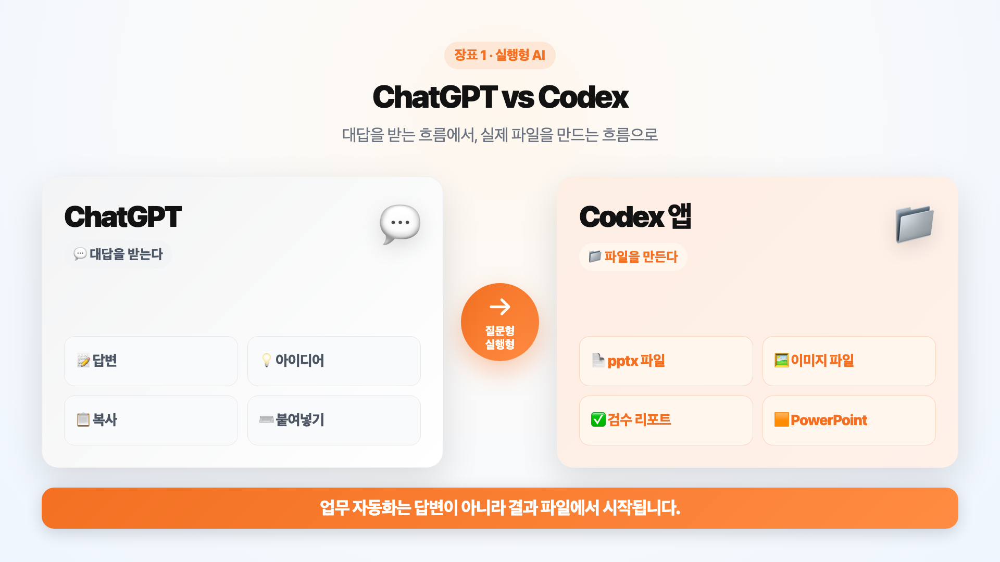
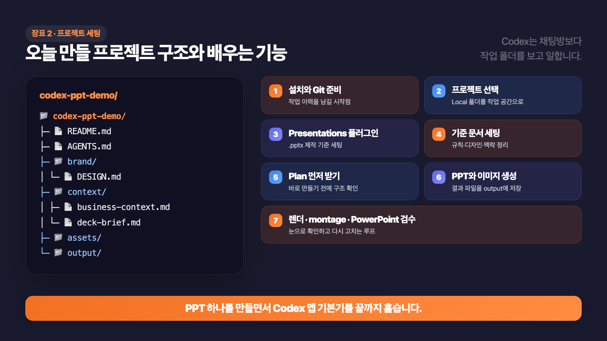
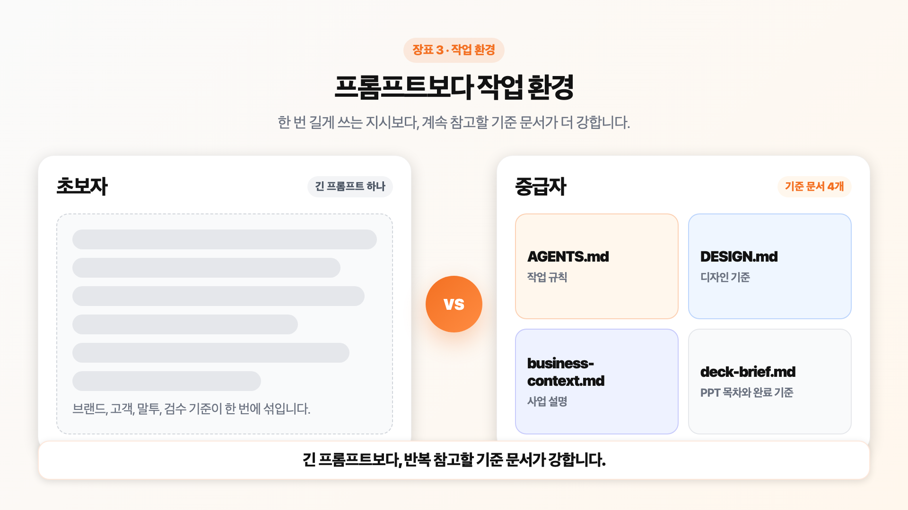
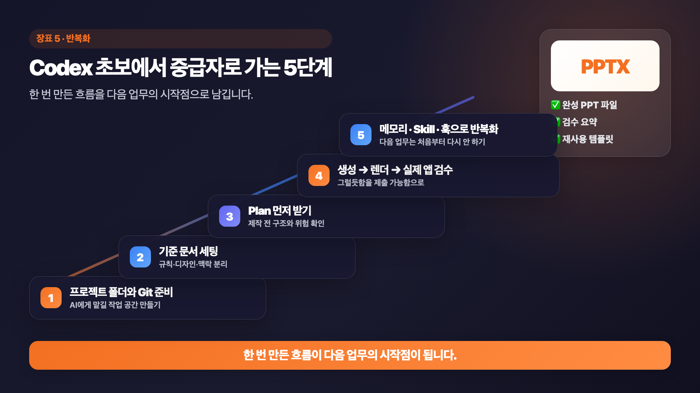

# Codex 앱으로 PPT 제안서 만들기 — 답변 말고 파일까지 맡기는 실전 가이드


ChatGPT에 질문하고 답변만 복사해 쓰던 방식에서 한 단계 넘어가, **Codex 앱에게 작업 폴더를 맡기고 실제 PPT 파일을 만들게 하는 흐름**을 정리한 가이드입니다.

이 문서는 영상에서 다룬 `AI 자동화 컨설팅 제안서 PPT` 예시를 기준으로, 프로젝트 폴더 세팅 → 기준 문서 작성 → Plan 먼저 받기 → PPT 생성 → 렌더 검수 → PowerPoint 최종 확인까지 그대로 따라 할 수 있게 구성했습니다.

> 💡 핵심은 “프롬프트를 길게 쓰는 법”이 아니라, Codex가 계속 참고할 **작업 환경**을 먼저 만드는 것입니다.

## 목차

- [1. 이 가이드로 만들 결과물](#1-이-가이드로-만들-결과물)
- [2. ChatGPT와 Codex는 무엇이 다른가](#2-chatgpt와-codex는-무엇이-다른가)
- [3. 전체 작업 흐름](#3-전체-작업-흐름)
- [4. 사전 준비](#4-사전-준비)
- [5. 프로젝트 폴더 구조 만들기](#5-프로젝트-폴더-구조-만들기)
- [6. 기준 문서 세팅](#6-기준-문서-세팅)
- [7. 바로 만들지 말고 Plan 먼저 받기](#7-바로-만들지-말고-plan-먼저-받기)
- [8. Presentations 플러그인으로 PPT 만들기](#8-presentations-플러그인으로-ppt-만들기)
- [9. 렌더 이미지와 montage로 1차 검수하기](#9-렌더-이미지와-montage로-1차-검수하기)
- [10. Computer Use로 PowerPoint 최종 확인하기](#10-computer-use로-powerpoint-최종-확인하기)
- [11. 중급자 세팅: 메모리, Skill, 훅](#11-중급자-세팅-메모리-skill-훅)
- [12. 자주 하는 실수와 우회 방법](#12-자주-하는-실수와-우회-방법)
- [13. FAQ](#13-faq)
- [14. 참고 자료](#14-참고-자료)

---

## 1. 이 가이드로 만들 결과물

영상에서는 Codex 앱으로 **온라인 쇼핑몰 대상 AI 자동화 컨설팅 제안서 PPT**를 만드는 흐름을 예시로 사용했습니다.

| 결과물 | 설명 | 저장 위치 예시 |
|---|---|---|
| 프로젝트 기준 문서 | Codex가 참고할 말투, 디자인, 사업 맥락, 제안서 기준 | `AGENTS.md`, `brand/DESIGN.md`, `context/*.md` |
| 제안서 PPT | 편집 가능한 PowerPoint 파일 | `output/shoppingmall-ai-automation-consulting-deck.pptx` |
| 렌더 이미지 | 슬라이드별 PNG 미리보기 | `output/rendered/` |
| 검수 montage | 전체 슬라이드를 한 장에 모아 보는 이미지 | `output/review-montage.png` |
| 최종 검수 요약 | 글자 잘림, 이미지 crop, 발표 모드 확인 결과 | Codex 응답 또는 검수 리포트 |



---

## 2. ChatGPT와 Codex는 무엇이 다른가

ChatGPT는 아이디어를 얻고, 글을 정리하고, 방향을 잡는 데 좋습니다. 하지만 제안서, 보고서, PPT처럼 **실제 업무 파일**을 만들고 고치고 검수해야 하는 순간에는 Codex 앱이 더 잘 맞습니다.

| 구분 | ChatGPT 중심 방식 | Codex 앱 중심 방식 |
|---|---|---|
| 기본 단위 | 채팅방 | 프로젝트 폴더 |
| 결과 형태 | 답변, 초안, 정리문 | 파일, 폴더, 검수 결과 |
| 작업 방식 | 답을 받고 사람이 복사/붙여넣기 | Codex가 폴더 안에서 직접 생성·수정 |
| 반복 작업 | 매번 다시 설명 필요 | `AGENTS.md`, 메모리, Skill로 재사용 가능 |
| PPT 작업 | 슬라이드 문구 초안에 강함 | `.pptx`, 렌더 이미지, 검수 루프까지 연결 가능 |

> 정리하면, ChatGPT가 **옆에서 답을 말해주는 상담사**라면, Codex 앱은 **폴더를 열고 파일을 만드는 실무 담당자**에 가깝습니다.

---

## 3. 전체 작업 흐름

이번 실습은 PPT 하나를 만드는 과정처럼 보이지만, 실제로는 Codex 앱을 실무에 쓰는 기본기를 한 번에 훑는 흐름입니다.



| 단계 | 목표 | 핵심 포인트 |
|---|---|---|
| 1 | Codex 앱 설치와 로그인 | ChatGPT 계정으로 Codex 앱 사용 |
| 2 | 프로젝트 폴더 선택 | 채팅방이 아니라 작업 폴더를 맡김 |
| 3 | Git 준비 | 변경 이력을 남겨 되돌릴 수 있게 함 |
| 4 | 기준 문서 세팅 | `AGENTS.md`, `DESIGN.md`, `business-context.md`, `deck-brief.md` 작성 |
| 5 | Plan 먼저 받기 | 바로 만들기 전에 슬라이드 구성과 검수 방식을 확인 |
| 6 | PPT 생성 | Presentations 플러그인으로 편집 가능한 `.pptx` 생성 |
| 7 | 렌더 검수 | PNG와 montage로 전체 톤·깨짐·잘림 확인 |
| 8 | PowerPoint 최종 확인 | Computer Use 또는 사람이 실제 앱에서 마지막 점검 |

---

## 4. 사전 준비

| 준비물 | 왜 필요한가 | 비고 |
|---|---|---|
| ChatGPT 계정 | Codex 앱 로그인 | Codex는 무료버전 (제한적), ChatGPT Plus, Pro, Business, Edu, Enterprise 플랜에 포함됩니다. 최신 플랜 조건은 공식 문서를 확인하세요. |
| Codex 앱 | 로컬 프로젝트 폴더 기반 작업 | macOS와 Windows에서 제공됩니다. |
| Git / GitHub | 변경 이력 관리 | AI가 마음에 안 드는 방향으로 수정했을 때 되돌리기 좋습니다. |
| PowerPoint 또는 Keynote | 최종 파일 확인 | 실제 앱에서 열었을 때 보이는 문제를 잡습니다. |
| 참고 문서 | 결과물 품질 기준 | 디자인 가이드, 사업 설명, 제안서 브리프 등 |

### 권한 설정 원칙

| 권한/모드 | 추천 사용 시점 | 주의할 점 |
|---|---|---|
| Auto-review | 처음 시작할 때 | 민감한 작업만 확인하면서 진행하기 좋습니다. |
| Full access | 반복 작업에 익숙해진 뒤 | 폴더와 명령 범위를 정확히 알고 있을 때만 사용하세요. |
| Computer Use | 실제 앱 화면 확인이 필요할 때 | 계정, 결제, 보안 설정 화면은 자동 조작하지 않게 제한하세요. |

---

## 5. 프로젝트 폴더 구조 만들기

먼저 PPT 작업용 폴더를 하나 만듭니다. 영상에서는 아래 구조를 기준으로 설명했습니다.

```text
codex-ppt-demo/
├── README.md (optional)
├── AGENTS.md
├── brand/
│   └── DESIGN.md
├── context/
│   ├── business-context.md
│   └── deck-brief.md
├── assets/
└── output/
```

| 파일/폴더 | 역할 |
|---|---|
| `README.md` | 프로젝트 전체 설명 (Optional) |
| `AGENTS.md` | Codex가 이 프로젝트에서 지켜야 할 작업 규칙 |
| `brand/DESIGN.md` | 색상, 여백, 버튼, 레이아웃 같은 디자인 기준 |
| `context/business-context.md` | 사업·고객·문제·제안 서비스 설명 |
| `context/deck-brief.md` | PPT 목차, 청중, 완료 기준 |
| `assets/` | 이미지와 참고 자료 보관 |
| `output/` | 최종 PPT와 렌더 결과 저장 |

### 프로젝트 초기 세팅 프롬프트

아래 프롬프트를 Codex에 넣어 프로젝트 파일을 먼저 만들게 합니다.

```text
##목표:
이 프로젝트를 AI 자동화 컨설팅 제안서 PPT 제작용 폴더로 준비해줘.

##성공 기준:
- AGENTS.md 생성
- brand/DESIGN.md 생성
- context/business-context.md 생성
- context/deck-brief.md 생성
- assets/와 output/ 폴더 생성
- 각 파일에는 초안 내용이 들어가 있어야 함

##제약:
- 아직 PPT 파일은 만들지 말 것
- 특정 브랜드의 공식 디자인 시스템이라고 쓰지 말 것
- 초보자가 읽어도 이해되는 쉬운 말로 작성할 것

##출력:
- 만든 파일 목록
- 각 파일 역할 한 줄 설명
- 다음에 내가 확인해야 할 것

##멈춤 기준:
파일을 만든 뒤에는 다음 작업으로 넘어가지 말고 내 확인을 기다려줘.
```

> 📌 포인트: 처음부터 PPT를 만들지 않습니다. 먼저 Codex가 일할 수 있는 작업 환경을 만듭니다.

---

## 6. 기준 문서 세팅

Codex에게 “PPT 만들어줘”만 말하면 그럴듯한 초안은 나옵니다. 하지만 우리 사업, 고객, 말투, 디자인 기준을 모르면 제출 가능한 결과물까지 가기 어렵습니다.



### 기준 문서 4개

| 문서 | 담아야 할 내용 | 왜 중요한가 |
|---|---|---|
| `AGENTS.md` | 작업 규칙, 말투, 검수 기준, 안전 규칙 | Codex가 매 작업 전에 참고할 기준 |
| `brand/DESIGN.md` | 색상, 폰트, 배경, 버튼, 레이아웃 | PPT 디자인 일관성 유지 |
| `context/business-context.md` | 고객, 문제, 제안 서비스, 핵심 메시지 | 내용이 뜬구름 잡지 않게 함 |
| `context/deck-brief.md` | 슬라이드 흐름, 발표 대상, 완료 기준 | 결과물이 목적에 맞는지 판단 |

### 사업 맥락 문서 예시

```md
# AI 자동화 컨설팅 제안서 맥락

대상 고객: 내부 개발팀이 없는 10~50명 규모의 SMB 대표
고객 문제:
- 반복 보고서 작성에 시간이 많이 든다
- 고객 문의 응대가 늦어진다
- 자료 정리와 제안서 작성이 대표에게 몰린다

제안 서비스: 4주 AI 자동화 진단 및 업무 시스템 구축 컨설팅
핵심 메시지: AI 도구 하나를 더 사는 게 아니라, 반복 업무가 굴러가는 구조를 만든다
말투: 대표가 바로 이해할 수 있게, 어려운 기술 용어는 짧게 풀어서 설명한다
```

### AGENTS.md 예시

```md
# AGENTS.md

## 목표
이 프로젝트의 목표는 비개발자도 이해할 수 있는 AI 자동화 컨설팅 제안서 PPT를 만드는 것이다.

## 말투
- 쉬운 우리말로 설명한다.
- 어려운 기술 용어는 첫 등장 때 한 문장으로 풀어 설명한다.
- 대표가 바로 이해할 수 있게 과장보다 구체적인 효과를 우선한다.

## PPT 제작 규칙
- Presentations 플러그인을 우선 활용한다.
- 텍스트, 차트, 기본 도형은 가능하면 PowerPoint에서 편집 가능한 객체로 유지한다.
- 중요한 글자는 이미지 안에 넣지 말고 PPT 텍스트로 배치한다.
- brand/DESIGN.md의 색상, 배경, 버튼, 여백 규칙을 우선 적용한다.
- 완료 전 output/review-montage.png와 검수 요약을 만든다.

## 안전 규칙
- 외부 웹 접속이나 데스크톱 앱 조작이 필요하면 먼저 왜 필요한지 설명하고 승인을 요청한다.
- 비밀키, 결제, 계정 설정 화면은 자동 조작하지 않는다.
```

### deck-brief.md 개선 요청

초안이 너무 추상적이면 바로 PPT 제작으로 넘어가지 말고 브리프를 먼저 다듬습니다.

```text
지금 Deck에 슬라이드별로 실제로 들어갈 내용에 대한 부분이 아직 덜 구체적인거같은데.
- 클로드코드나 코덱스를 활용한 업무 자동화
- n8n을 활용한 반복 업무 자동화
이런 것과 관련된 내용이 좀 더 구체적으로 포함되도록 deck-brief.md를 개선해주면 좋겠어.
```

이미지 사용 기준도 미리 넣어둡니다.

```text
Deck brief/ AGENTS.md에 이미지가 필요한 영역은 $imagegen을 활용해 삽입할 수 있게 수정해줘.
전체 덱에서 이미지가 최소 3개정도는 활용되는 것을 권장.
```

> ⚠️ DESIGN.md 작업을 할때는 getdesign.md에서 벤치마크할 design.md를 가져와서 본인의 브랜드에 맞게 수정해 사용해보세요!

---

## 7. 바로 만들지 말고 Plan 먼저 받기

중급자처럼 쓰려면 첫 제작 요청에서 바로 “만들어줘”라고 하지 않는 게 좋습니다. 먼저 계획을 받으면 슬라이드 방향, 검수 방식, 참고 문서 누락을 미리 잡을 수 있습니다.

### Plan 요청 프롬프트

```text
목표:
여성용 가방을 판매하는 온라인 쇼핑몰 대상 10장짜리 AI 자동화 컨설팅 제안서 PPT를 만들고 싶어.

성공 기준:
- 해당 업계의 페인포인트, 적절 솔루션에 대한 리서치 진행
- 코덱스를 활용해 해당 회사의 업무 자동화할 수 있는 솔루션 제시
- 슬라이드별 역할과 핵심 메시지가 분명해야 함
- 활용된 근거나 수치는 명확한 출처가 있어야 함
- PowerPoint에서 텍스트와 기본 도형을 편집할 수 있어야 함
- brand/DESIGN.md의 색상, 배경, 버튼, 여백 규칙을 반영해야 함
- 생성 후 렌더 이미지와 review-montage.png로 검수할 수 있어야 함

참고 문서:
- AGENTS.md
- brand/DESIGN.md
- context/business-context.md
- context/deck-brief.md

제약:
- 아직 pptx 파일은 만들지 말 것
- 중요한 글자를 이미지 안에 넣지 말 것
- 특정 브랜드 로고나 상표를 넣지 말 것
- 불확실한 기능이나 파일 경로는 추측하지 말고 확인 질문할 것

출력:
- 만들 파일 목록
- 슬라이드별 구성안
- 사용할 도구와 검수 방식
- 내가 승인해야 할 지점

멈춤 기준:
계획을 보여준 뒤에는 제작을 시작하지 말고 내 승인을 기다려줘.
```

### Plan에서 확인할 것

| 확인 항목 | 봐야 하는 이유 |
|---|---|
| 슬라이드 구성이 목적과 맞는가 | 표지, 문제, 진단, 솔루션, 로드맵, 다음 단계가 자연스러운지 확인 |
| 편집 가능한 PPT로 만들겠다고 하는가 | 텍스트와 기본 도형이 PowerPoint 객체로 남아야 나중에 수정 가능 |
| 검수 방식이 들어갔는가 | 렌더 이미지, montage, 글자 잘림 검사가 빠지면 제출 품질이 불안정 |
| 추가 질문을 하는가 | 고객사, 청중, 성과지표가 비어 있으면 결과가 추상적이 됨 |

### 제작 전 답변 예시

```text
1. 고객사명: 그린토트백
2. 발표 대상: 쇼핑몰 대표 + IT담당자
3. 가장 강조할 문제: 고객문의 응대, 상품정보관리, 상품기획 리서치
4. 현재 사용 도구: 카페24, 엑셀, 인스타그램DM, 스마트스토어, 챗GPT
5. 성과지표: 응답 속도 개선, 반복 업무 시간 절감 등 표현 / 표현시 예측 숫자 기입 -> 해당 숫자 근거 리서치 병행
```

---

## 8. Presentations 플러그인으로 PPT 만들기

계획을 확인한 뒤에야 실제 `.pptx` 생성을 요청합니다.

```text
@Presentations
해당 계획대로 1차 덱을 제작해줘. 

성공 기준:
- output/shoppingmall-ai-automation-consulting-deck.pptx 생성
- 텍스트와 기본 도형은 편집 가능한 객체로 유지
- 표지 이미지는 assets/에 별도 파일로 저장
- 생성 후 어떤 파일을 만들었는지 요약

제약:
- 핵심 텍스트는 이미지 안에 넣지 말 것
- 특정 브랜드 로고는 넣지 말 것
- 렌더 검수는 다음 단계에서 따로 할 것이므로, 이번에는 1차 pptx 생성까지 진행

출력:
- 생성 파일 경로
- 슬라이드별 한 줄 요약
- 다음 검수에서 확인해야 할 위험 요소
```

| 요청에 꼭 넣을 것 | 이유 |
|---|---|
| 저장 경로 | 나중에 파일을 못 찾는 일을 줄임 |
| 편집 가능한 객체 유지 | 이미지로 구워진 텍스트는 수정이 어려움 |
| 이미지 별도 저장 | 표지나 비주얼 자산을 재사용하기 좋음 |
| 이번 단계의 멈춤 기준 | 생성과 검수를 섞으면 문제 원인을 찾기 어려움 |

> 💡 PPT는 예쁘기만 하면 안 됩니다. 사람이 나중에 고칠 수 있어야 실무 파일입니다.

---

## 9. 렌더 이미지와 montage로 1차 검수하기

PPT 초안이 나오면 바로 사람이 열어보기 전에, Codex에게 렌더 이미지와 montage를 만들게 합니다.

```text
@Presentations
방금 만든 PPT를 1차 검수해줘.

목표:
제출 전에 눈으로 볼 수 있는 렌더 이미지와 검수 요약을 만들고 싶어.

성공 기준:
- output/rendered/에 슬라이드별 PNG 저장
- output/review-montage.png 생성
- 텍스트 잘림, 객체 겹침, 폰트 대체 가능성 검사
- 문제가 있으면 슬라이드 번호와 요소명을 함께 표시

제약:
- 렌더 결과에서 확인한 문제와 추측을 구분할 것
- 도구가 부족해서 검사할 수 없는 항목은 "확인 불가"로 표시할 것
- 바로 수정하지 말고 먼저 검수 결과만 보고할 것

출력:
- 만든 검수 파일 경로
- 문제 목록
- 우선 수정해야 할 항목 1~3개
- 문제 없으면 문제 없다고 보고
```

| 검수 결과물 | 어떻게 보는가 |
|---|---|
| `output/rendered/` | 슬라이드별로 글자 잘림, 이미지 crop, 정렬 확인 |
| `output/review-montage.png` | 전체 톤, 여백, 특정 슬라이드만 튀는지 확인 |
| 검수 요약 | 문제가 실제 렌더에서 보인 것인지, 추측인지 분리 |

수정이 필요하면 새 버전을 따로 만들게 합니다.

```text
수정본 ppt는 v2로 제작해주고, review-montage-v2도 제작해줘.
```

---

## 10. Computer Use로 PowerPoint 최종 확인하기

렌더 검수까지 마쳤다면 마지막으로 실제 PowerPoint 또는 Keynote에서 열어봅니다. 실제 앱에서만 보이는 폰트 대체, 슬라이드 쇼 전환, 편집 화면 깨짐이 있을 수 있기 때문입니다.

```text
@Computer
PowerPoint에서 생성된 최종 ppt를 열고 최종 확인해줘.

목표:
실제 PowerPoint 화면에서만 보일 수 있는 문제를 확인하고 싶어.

성공 기준:
- 모든 슬라이드가 정상적으로 열리는지 확인
- 제목이나 본문 글자가 잘리지 않는지 확인
- 이미지 crop이 어색하지 않은지 확인
- 발표 모드에서 10장 전체가 정상적으로 넘어가는지 확인
- 문제가 있으면 슬라이드 번호와 수정 제안 요약

제약:
- PowerPoint에서 이 파일만 열 것
- 계정, 결제, 보안 설정 화면은 건드리지 말 것
- 다른 앱이나 개인 파일을 열지 말 것
- 확실히 확인하지 못한 항목은 확인 불가로 표시할 것

출력:
- 확인 결과
- 문제 목록
- 수정 필요 여부 체크 및 수정 제안
```

### Computer Use는 언제 쓰나

| 상황 | 추천 방식 |
|---|---|
| 슬라이드 전체 톤을 빠르게 보고 싶음 | `review-montage.png` 먼저 확인 |
| 글자 잘림, 폰트 대체 가능성 확인 | 렌더 이미지 + 검수 요약 |
| 실제 앱에서만 보이는 문제 확인 | Computer Use 또는 사람이 직접 PowerPoint 확인 |
| 계정, 결제, 보안 화면 관련 작업 | 사람이 직접 처리 |

> ⚠️ Computer Use는 내 컴퓨터 앱을 실제로 조작할 수 있습니다. “PowerPoint에서 이 파일만 열어봐”처럼 범위를 좁게 주는 게 안전합니다.

### 최종 정리 프롬프트

```text
최종 파일과 검수 결과를 정리해줘.

목표:
이 프로젝트를 다음 제안서 제작에도 재사용할 수 있게 정리하고 싶어.

성공 기준:
- 최종 pptx 경로가 정확해야 함
- 사용한 이미지 파일이 정리되어야 함
- 검수 결과가 한눈에 보여야 함
- 사람이 마지막으로 확인해야 할 항목이 분리되어야 함
- 다음에 템플릿으로 남길 파일이 제안되어야 함

출력:
- 최종 산출물 목록
- 검수 결과 요약
- 이번 작업 기반 다음 재사용을 위해 템플릿화 하면 좋은 내용 제안
```

---

## 11. 중급자 세팅: 메모리, Skill, 훅

한 번 만든 흐름을 다음 업무에도 재사용하려면, Codex를 “한 번 쓰고 끝나는 앱”이 아니라 내 업무 방식에 맞게 길들이는 작업 공간으로 봐야 합니다.



| 기능 | 언제 쓰면 좋은가 | 주의할 점 |
|---|---|---|
| Memory | 개인 선호, 반복 작업 방식 기억 | 필수 팀 규칙은 메모리만 믿지 말고 `AGENTS.md`에 둡니다. |
| Skill | 반복되는 제안서·보고서·자료 제작 흐름 재사용 | 입력, 출력, 검수 기준을 명확히 적어야 합니다. |
| Hook | 고급 자동 체크, 비밀키 차단, 완료 전 검수 강제 | 처음부터 쓰기보다 반복 패턴이 보일 때 추가합니다. |
| `AGENTS.md` | 프로젝트의 고정 규칙 | 저장소에 남아 다음 작업에도 이어집니다. |

### 메모리 확인 프롬프트

```text
코덱스에 저장된 메모리 내용을 보여줘.
```

> 📌 메모리는 안정적인 선호를 기억시키는 용도입니다. 꼭 지켜야 하는 규칙은 `AGENTS.md` 같은 파일로 남겨두는 편이 안전합니다.

---

## 12. 자주 하는 실수와 우회 방법

| 실수 | 왜 문제인가 | 우회 방법 |
|---|---|---|
| 처음부터 “PPT 만들어줘”만 입력 | 고객, 말투, 디자인 기준을 모르기 때문에 결과가 평범해짐 | 기준 문서 4개를 먼저 세팅 |
| Plan 없이 바로 생성 | 슬라이드 방향이 틀어진 뒤에야 발견 | 먼저 계획을 받고 승인 후 제작 |
| 중요한 글자를 이미지 안에 넣음 | PowerPoint에서 수정하기 어렵고 깨질 수 있음 | 텍스트는 PPT 기본 객체로 유지 |
| 검수 없이 최종본으로 사용 | 글자 잘림, 폰트 대체, 여백 문제를 놓침 | 렌더 이미지와 montage 검수 |
| Computer Use에 너무 넓은 권한을 줌 | 개인 파일이나 민감한 화면을 건드릴 수 있음 | “이 파일만”, “이 앱만”처럼 범위를 좁게 지정 |
| 디자인 레퍼런스를 공식 디자인처럼 표현 | 상표나 브랜드 오해가 생길 수 있음 | “풍”, “레퍼런스”, “시작점”으로만 설명 |

---

## 13. FAQ

### Q1. ChatGPT만으로도 PPT 초안은 만들 수 있는데, 꼭 Codex를 써야 하나요?

초안 문구만 필요하면 ChatGPT로도 충분합니다. 하지만 실제 `.pptx` 파일을 만들고, 폴더 안에 저장하고, 렌더 이미지로 검수하고, 수정 이력을 남기려면 Codex 앱 방식이 더 자연스럽습니다.

### Q2. Git을 꼭 알아야 하나요?

깊게 알 필요는 없습니다. 다만 AI가 파일을 여러 번 수정할 때 되돌릴 수 있는 안전장치가 필요합니다. 처음에는 “이 폴더를 git으로 초기화해줘”, "수정사항을 커밋하고, 깃허브에 푸시해줘" 이런 정도의 명령어만 알아도 충분합니다. 

### Q3. Presentations 플러그인이 꼭 필요한가요?

PPT 제작에는 Presentations 계열 플러그인을 쓰는 것이 좋습니다. `.pptx` 생성, 편집 가능한 객체 유지, 렌더와 검수 스크립트 흐름이 더 안정적입니다.

### Q4. Computer Use는 제작 단계에서 계속 써야 하나요?

아닙니다. 제작의 시작은 기준 문서와 Presentations 플러그인으로 하고, Computer Use는 실제 앱에서만 보이는 문제를 잡는 최종 확인 카드로 쓰는 편이 좋습니다.

### Q5. 내 브랜드가 스타벅스풍 디자인과 다르면 어떻게 하나요?

`brand/DESIGN.md`를 본인 브랜드 기준으로 바꾸면 됩니다. 색상, 배경, 버튼, 여백, 사진 톤을 정리해두면 Codex가 그 기준을 반복해서 참고할 수 있습니다.

---

## 14. 참고 자료

| 자료 | 링크 |
|---|---|
| Codex 앱 공식 문서 | https://developers.openai.com/codex/app |
| Codex 앱 기능 | https://developers.openai.com/codex/app/features |
| Slide deck 생성 use case | https://developers.openai.com/codex/use-cases/generate-slide-decks |
| AGENTS.md 공식 문서 | https://developers.openai.com/codex/guides/agents-md |
| Computer Use 공식 문서 | https://developers.openai.com/codex/app/computer-use |
| Codex 메모리 공식 문서 | https://developers.openai.com/codex/memories |
| Hooks 공식 문서 | https://developers.openai.com/codex/hooks |
| getdesign.md Starbucks 레퍼런스 | https://getdesign.md/starbucks/design-md |

---

## 마지막 체크리스트

| 체크 항목 | 완료 기준 |
|---|---|
| 기준 문서 | `AGENTS.md`, `DESIGN.md`, `business-context.md`, `deck-brief.md` 존재 |
| PPT 생성 | `output/*.pptx` 파일 생성 |
| 렌더 검수 | `output/rendered/`, `output/review-montage.png` 확인 |
| 최종 확인 | PowerPoint 또는 Keynote에서 실제 열기 |
| 재사용 준비 | 다음 제안서에 쓸 템플릿 요소 정리 |

이 흐름을 한 번 만들어두면, 다음부터는 고객사 정보와 제안서 목적만 바꿔서 반복 사용할 수 있습니다.
