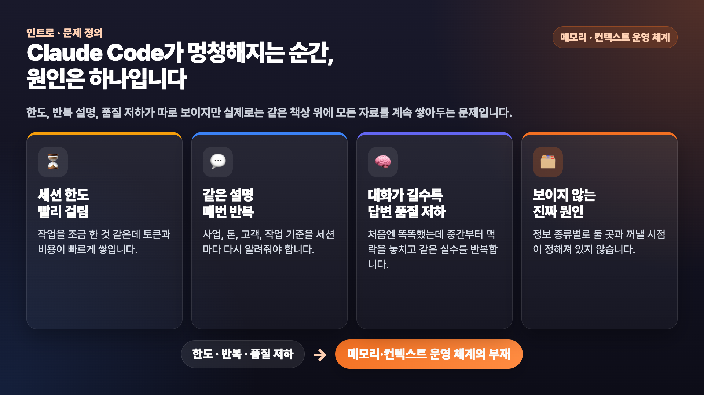
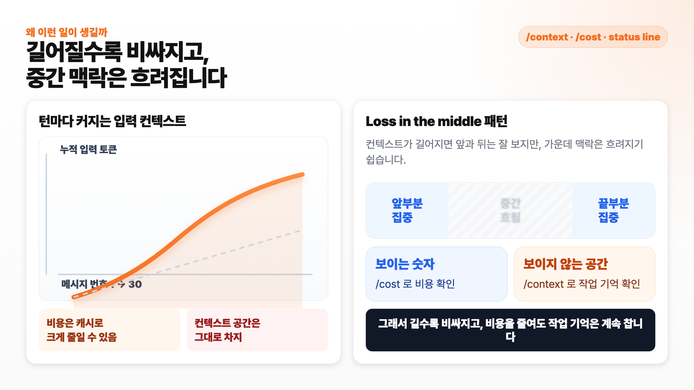
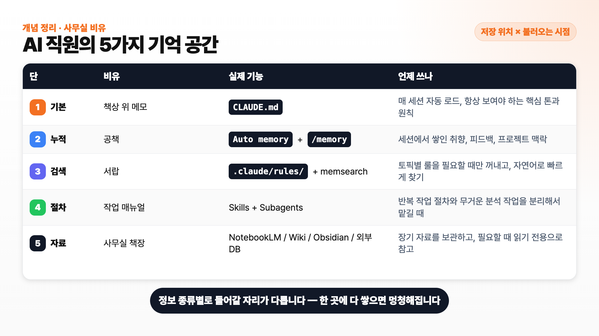
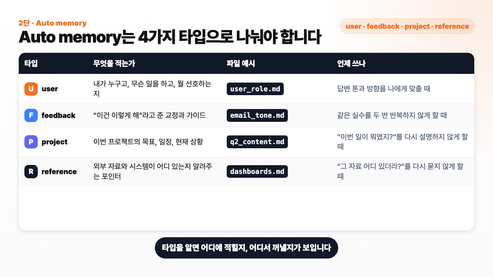
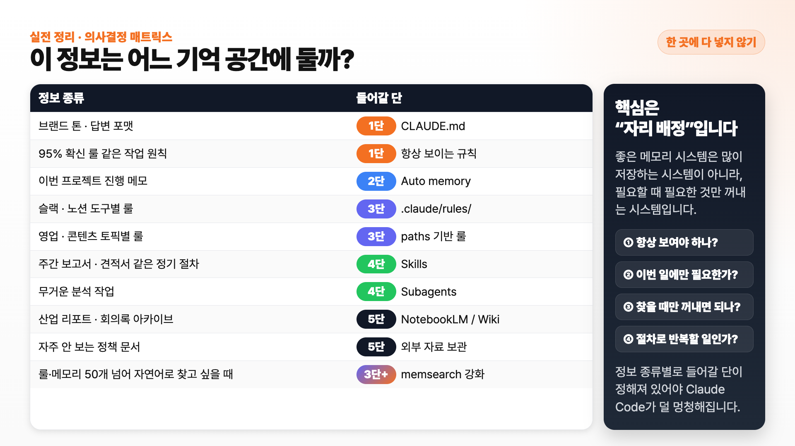

# 클로드 코드 메모리·컨텍스트 5단 시스템 가이드


클로드 코드가 갈수록 멍청해지고, 같은 설명을 반복해서 해야 하고, 5시간 한도에 빨리 걸린다면 문제는 대부분 하나입니다. **메모리와 컨텍스트를 운영하는 체계가 없기 때문**입니다.

이 가이드는 영상에서 다룬 내용을 그대로 따라 할 수 있게 정리한 실전 문서입니다. 핵심은 클로드 코드를 그냥 채팅창처럼 쓰지 않고, **똑똑한 AI 직원이 일하는 사무실**처럼 만드는 것입니다. 책상 위 메모, 공책, 서랍, 작업 매뉴얼, 사무실 책장으로 정보를 나누면 토큰 낭비와 컨텍스트 부패를 크게 줄일 수 있습니다.

> 💡 이 문서는 비개발자, 1인 사업가, 작은 팀 운영자, 콘텐츠 제작자, 프리랜서가 클로드 코드를 더 오래, 더 안정적으로, 더 똑똑하게 쓰기 위한 운영 가이드입니다.

---

## 목차

1. [왜 클로드 코드가 점점 멍청해질까](#왜-클로드-코드가-점점-멍청해질까)
2. [먼저 토큰 사용량을 보이게 만들기](#먼저-토큰-사용량을-보이게-만들기)
3. [5단 메모리·컨텍스트 시스템 한눈에 보기](#5단-메모리컨텍스트-시스템-한눈에-보기)
4. [1단 책상 위 메모 — CLAUDE.md](#1단-책상-위-메모--claudemd)
5. [2단 공책 — Auto memory와 /memory](#2단-공책--auto-memory와-memory)
6. [3단 서랍 — .claude/rules/와 paths](#3단-서랍--clauderules와-paths)
7. [3단 강화 — memsearch로 서랍 안 검색](#3단-강화--memsearch로-서랍-안-검색)
8. [4단 작업 매뉴얼 — Skills와 Subagents](#4단-작업-매뉴얼--skills와-subagents)
9. [5단 사무실 책장 — NotebookLM, LLM Wiki, 외부 DB](#5단-사무실-책장--notebooklm-llm-wiki-외부-db)
10. [매일 쓰는 운영 습관 6가지](#매일-쓰는-운영-습관-6가지)
11. [세션 인수인계 — handoff.md 자동화](#세션-인수인계--handoffmd-자동화)
12. [어느 정보를 어느 단에 둘까](#어느-정보를-어느-단에-둘까)
13. [자주 묻는 질문](#자주-묻는-질문)
14. [참고 자료](#참고-자료)

---

## 왜 클로드 코드가 점점 멍청해질까

클로드 코드는 메시지를 하나 보낼 때마다 그동안 쌓인 대화 이력과 자동으로 로드된 지침을 새 요청의 입력 컨텍스트로 같이 들고 갑니다. 쉽게 말하면, 새 안건이 나올 때마다 지금까지의 회의록을 책상 위에 다시 펼쳐놓고 답하는 직원과 비슷합니다.



| 증상 | 겉으로 보이는 문제 | 실제 원인 |
|---|---|---|
| 5시간 한도에 빨리 걸림 | 얼마 안 쓴 것 같은데 사용량 제한 | 과거 대화와 자동 로드 지침이 계속 누적됨 |
| 같은 설명을 반복해야 함 | 사업 맥락, 톤, 고객 정보를 매번 다시 설명 | 정보가 적절한 기억 위치에 저장되지 않음 |
| 대화가 길어질수록 답변 품질 하락 | 처음엔 똑똑했는데 점점 같은 실수 반복 | 긴 컨텍스트에서 중간 정보가 약해지는 현상 |
| 시작하자마자 토큰이 많이 찬 상태 | 새 세션인데 이미 수만 토큰 사용 | MCP, 메모리, 스킬, 긴 지침 파일이 자동 로드됨 |

> 핵심은 **정보를 한 곳에 다 쌓지 않는 것**입니다. 자주 보는 정보와 가끔 꺼낼 정보를 나눠야 클로드 코드가 오래 똑똑하게 일합니다.

---

## 먼저 토큰 사용량을 보이게 만들기

운영은 보이는 것부터 시작됩니다. 토큰이 어디서 새는지 모르면 줄일 수도 없습니다.



| 확인 도구 | 무엇을 보는가 | 언제 쓰나 |
|---|---|---|
| `/context` | 현재 세션이 어떤 항목에 토큰을 쓰는지 | 새 세션을 열었는데 이미 무거울 때 |
| `/cost` | 현재 세션의 토큰 사용량과 예상 비용 | 긴 작업 중간 점검 |
| `/statusline` | 터미널 하단에 컨텍스트 사용률을 상시 표시 | 매일 켜두는 기본 계기판 |
| `/compact` | 긴 세션을 요약 압축 | 컨텍스트 60% 전후에서 수동 실행 |
| `/clear` | 주제가 바뀔 때 세션 초기화 | 작업 단위가 바뀔 때 바로 실행 |

### status line 셋업 프롬프트

클로드 코드에서 `/statusline`을 입력한 뒤 아래처럼 요청하면 됩니다.

```text
/statusline 컨텍스트 사용률을 % 와 막대 그래프로 보여주고,
모델 이름, 현재 git 브랜치, 그리고 누적 비용도 같이 표시해줘.
50% 넘으면 노란색, 80% 넘으면 빨간색으로 강조해주고. 각 섹션앞에는 어울리는 이모지를 달아줘.
```

한 번 셋업하면 터미널 하단에서 컨텍스트 사용률을 계속 볼 수 있습니다.

---

## 5단 메모리·컨텍스트 시스템 한눈에 보기

저는 이 구조를 **AI 직원이 일하는 사무실**에 비유합니다. 직원이 모든 종이를 책상 위에 올려두면 일을 못 합니다. 자주 보는 메모, 업무 공책, 서랍, 매뉴얼, 책장이 나뉘어 있어야 합니다.



| 단 | 사무실 비유 | 실제 기능 | 언제 쓰나 |
|---|---|---|---|
| 1단 | 책상 위 메모 | `CLAUDE.md` | 매 세션 반드시 필요한 핵심 룰 |
| 2단 | 공책 | Auto memory, `/memory`, `memory.md` | 세션에서 배운 사용자 정보, 프로젝트 상황, 교정 |
| 3단 | 서랍 | `.claude/rules/` + `paths` | 특정 폴더나 작업에만 필요한 토픽별 룰 |
| 3단 강화 | 검색되는 서랍 | `memsearch` | 룰과 메모가 많아져 자연어 검색이 필요할 때 |
| 4단 | 작업 매뉴얼 | Skills, Subagents | 반복 작업 절차, 무거운 리서치 분리 |
| 5단 | 사무실 책장 | NotebookLM, LLM Wiki, Obsidian, 외부 DB | 긴 회의록, 리포트, 지식베이스, 장기 자료 |

> 한 줄 요약: **항상 필요한 것은 1단, 자주 쌓이는 것은 2단, 조건부 룰은 3단, 반복 절차는 4단, 큰 자료는 5단**입니다.

---

## 1단 책상 위 메모 — CLAUDE.md

`CLAUDE.md`는 클로드 코드가 매 세션 자동으로 읽는 파일입니다. 그래서 가장 강력하지만, 가장 위험합니다. 너무 길면 매번 그 긴 내용을 들고 시작합니다.

### 좋은 CLAUDE.md와 나쁜 CLAUDE.md 비교

| 항목 | 안 좋은 예 | 좋은 예 |
|---|---|---|
| 길이 | 500~1,000줄 이상 | 50~200줄 안쪽 |
| 내용 | 브랜드, 고객, 코딩 룰, 회계 룰, 슬랙 룰을 한 파일에 모두 넣음 | 꼭 필요한 핵심 룰 + 자세한 파일 위치만 적음 |
| 역할 | 모든 정보를 직접 담는 창고 | 필요한 정보를 찾게 해주는 인덱스 |
| 결과 | 시작부터 컨텍스트가 무거워짐 | 필요한 순간에만 세부 파일을 읽음 |

### 95% 확신 룰

영상에서 추천한 가장 간단한 안전장치입니다. `CLAUDE.md`에 아래 두 줄을 넣어두세요.

```text
작업을 시작하기 전에 95% 확신이 들 때까지 저에게 추가 질문을 해주세요.
확신이 안 서면 코드를 작성하지 마세요.
```

이 룰은 잘못된 방향으로 길게 실행하면서 토큰을 태우는 일을 줄여줍니다. 특히 코드 수정, 설정 변경, 외부 발송처럼 되돌리기 귀찮은 작업 전에 효과가 큽니다.


> 목표는 `CLAUDE.md`를 **지식 창고**가 아니라 **길 안내판**으로 만드는 것입니다.

---

## 2단 공책 — Auto memory와 /memory

Auto memory는 클로드가 세션 중에 배운 내용을 자동으로 정리해두는 공책입니다. `/memory`를 입력하면 관련 폴더와 `memory.md` 인덱스를 확인할 수 있습니다.



| 타입 | 무엇을 적나 | 예시 | 언제 유용한가 |
|---|---|---|---|
| user | 사용자가 누구이고 무엇을 선호하는지 | 답변 톤, 역할, 선호 도구 | 매번 자기소개를 다시 안 해도 됨 |
| feedback | “이건 이렇게 해” 같은 교정 | 제목 톤, 보고 방식, 금지 표현 | 같은 실수 반복 방지 |
| project | 이번 프로젝트 목표와 진행 상황 | 이번 분기 콘텐츠 목표, 마감일 | 이어서 작업할 때 맥락 복원 |
| reference | 자료 위치와 시스템 포인터 | 대시보드 위치, 문서 링크 | “그 자료 어디 있더라” 줄이기 |

### 프로젝트 목표를 기억시키는 예시

```text
앞으로 이번 분기 콘텐츠 목표는 영상 월 8개,
영상 한 편 평균 길이는 7분 기준으로 기억해줘.
```

이런 정보는 프로젝트 타입 메모로 보통 남겨줍니다. 다음에 “이번 주 영상 일정 짜줘”라고 했을 때 월 8개 페이스를 기준으로 생각할 수 있습니다.

### 메모리 정리 요청 예시

Auto memory는 완벽하지 않습니다. 가끔 오래된 정보나 의미가 약한 정보가 남습니다. 주기적으로 정리 의견을 받아보세요.

```text
memory.md파일에서 불필요한 내용이 있으면, 좀 정리하고 싶어. 한번 확인해보고 너무 이전정보이거나, 의미 없겠다 판단되는게 있다면 정리전에 먼저 의견을 줘.
```

> 바로 삭제하라고 하지 말고, 먼저 의견을 달라고 하는 것이 안전합니다.

---

## 3단 서랍 — .claude/rules/와 paths

3단은 토픽별 룰을 보관하는 서랍입니다. 클로드 코드 공식 문서에서 큰 프로젝트의 규칙을 나눠 관리할 때 `.claude/rules/` 폴더를 쓰라고 안내합니다.

핵심은 `paths`입니다. 그냥 룰 파일만 많이 만들면 정리는 편해지지만 컨텍스트 절약은 약합니다. **필요한 파일을 만지는 순간에만 룰이 들어오게 하려면 파일 상단에 `paths`를 넣어야 합니다.**

### 3단이 필요한 상황

| 상황 | 1단에 두면 생기는 문제 | 3단으로 빼면 좋은 점 |
|---|---|---|
| 콘텐츠 톤 룰 | 모든 세션에서 콘텐츠 톤을 읽음 | `content/**/*.md` 작업 때만 적용 |
| 고객 메일 룰 | 코딩 작업에도 고객 메일 룰이 붙음 | `emails/**/*.md` 작업 때만 적용 |
| 슬랙 보고 룰 | 글쓰기와 개발 작업에도 슬랙 룰이 붙음 | `slack/**/*.md` 작업 때만 적용 |
| 주간 보고서 포맷 | 일상 대화에도 보고서 양식이 붙음 | `reports/weekly/**/*.md`에만 적용 |

### 룰 파일 생성 요청 프롬프트

아래 내용을 그대로 클로드 코드에 붙여넣으면 프로젝트 폴더 안에 실제 룰 파일을 만들 수 있습니다.

```text
이 프로젝트 폴더 안에 .claude/rules/ 디렉토리를 만들고,
아래 3개 룰 파일을 실제 내용까지 작성해줘.

1. content-tone.md
- 콘텐츠 원고와 유튜브 대본 작업에만 적용
- paths: content/**/*.md, scripts/**/*.md
- 쉬운 말, 첫 문장 훅, 과장 표현 금지 룰 포함

2. client-comm.md
- 고객 메일과 제안서 작업에만 적용
- paths: emails/**/*.md, client/**/*.md, proposals/**/*.md
- 호칭, 가격 표기, 다음 액션 정리 룰 포함

3. slack.md
- 슬랙 공지와 업무 요청 초안에만 적용
- paths: slack/**/*.md, reports/slack/**/*.md
- 결론 먼저, 결정 필요 여부, 멘션 기준 룰 포함

각 파일 상단에는 YAML frontmatter 로 paths 를 넣고,
본문은 바로 복사해서 쓸 수 있는 운영 룰 형태로 작성해줘.
```

### 콘텐츠 톤 룰 예시

```markdown
---
paths:
  - "content/**/*.md"
  - "scripts/**/*.md"
---

# 콘텐츠 톤 룰
- 첫 문장에 훅, 결론 먼저
- 영상 길이 8~12분, 인트로 2분 이내
- 금지어: "혁신적", "획기적", "독보적"
```

### 영업·고객 메일 룰 예시

```markdown
---
paths:
  - "emails/**/*.md"
  - "client/**/*"
---

# 영업·고객 메일 룰
- 고객 호칭은 성함 + 님으로 통일
- 첫 줄에 미팅 요약 한 줄
- 마지막에 다음 액션 두 줄 명시
- 가격은 항상 부가세 별도 표기
```

### paths를 쓸 때 기억할 것

| 질문 | 답 |
|---|---|
| `paths`는 언제 작동하나 | 클로드가 매칭되는 파일을 실제로 읽거나 쓸 때 작동합니다 |
| 세션 시작 때만 평가되나 | 아닙니다. 작업 중 해당 경로를 만지는 순간 룰이 들어옵니다 |
| `CLAUDE.md`에 룰 목록을 다시 적어야 하나 | 보통은 필요 없습니다. `.claude/rules/` 자체가 룰 저장소입니다 |
| 파일 경로가 아니라 상황으로 켜고 싶다면 | `CLAUDE.md`에 “이 상황이면 이 문서를 읽어라”는 자연어 인덱스를 둡니다 |

---

## 3단 강화 — memsearch로 서랍 안 검색

룰과 메모가 30개, 50개를 넘어가면 “그 결정 어디 적었더라?”가 다시 문제 됩니다. `paths`는 파일 경로 기반이라서, 의미 기반 검색에는 한계가 있습니다.

이때 선택지로 쓸 수 있는 것이 `memsearch`입니다. 자체 마크다운 폴더에 대화와 메모를 저장하고, 그 위에 벡터 검색과 키워드 검색을 함께 얹어주는 방식입니다.

### 언제 memsearch가 필요한가

| 상황 | 기본 rules만으로 충분 | memsearch 고려 |
|---|---|---|
| 룰 파일 10개 안쪽 | 예 | 아니오 |
| 룰·메모 50개 이상 | 애매함 | 예 |
| 정확한 파일 위치를 기억함 | 예 | 아니오 |
| “가격 협상 관련 결정”처럼 의미로 찾고 싶음 | 약함 | 예 |
| 외부 API 키 없이 쓰고 싶음 | 가능 | ONNX 로컬 임베딩 설정 추천 |

### 설치 명령

```text
/plugin marketplace add zilliztech/memsearch
/plugin install memsearch
```

설치 후에는 클로드 코드를 한 번 재시작해야 합니다. 그래야 플러그인이 활성화됩니다.

### ONNX 로컬 임베딩으로 바꾸는 요청

환경에 따라 처음 설치했을 때 임베딩 provider가 OpenAI로 잡혀 있을 수 있습니다. API 키가 없으면 아무 일도 안 일어나는 것처럼 보일 수 있으니, 로컬 모델인 ONNX로 명시하는 편이 안전합니다.

```text
memsearch 임베딩 provider 를 무료 로컬 모델인 onnx 로 바꿔줘.
config 위치 확인해서 적용해주고, 적용 후 짧은 메모 한 줄 저장 → /memory-recall 까지
정상 동작하는지 한 번 테스트해줘.
```

### 검색 예시

```text
/memory-recall 클라이언트 가격 협상 관련 결정 어떻게 했더라?
```

> 핵심은 평소에는 컨텍스트를 차지하지 않다가, 과거 정보가 필요할 때만 검색 결과를 가져오는 것입니다.

---

## 4단 작업 매뉴얼 — Skills와 Subagents

자주 하는 작업은 매번 설명하지 말고 매뉴얼로 빼야 합니다. 클로드 코드에서는 이 역할을 Skills와 Subagents가 맡습니다.

| 구분 | 비유 | 쓰는 상황 | 컨텍스트 절약 방식 |
|---|---|---|---|
| Skill | 반복 업무 절차서 | 주간 보고서, 견적서, 대본 리뷰처럼 절차가 정해진 작업 | 필요한 작업이 떠오를 때만 SKILL.md 본문 로드 |
| Subagent | 별도 직원 | 긴 리서치, 대량 자료 분석, 깊은 검수 | 메인 세션 밖에서 자료를 읽고 요약만 돌려줌 |

### Skill 생성 예시 — 주간 보고서

아래 프롬프트는 영상에 나온 예시입니다. 실제 업무에 맞게 폴더와 컬럼만 바꿔 쓰면 됩니다.

```text
새 스킬을 만들어줘. 이름은 "weekly-report".                              
[입력]                              
- 폴더: data/sales/                                                      
  - 파일명: YYYY-W##.csv (ISO 주차 기준)                                 
  - 컬럼: date, customer(고객사명), category, product, channel, region,    
          orders, revenue, new_customers,                                  
  payment_status(paid/pending/refunded)                                             
  [작업]                                                                   
  1. 가장 최근 주차 CSV 자동 선택, 직전 주차 CSV와 비교                  
  2. paid 기준으로 매출/주문/신규 고객/거래 고객사 수 집계                 
  3. 카테고리별 / 고객사 TOP 3 / 채널별 / 지역별 매출 정리                 
  4. refunded는 매출에서 제외하고 환불 섹션에 별도 표기, pending은         
  미수금으로 분리                                                          
  5. 신규/이탈 고객사, 성장·요주의 항목 자동 추출                          
                                                                           
  [출력]                                                                 
  - reports/weekly/YYYY-W##.md 로 저장                                     
  - 톤·구조 룰은 .claude/rules/weekly-report.md 가 폴더 매칭으로 자동      
적용되니                                                                 
    SKILL 안에 톤 룰 중복 명시 금지                                        
                                                                           
  [보고서 섹션]                                                          
  한 줄 요약 → 핵심 성과 3개 → 카테고리별 → 고객사 TOP 3 →                 
  채널·지역 인사이트 → 환불/미수금 → 막힌 점 → 다음 주 액션 3개 
```

여기서 중요한 부분은 “톤 룰 중복 명시 금지”입니다. 보고서 산출물이 `reports/weekly/`에 저장되면 3단의 `paths` 룰이 자동으로 붙습니다. Skill 안에 같은 톤 룰을 또 넣으면 관리 지점이 두 개가 됩니다.

### Subagent 생성 예시 — 트렌드 리서치 전담 직원

무거운 자료 수집은 메인 세션에서 직접 하지 않는 편이 좋습니다. 별도 직원에게 맡기고, 메인 세션에는 요약만 가져오게 만듭니다.

```text
  trend-research 라는 서브에이전트를 만들어줘.                                   
                                                                                 
  [역할]                                                                   
  - AI 자동화 / AI 에이전트 분야 전담 리서처
  - 매주 1회, 최근 7~14일 사이의 새 소식을 30~80건 범위에서 수집                 
  - 비개발자 시청자 대상 유튜브 채널 운영자가 영상으로 만들 만한                 
    "바로 적용 가능한" 자동화·에이전트 패턴만 추출                               
                                                                                 
  [수집 우선순위]                                                                
  1. 공식 발표: Anthropic, OpenAI, Google DeepMind, Microsoft AI 블로그          
  2. 에이전트 프레임워크: Claude Agent SDK, OpenAI Agent Builder,                
     LangGraph, CrewAI, AutoGen 릴리스 노트                                
  3. 한국 AI 커뮤니티 + 실사용 사례 (브런치, 미디엄 한국어, 유튜브)              
  4. 실무 벤치마크·논문은 _시청자에게 와닿는 데모가 있을 때만_ 포함              
                                                                                 
  [작업 절차]                                                                    
  1. WebSearch + WebFetch 로 1차 수집                                            
  2. 중복·홍보성 글·단순 자금조달 뉴스 제거                                
  3. "비개발자가 한 시간 안에 따라할 수 있나" 기준으로 필터링                    
  4. 다음 3개 카테고리로 분류:                                                   
     - 🤖 새 에이전트 / 새 모델 (출시·업데이트)                                  
     - 🔁 자동화 워크플로우 사례 (실제 적용 케이스)                              
     - 🛠️  새로 나온 도구·SDK (영상 소재 후보)                                    
  5. 카테고리당 1~2개씩, 총 패턴 5개 + 추천 액션 3개로 압축                      
                                                                                 
  [출력 형식]                                                                    
  - 저장 위치: reports/weekly/YYYY-W##-trends.md                                 
  - 톤 룰은 .claude/rules/weekly-report.md 가 paths 매칭으로 자동 적용 — 중복    
  명시 금지                                                                      
  - 메인 세션으로는 파일 경로 + 패턴 5개 한 줄 요약만 반환
    (원본 기사 본문·긴 인용 절대 반환 금지)                                      
  - 보고서 안에는 패턴마다 출처 링크 1~2개 필수                                  
  - 추천 액션은 "이번 주 영상 1개 / 클라이언트 데모 1개 / 내부 실험 1개" 구조    
                                                                                 
  [메인 세션 트리거]                                                       
  - "이번 주 AI 트렌드 정리해줘"                                                 
  - "최근 AI 에이전트 트렌드 리서치 부탁"                                        
  - "주간 AI 자동화 트렌드"           
  - "이번 주 영상 소재 뽑아줘"                                                   
                                                                           
  [저장 위치]                                                                    
  ~/.claude/agents/trend-research.md                    
```

### 3단과 4단이 맞물리는 방식

| 흐름 | 예시 | 결과 |
|---|---|---|
| Skill이 파일을 저장 | `reports/weekly/2026-W18.md` | `reports/weekly/**/*.md` 룰 자동 적용 |
| Subagent가 보고서를 저장 | `reports/weekly/2026-W18-trends.md` | 보고서 톤 룰 자동 적용 |
| 콘텐츠 스킬이 대본 저장 | `content/youtube/2026-05-script.md` | 콘텐츠 톤 룰 자동 적용 |
| 영업 스킬이 메일 저장 | `emails/outbound/clientA.md` | 고객 메일 룰 자동 적용 |

---

## 5단 사무실 책장 — NotebookLM, LLM Wiki, 외부 DB

5단은 클로드 코드 컨텍스트 밖에 있는 장기 자료 저장소입니다. 회의록 1년치, 산업 리포트, 클라이언트 자료, 오래된 의사결정 로그를 전부 클로드 코드 안에 넣으면 컨텍스트가 바로 막힙니다.

대신 사무실 안쪽 책장에 꽂아두고, 필요할 때 색인 카드만 받아오는 방식으로 씁니다.

### 5단 도구 비교

| 도구 | 비유 | 적합한 자료 | 쓰는 방식 |
|---|---|---|---|
| NotebookLM | 자료 책장 + 질문 창구 | PDF, 회의록, 긴 리포트, 영상 자료 | 노트북에 올려두고 질문 결과만 받음 |
| LLM Wiki | AI가 정리하는 나무위키 | 장기 지식, 프로젝트 기록, 학습 메모 | 원본을 넣으면 위키 페이지로 정리 |
| Obsidian | 사람이 읽는 지식 보관함 | 마크다운 지식, 개인 노트 | Claude Code가 정리하고 사람이 읽음 |
| Supabase/PostgreSQL | 여러 AI가 함께 쓰는 공유 DB | 구조화된 고객 정보, 로그, 운영 데이터 | 필요한 쿼리 결과만 가져옴 |

### NotebookLM 질의 예시

```text
/notebooklm 클라이언트A 회의록 노트북에서
"가격 협상" 관련 결정 사항만 추려서 시간 순으로 5줄로 정리해줘.
```

### LLM Wiki 질의 예시

```text
/wiki "AI 에이전트 가격 정책" 주제로
우리 위키에서 관련 문서 3개를 찾고,
영상 대본에 쓸 수 있게 핵심만 5문단으로 요약해줘.
```

> 5단의 원칙은 간단합니다. **자료 전체를 책상 위로 가져오지 말고, 질문 결과만 가져오세요.**

---

## 매일 쓰는 운영 습관 6가지

5단 구조를 만들어도 습관이 없으면 다시 컨텍스트가 망가집니다. 아래 6가지를 기본 운영 규칙으로 두세요.

| 습관 | 왜 필요한가 | 추천 기준 |
|---|---|---|
| `/clear` 자주 쓰기 | 주제가 섞이면 토큰이 빠르게 누적됨 | 작업 주제가 바뀌면 바로 새 세션 |
| 안 쓰는 MCP 끄기 | 도구 정의만으로도 토큰을 많이 먹을 수 있음 | 지금 작업에 필요한 MCP만 켜기 |
| 파일을 수술하듯 지정 | 폴더 전체 탐색은 토큰 낭비 | `emails/clientA.md`의 마지막 단락처럼 좁게 요청 |
| plan mode 켜기 | 잘못된 방향으로 바로 실행하는 것 방지 | 큰 수정 전에는 먼저 계획 확인 |
| 60%쯤 수동 `/compact` | 자동 압축까지 기다리면 늦을 수 있음 | status line 보고 50~60%에서 압축 |
| 일하는 과정을 지켜보기 | 30분 잘못 가면 토큰도 시간도 날아감 | 이상하면 5초 안에 멈추기 |

---

## 세션 인수인계 — handoff.md 자동화

긴 작업에서 가장 강력한 운영법은 `handoff.md`입니다. 세션이 끝날 때 다음 세션의 자기 자신에게 한 장짜리 인수인계를 남기는 방식입니다.

### handoff.md에 들어갈 내용

| 섹션 | 내용 | 길이 |
|---|---|---|
| 오늘 한 일 | 완료한 작업 3줄 | 짧게 |
| 다음에 먼저 할 일 | 다음 세션 첫 액션 | 가장 중요 |
| 절대 하지 말 것 | 이미 실패한 시도, 건드리면 안 되는 것 | 사고 방지 |
| 참고 파일/링크 | 이어서 볼 경로 | 복원용 |

### Stop hook + SessionStart hook 요청 프롬프트

인수인계를 매번 수동으로 만들기 귀찮다면 hook으로 자동화할 수 있습니다.

```text
세션이 종료되거나 /clear 할 때 오늘 세션 내용을 요약해서
./handoff.md 를 자동으로 덮어쓰는 Stop hook,
그리고 새 세션이 시작될 때 그 ./handoff.md 를 컨텍스트에
자동 주입하는 SessionStart hook 두 개를 같이 만들어줘.

handoff.md 는 다음 4줄로 압축해줘.
1. 오늘 한 일 (3줄 요약)
2. 다음 세션에서 가장 먼저 할 일
3. 절대 하지 말 것 (이미 시도했는데 안 된 것, 지금 건드리면 안 되는 것)
4. 참고할 파일 경로 / 외부 링크

.claude/settings.json 과 필요한 bash 스크립트까지 다 알아서 셋업해줘.
```

### hook과 CLAUDE.md 강조어 비교

| 방식 | 장점 | 한계 | 추천 상황 |
|---|---|---|---|
| `CLAUDE.md`에 “IMPORTANT”로 적기 | 가볍고 쉽다 | 권고라서 가끔 누락 가능 | 가벼운 개인 프로젝트 |
| SessionStart hook | 새 세션 때 자동 주입 | 셋업이 조금 필요 | 인수인계 누락이 치명적인 작업 |
| Stop hook | 세션 끝에 자동 갱신 | 잘못 만들면 덮어쓰기 주의 | 긴 개발·콘텐츠 제작 세션 |

---

## 어느 정보를 어느 단에 둘까

새 정보가 생겼을 때 가장 헷갈리는 지점은 “이걸 어디에 둬야 하지?”입니다. 아래 표를 기준으로 빠르게 판단하세요.



| 정보 종류 | 추천 단 | 이유 |
|---|---|---|
| 답변 톤, 기본 포맷 | 1단 `CLAUDE.md` | 매 세션 항상 필요 |
| 95% 확신 룰 | 1단 `CLAUDE.md` | 모든 작업 시작 전 필요 |
| 이번 프로젝트 진행 메모 | 2단 Auto memory | 세션 사이 이어가기용 |
| 콘텐츠 톤, 영업 메일 룰 | 3단 `.claude/rules/` | 특정 파일 작업 때만 필요 |
| 슬랙/노션/보고 도구별 룰 | 3단 `.claude/rules/` | 도구별 상황에서만 필요 |
| 주간 보고서, 견적서 절차 | 4단 Skill | 반복 작업 절차 |
| 대량 리서치, 경쟁 분석 | 4단 Subagent | 메인 컨텍스트 보호 |
| 회의록 1년치, 산업 리포트 | 5단 NotebookLM/Wiki | 너무 커서 컨텍스트 안에 넣으면 안 됨 |
| 자주 안 보지만 중요 문서 | 5단 외부 지식베이스 | 필요할 때만 질문 |
| 룰과 메모가 50개 이상 | 3단 강화 memsearch | 자연어 검색 필요 |

---

## 자주 묻는 질문

### Q1. CLAUDE.md를 길게 잘 쓰면 더 똑똑해지는 것 아닌가요?

아닙니다. 너무 긴 `CLAUDE.md`는 매 세션 책상을 꽉 채우는 종이 더미가 됩니다. 핵심만 남기고 자세한 내용은 `.claude/rules/`, Skill, 외부 지식베이스로 빼는 편이 좋습니다.

### Q2. `.claude/rules/`에 파일을 나누기만 하면 컨텍스트가 줄어드나요?

나누는 것만으로는 부족합니다. 진짜 효과를 보려면 파일 상단에 `paths`를 넣어 해당 경로 작업 때만 룰이 들어오게 해야 합니다.

### Q3. Auto memory만 쓰면 충분하지 않나요?

작은 개인 작업은 충분할 수 있습니다. 하지만 반복 업무 절차, 팀 룰, 대량 자료, 장기 지식까지 모두 Auto memory에 기대면 금방 뒤엉킵니다. Auto memory는 공책이고, 룰·매뉴얼·책장은 따로 두는 편이 안정적입니다.

### Q4. memsearch는 꼭 깔아야 하나요?

아닙니다. 룰과 메모가 적다면 기본 `.claude/rules/` + `paths`로 충분합니다. 메모와 결정 로그가 많아져 “의미로 검색”이 필요해질 때 도입하세요.

### Q5. NotebookLM과 LLM Wiki는 5단이라고 했는데, 둘 중 뭘 먼저 쓰면 좋나요?

긴 자료를 올려두고 질문하고 싶다면 NotebookLM이 쉽습니다. 자료를 장기적으로 정리하고 서로 연결되는 지식베이스를 만들고 싶다면 LLM Wiki가 좋습니다. 처음에는 NotebookLM으로 시작하고, 반복해서 쌓이는 지식이 보이면 Wiki로 확장하는 흐름을 추천합니다.

### Q6. 이 구조를 한 번에 다 만들 필요가 있나요?

아닙니다. 추천 순서는 이렇습니다.

| 순서 | 먼저 할 일 | 이유 |
|---|---|---|
| 1 | `/context`, `/cost`, status line 켜기 | 현재 상태를 봐야 줄일 수 있음 |
| 2 | `CLAUDE.md`를 200줄 이하 인덱스로 정리 | 가장 즉각적인 개선 |
| 3 | `.claude/rules/` + `paths` 만들기 | 토픽별 룰 분리 |
| 4 | 자주 하는 일을 Skill로 만들기 | 반복 설명 줄이기 |
| 5 | 긴 자료를 NotebookLM/Wiki로 빼기 | 장기 자료로 컨텍스트 막힘 방지 |
| 6 | 필요할 때 memsearch 도입 | 메모가 많아진 뒤 검색 강화 |

---

## 참고 자료

| 자료 | 링크 | 참고한 내용 |
|---|---|---|
| Claude Code Memory | https://code.claude.com/docs/ko/memory | `CLAUDE.md`, `.claude/rules/`, path-scoped rules |
| Claude Code Best Practices | https://code.claude.com/docs/ko/best-practices | 긴 지침 파일 문제, 강조어, hook 작성 |
| Claude Code Hooks | https://code.claude.com/docs/ko/hooks | `Stop`, `SessionStart` hook |
| Claude Code Status Line | https://code.claude.com/docs/ko/statusline | status line 셋업 |
| Claude Code Skills | https://code.claude.com/docs/ko/skills | Skills on-demand 로딩 |
| Anthropic Context Windows | https://docs.claude.com/ko/docs/build-with-claude/context-windows | 컨텍스트 윈도우와 압축 |
| Anthropic Prompt Caching | https://claude.com/blog/prompt-caching | 캐시 비용 절감과 컨텍스트 구분 |
| Lost in the Middle 논문 | https://arxiv.org/abs/2307.03172 | 긴 컨텍스트에서 중간 정보 약화 |
| memsearch | https://github.com/zilliztech/memsearch | 마크다운 기반 메모리 + 하이브리드 검색 |
| memsearch Claude Code 설치 | https://zilliztech.github.io/memsearch/platforms/claude-code/installation/ | 설치, ONNX provider, 설정 |
| NotebookLM | https://notebooklm.google.com/ | 5단 외부 지식베이스 예시 |
| Karpathy LLM Wiki 아이디어 | https://gist.github.com/karpathy/442a6bf555914893e9891c11519de94f | LLM이 관리하는 지식 위키 개념 |

---

## 한 줄 정리

클로드 코드를 오래 똑똑하게 쓰려면, 더 긴 프롬프트를 쓰는 게 아니라 **정보가 들어갈 자리를 나눠야 합니다.**

- 매번 필요한 건 `CLAUDE.md`
- 세션에서 배운 건 Auto memory
- 조건부 룰은 `.claude/rules/`
- 반복 절차는 Skills와 Subagents
- 큰 자료는 NotebookLM, LLM Wiki, 외부 DB

이렇게 나누면 클로드 코드는 단순 채팅창이 아니라, 진짜 일하는 AI 직원 시스템에 가까워집니다.
