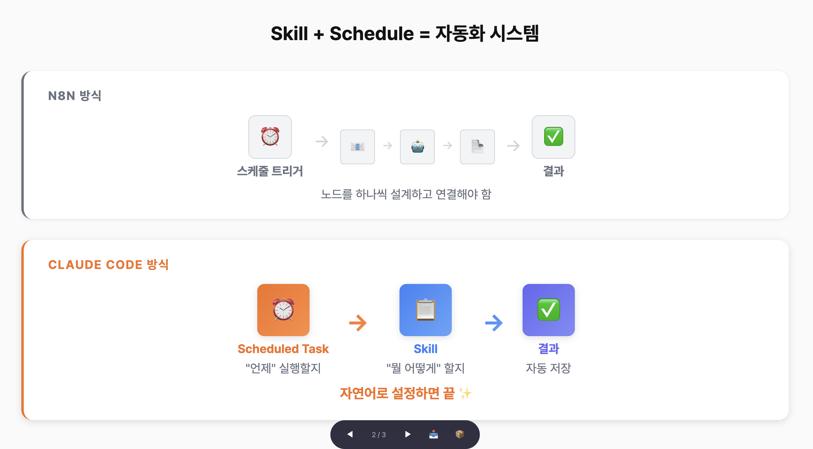
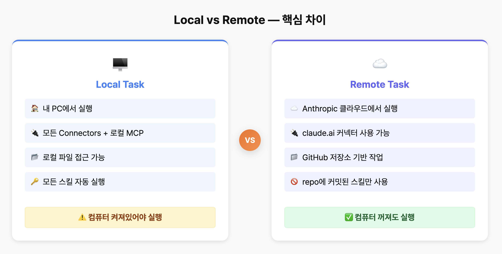

# 클로드코드 Scheduled Tasks 완전 가이드


클로드코드에 추가된 스케줄 트리거 기능을 활용하여, 원하는 시간에 원하는 작업을 자동으로 실행하는 방법을 안내합니다. n8n의 스케줄 트리거처럼, 반복 업무를 자동화하는 세 가지 방식을 실습과 함께 알아봅니다.

## 목차

- [스케줄링 방식 개요](#스케줄링-방식-개요)
  - [3가지 방식 비교](#3가지-방식-비교)
  - [어떤 방식을 선택해야 할까?](#어떤-방식을-선택해야-할까)
- [실습 1: /loop — 임시 반복 실행](#실습-1-loop--임시-반복-실행)
  - [기본 사용법](#기본-사용법)
  - [실무 활용 예시](#실무-활용-예시)
  - [등록된 작업 관리](#등록된-작업-관리)
  - [/loop 사용 시 참고사항](#loop-사용-시-참고사항)
- [실습 2: Local Scheduled Task — 매일 반복 업무 자동화](#실습-2-local-scheduled-task--매일-반복-업무-자동화)
  - [사전 준비: Connectors 연결](#사전-준비-connectors-연결)
  - [Local Task 생성하기](#local-task-생성하기)
  - [실행 및 권한 승인](#실행-및-권한-승인)
  - [놓친 실행 복구와 팁](#놓친-실행-복구와-팁)
- [실습 3: Local Task + Skills 연동](#실습-3-local-task--skills-연동)
  - [스킬 + 스케줄 = 자동화 시스템](#스킬--스케줄--자동화-시스템)
  - [설정 예시](#설정-예시)
- [실습 4: Remote Scheduled Task — 컴퓨터 꺼도 실행](#실습-4-remote-scheduled-task--컴퓨터-꺼도-실행)
  - [Remote Task 생성하기](#remote-task-생성하기)
  - [Remote Task에서 할 수 있는 것과 없는 것](#remote-task에서-할-수-있는-것과-없는-것)
  - [실전 예시: 비즈니스 메일 자동 관리](#실전-예시-비즈니스-메일-자동-관리)
  - [Remote Task에서 Skills 사용하기](#remote-task에서-skills-사용하기)
- [주의사항 및 한계](#주의사항-및-한계)

---

## 스케줄링 방식 개요

n8n이나 Make 같은 자동화 툴의 스케줄 트리거처럼, 클로드코드에서도 원하는 시간에 작업을 자동 실행할 수 있게 되었습니다. 방식은 세 가지이며, 각각 용도가 다릅니다.

### 3가지 방식 비교

| 구분 | /loop | Local Scheduled Task | Remote Scheduled Task |
|------|-------|---------------------|----------------------|
| **아이콘** | ⏱️ 임시 반복 | 🖥️ 내 PC 기반 | ☁️ 클라우드 기반 |
| **실행 환경** | CLI 또는 데스크톱 앱 세션 | 클로드 데스크톱 앱 | Anthropic 클라우드 (VM) |
| **저장 여부** | 세션 종료 시 삭제 (공식 기준 3일 만료) | 영구 저장 (앱 재시작해도 유지) | 영구 저장 (클라우드에 등록) |
| **외부 서비스 연동** | 세션 내 사용 가능한 도구 | 모든 Connectors + 로컬 MCP 서버 | claude.ai 커넥터만 (OAuth 관리) |
| **로컬 파일 접근** | ✅ 가능 | ✅ 가능 | ❌ 불가 (GitHub repo 파일만) |
| **컴퓨터 꺼도 실행** | ❌ | ❌ | ✅ |
| **n8n 비유** | 수동으로 "실행" 버튼 반복 누르기 | 내 PC에 설치한 로컬호스트 n8n | n8n Cloud |

### 어떤 방식을 선택해야 할까?

- **잠깐 동안 주기적으로 뭔가 확인**하고 싶다 → `/loop`
- **매일 반복하는 업무를 자동화**하고 싶다 → **Local Task**
- **내 컴퓨터 없이 작업을 돌리고 싶다** → **Remote Task**

비개발자분들은 대부분 **Local Task**를 가장 많이 쓰게 됩니다. 내 PC의 모든 도구와 커넥터를 활용할 수 있기 때문입니다.

---

## 실습 1: /loop — 임시 반복 실행

`/loop`은 클로드코드 세션 안에서 사용하는 명령어입니다. 터미널이든 데스크톱 앱이든, 세션이 열려 있는 동안 지정한 간격으로 작업을 반복 실행합니다.

### 기본 사용법

터미널에서 클로드코드를 실행한 뒤, 다음과 같이 입력합니다:

```
/loop 1m 현재 시간을 알려주고, "집중하고 있나요?" 라고 물어봐줘
```

1분마다 클로드가 현재 시간을 알려주면서 리마인더를 보내줍니다.

### 실무 활용 예시

**미팅 준비 리마인더:**

```
/loop 1h Google Calendar에서 오늘 남은 일정 확인해주고,
다음 미팅 30분 전이면 미팅 주제와 준비할 내용을 정리해서 알려줘
```

작업에 집중하면서 미팅 준비를 자동으로 리마인드 받을 수 있습니다. 캘린더를 직접 확인할 필요가 없습니다.

**작업 완료 체크:**

```
/loop 30m 아까 시킨 리서치 작업 파일 확인해서 완료됐으면 알려줘
```

시간이 걸리는 작업을 시켜놓고, 주기적으로 완료 여부를 체크하는 용도입니다.

### 등록된 작업 관리

등록된 작업 확인:

```
현재 스케줄된 작업 보여줘
```

작업 취소:

```
캘린더 확인 작업 취소해줘
```

자연어로 컨트롤이 가능하여 편리합니다.

### /loop 사용 시 참고사항

- 세션을 닫으면 `/loop`도 종료됩니다. **임시용**으로 생각하세요.
- 공식 문서 기준 **3일 만료**이지만, CLI에서 실행 시 7일이라고 표시되기도 합니다. 어느 쪽이든 며칠 이내 만료되는 임시 기능입니다.
- 데스크톱 앱에서도 `/loop`을 사용할 수 있지만, 데스크톱 앱에서는 Scheduled Task가 훨씬 강력합니다.

---

## 실습 2: Local Scheduled Task — 매일 반복 업무 자동화

Local Scheduled Task는 클로드 데스크톱 앱에서 설정하는 기능입니다. GUI로 이름, 프롬프트, 실행 주기를 설정하면 **영구적으로** 저장되며, 앱을 재시작해도 유지됩니다.

### 사전 준비: Connectors 연결

Gmail, Google Calendar 등 외부 서비스 데이터를 사용하려면 **Connectors/MCP**가 미리 연결되어 있어야 합니다.

1. 데스크톱 앱에서 일반 세션을 엽니다.
2. 프롬프트 입력창 옆의 **+** 버튼을 클릭합니다.
3. **Connectors** 메뉴에서 Gmail, Google Calendar 등을 추가합니다.
4. 구글 계정 인증을 완료합니다.

Connectors는 **MCP 서버를 GUI로 감싼 것**입니다. 공식 문서에서도 "Connectors are MCP servers with a graphical setup flow"라고 설명하고 있습니다. 예전에는 `.mcp.json` 파일을 직접 편집해야 했지만, 이제는 클릭 몇 번이면 됩니다.

한 번 연결해두면 **모든 로컬 세션에 자동으로 적용**됩니다. Scheduled Task 설정 화면에 별도로 커넥터를 추가하는 옵션이 보이지 않는 이유가 바로 이것입니다. 이미 연결된 커넥터가 자동으로 사용됩니다.

### Local Task 생성하기

1. 데스크톱 앱 왼쪽 사이드바에서 **Scheduled** 메뉴를 클릭합니다.
2. **+ New task** 버튼을 눌러 **New local task**를 선택합니다.
3. 아래 내용을 채워 넣습니다:

| 항목 | 설정 값 |
|------|---------|
| **Name** | `morning-briefing` |
| **Description** | 매일 아침 업무 브리핑 생성 |
| **Permission** | Auto accept edits (자동 실행이므로 매번 승인 불필요) |
| **Frequency** | Daily, 09:00 AM |
| **Select folder** | 브리핑 결과를 저장할 프로젝트 폴더 선택 |

4. **Prompt**에 다음 내용을 입력합니다:

```
오늘 Gmail에서 읽지 않은 메일을 확인하고,
Google Calendar에서 오늘 일정을 가져와서,
아래 형식으로 아침 브리핑을 정리해줘:

## 오늘의 브리핑
### 중요 메일 (답장 필요)
### 오늘 일정
### 우선순위 제안
```

5. **Create task**를 클릭하여 생성합니다.

### 실행 및 권한 승인

생성 후 반드시 **Run now** 버튼으로 한 번 테스트 실행하세요.

- 처음 실행하면 "Gmail 접근을 허용할까요?" 같은 **권한 승인 팝업**이 뜹니다.
- 이때 **always allow**를 선택해두면, 이후 자동 실행 시 권한 문제로 멈추지 않습니다.
- 실행하면 새로운 세션이 열리면서 클로드가 Gmail에서 메일을 가져오고, Calendar에서 일정을 가져와 브리핑을 정리해줍니다.
- 권한 승인을 자동으로 하고 싶다면 Bypass Permission 모드 설정이 가능합니다.

### 놓친 실행 복구와 팁

**컴퓨터 잠자기 방지:**

Settings에서 **"Keep computer awake"**를 켜두면 컴퓨터가 자동으로 잠자기 모드에 들어가는 것을 방지할 수 있습니다. 다만 노트북 덮개를 닫으면 여전히 잠들기 때문에 주의가 필요합니다.

**놓친 실행 자동 복구:**

컴퓨터를 끄고 다음 날 켰을 때 놓친 실행이 있으면, **7일 이내 놓친 실행은 1회 자동 복구**됩니다. 6일을 놓쳐도 마지막 1회만 실행하는 방식입니다.

주의할 점은, 아침 9시에 예약된 작업인데 밤 11시에 컴퓨터를 켜면 **밤 11시에 실행**됩니다. 이런 경우를 대비해서 프롬프트에 가드레일을 추가하는 것이 좋습니다:

```
오후 5시 이후면 건너뛰고 내일 할 일만 정리해줘
```

---

## 실습 3: Local Task + Skills 연동

### 스킬 + 스케줄 = 자동화 시스템



이전에 만들어둔 **클로드 스킬**을 Scheduled Task에서 자동으로 실행할 수 있습니다. 이것이 핵심 시너지입니다.

- **스킬** = "뭘 어떻게 할지"를 정의해둔 매뉴얼
- **Scheduled Task** = "언제 실행할지"를 정해주는 트리거

이 둘이 합쳐지면, n8n의 "스케줄 트리거 + 워크플로우" 조합과 비슷한 구조가 됩니다.

| n8n 방식 | Claude Code 방식 |
|----------|-----------------|
| 스케줄 트리거 노드 → 워크플로우 노드들 → 결과 | Scheduled Task (트리거) → Skill (작업 매뉴얼) → 결과 |

차이점은 **자연어로 설정하면 끝**이라는 것입니다.

### 설정 예시

예를 들어, 매일 아침 AI 뉴스를 수집해서 정리해주는 뉴스 브리핑 스킬이 있다고 합시다.

새로운 Local task를 만들고, 프롬프트에 다음과 같이 입력합니다:

```
/ai-news-briefing 오늘의 AI 뉴스 브리핑을 생성해줘.
결과를 content/briefings/ 폴더에 저장해줘.
```

이렇게 설정하면 매일 아침 9시에 뉴스 브리핑 스킬이 자동으로 실행되고, 결과가 파일로 저장됩니다. 스킬 안에 어디서 뉴스를 수집하고, 어떤 형식으로 정리하고, 어떻게 저장할지가 전부 정의되어 있으므로, Scheduled Task는 그냥 **"실행 버튼을 언제 눌러줄지"만 정해주는 것**입니다.

핵심: **스킬을 한 번 잘 만들어두면 스케줄만 걸면 됩니다.** 마치 n8n에서 워크플로우를 한 번 만들고 스케줄 트리거를 걸어두는 것과 같은 구조입니다.

---

## 실습 4: Remote Scheduled Task — 컴퓨터 꺼도 실행

Remote Scheduled Task는 **Anthropic 클라우드**에서 실행되는 방식입니다. 내 컴퓨터가 꺼져 있어도 실행됩니다.

### Remote Task 생성하기

1. **claude.ai**에 접속합니다.
2. **Code** 탭으로 들어가 **Schedule** 메뉴를 클릭합니다.
3. **+ New task**를 눌러 생성 화면을 엽니다.

Local task와의 차이점:

- 로컬 폴더 대신 **GitHub repository**를 선택합니다.
- **커넥터** 섹션이 별도로 있습니다. "연결된 모든 통합이 기본적으로 포함됩니다"라고 표시됩니다.

여기서 보이는 커넥터들은 **claude.ai에서 연결한 커넥터**입니다. Desktop 앱에서 설정한 로컬 커넥터와는 다릅니다. claude.ai의 커넥터는 Anthropic 클라우드에서 호스팅되기 때문에, Remote task에서도 사용할 수 있습니다.

### Remote Task에서 할 수 있는 것과 없는 것



Remote task는 매번 **새로운 클라우드 VM**에서 실행됩니다. 이로 인해 명확한 제약이 있습니다.

**✅ 할 수 있는 것:**

- claude.ai에서 OAuth로 연결한 **커넥터** 사용 (Gmail, Notion, Google Calendar 등)
- **GitHub 저장소** 안의 파일 읽기/쓰기/커밋
- 저장소에 포함된 **스크립트 실행** (Python 등)
- `.claude/skills/` 폴더에 커밋된 **project skills** 사용
- **setup script**를 통한 필요 패키지 사전 설치

**❌ 할 수 없는 것:**

- 내 PC의 **로컬 파일** 접근
- 내 PC에서 돌아가는 **로컬 MCP 서버** 사용
- **브라우저 쿠키나 로컬 인증 정보** 사용 (매번 깨끗한 VM이 새로 생성됨)
- Google 로그인이 필요한 로컬 도구 사용
- Personal skills (내 컴퓨터에만 있는 스킬) 사용

### 실전 예시: 비즈니스 메일 자동 관리

다음과 같이 프롬프트를 설정합니다:

```
Gmail에서 읽지 않은 메일을 확인하고,
비즈니스 문의(강연/컨설팅/광고/협업)를 분류해줘.

각 문의에 대해:
1. 우선순위와 분석 의견을 정리하고
2. 답변 초안을 작성해서 Gmail 드래프트로 저장해줘

참고할 파일:
- reference/business-context.md (사업 맥락, 타겟 고객, 가격 정책)

처리 결과를 content/briefings/inbox-{오늘날짜}.md에
어떤 메일을 어떻게 처리했는지 요약해서 저장하고 커밋해줘.
```

**포인트:**

- Gmail 읽기와 드래프트 생성은 **claude.ai Gmail 커넥터**로 처리됩니다.
- `reference/business-context.md`는 **GitHub 저장소에 있는 파일**이라 Remote에서 바로 읽을 수 있습니다.
- 커넥터와 repo 파일을 조합하면, 단순히 메일을 분류하는 게 아니라 **사업 맥락에 맞는 분석 의견과 답변 초안까지** AI가 만들어줍니다.

Frequency를 Daily, 아침 9시로 설정하면, **매일 아침 자동으로 비즈니스 메일이 처리됩니다.** 출장 중이든, 여행 중이든, 컴퓨터가 꺼져 있어도 아침에 폰으로 Gmail 드래프트함을 열면 답변 초안이 준비되어 있고, GitHub에 들어가면 처리 내역이 커밋되어 있습니다.

### Remote Task에서 Skills 사용하기

GitHub 저장소에 `.claude/skills/` 폴더를 만들어서 스킬 파일을 커밋해두면, Remote task에서도 그 스킬을 사용할 수 있습니다. Personal skills(내 컴퓨터에만 있는 스킬)은 사용할 수 없지만, 저장소에 포함된 **project skills**는 사용 가능합니다.

---

## 주의사항 및 한계

### 1. Local Task는 컴퓨터가 켜져 있어야 합니다

노트북 사용자라면 덮개를 닫으면 잠자기 모드에 들어가므로 스케줄 작업이 실행되지 않습니다. 데스크톱이나 맥미니를 항상 켜두는 환경에 적합합니다. **Settings에서 "Keep computer awake"를 꼭 켜두세요.**

### 2. Remote Task의 VM 특성

Remote task는 매번 새 VM에서 실행되므로, **결과물을 반드시 커밋/깃푸시하거나 커넥터로 전송**해야 합니다. VM이 종료되면 안에 있던 파일이 전부 사라집니다. 프롬프트에 "커밋하고 깃푸시 해줘"나 "Gmail로 보내줘"를 꼭 포함하세요.

### 3. 각 실행은 독립 세션

어제 실행한 결과를 오늘 실행에서 기억하지 못합니다. n8n으로 비유하면, 매번 새로운 워크플로우 실행이 시작되는 것과 같습니다. 이전 실행 결과를 참고하게 하려면:

- 결과를 **파일로 저장**해두고 다음 실행에서 그 파일을 읽도록 프롬프트에 명시
- 또는 **CLAUDE.md**에 컨텍스트를 정리해두는 방법

### 4. 비용

- Scheduled Tasks 실행 시 별도 컴퓨팅 요금은 없으며, **구독 플랜 사용량에서 차감**됩니다.
- **일반 Claude 사용량과 같은 쿼터를 공유**합니다. Scheduled Task를 많이 돌리면 평소 대화나 Claude Code 사용에 영향을 줄 수 있습니다.
- Pro 플랜 기준 매일 1회 간단한 브리핑 정도는 충분하지만, 복잡한 작업을 자주 돌리려면 **Max 플랜**을 고려하세요.

### 5. n8n/Make를 완전히 대체하지는 않습니다

웹훅 트리거나 복잡한 멀티앱 워크플로우는 여전히 n8n이 적합합니다. Scheduled Tasks가 강한 건 **AI가 판단해야 하는 반복 작업**입니다. 하지만 클로드 코드의 업데이트 추세를 보면, 조만간 모든 기능을 제공하지 않을까 생각됩니다.

---