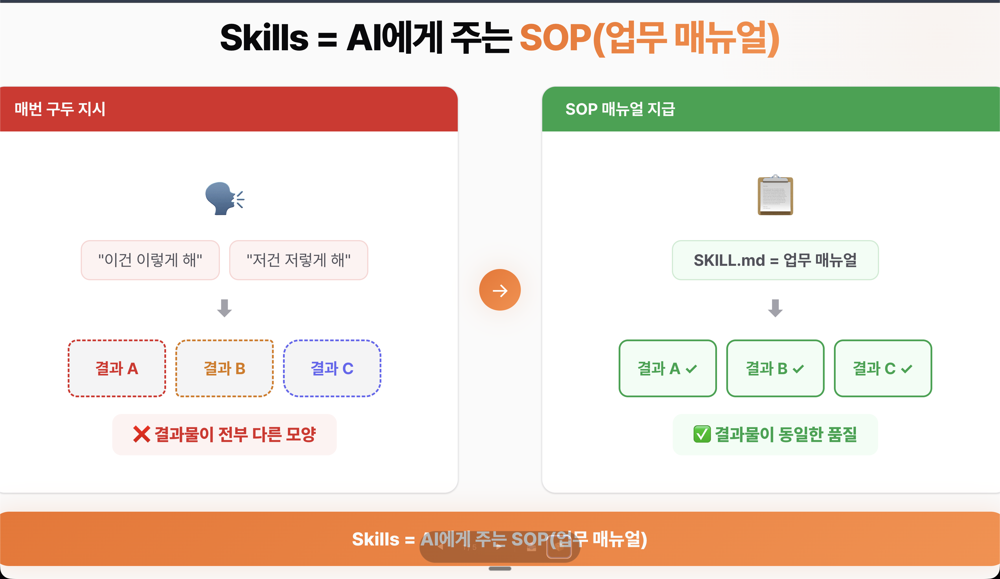

# Claude Code Skills 완벽 가이드 — 제작부터 배포까지


이 가이드는 Claude Code의 Skills 기능을 활용하여 반복 업무를 자동화하는 방법을 설명합니다. 스킬 개념 이해부터 직접 제작, 테스트, 브랜드 커스텀, 플러그인 배포, Cowork 활용까지 전 과정을 다룹니다.

## 목차

- [Skills 개요](#skills-개요)
  - [Skills란 무엇인가?](#skills란-무엇인가)
  - [프롬프트 vs Skills 비교](#프롬프트-vs-skills-비교)
- [Skills 구조 이해하기](#skills-구조-이해하기)
  - [폴더 구조](#폴더-구조)
  - [3계층 로딩 구조](#3계층-로딩-구조)
  - [SKILL.md 기본 템플릿](#skillmd-기본-템플릿)
- [실습: 견적서 스킬 제작](#실습-견적서-스킬-제작)
  - [1. skill-creator 플러그인 설치](#1-skill-creator-플러그인-설치)
  - [2. 스킬 요구사항 정의 및 생성](#2-스킬-요구사항-정의-및-생성)
  - [3. 생성된 SKILL.md 확인](#3-생성된-skillmd-확인)
  - [4. 테스트 및 결과 확인](#4-테스트-및-결과-확인)
  - [5. 브랜드 디자인 적용](#5-브랜드-디자인-적용)
  - [6. 수정사항을 스킬에 반영](#6-수정사항을-스킬에-반영)
- [스킬 배포 및 재사용](#스킬-배포-및-재사용)
  - [방법 1: 개인 스킬 폴더로 이동](#방법-1-개인-스킬-폴더로-이동)
  - [방법 2: 로컬 플러그인으로 등록](#방법-2-로컬-플러그인으로-등록)
- [Cowork에서 활용하기](#cowork에서-활용하기)
- [비개발자를 위한 실전 팁](#비개발자를-위한-실전-팁)
- [트러블슈팅](#트러블슈팅)
- [참고 자료](#참고-자료)

## Skills 개요

### Skills란 무엇인가?

한마디로, **Skills는 AI에게 주는 업무 매뉴얼(SOP)** 입니다.

회사에서 신입사원이 들어왔다고 생각해보세요. 매번 "이건 이렇게 해, 저건 저렇게 해" 하나하나 말로 지시하면, 시키는 사람도 힘들고 결과물도 들쭉날쭉합니다. 그래서 표준운영절차(SOP)를 만듭니다. 한 번 만들어두면 누가 하든 일정한 품질이 나오죠.



**Claude Skills가 바로 SOP입니다.** `SKILL.md` 파일 하나에 절차, 포맷, 체크리스트를 정의해두면, Claude가 알아서 판단하고 일관된 품질로 결과를 만들어줍니다.

n8n이나 Make.com 같은 자동화 툴을 사용해본 분이라면 이렇게 대응시켜 생각하시면 됩니다:

| n8n 워크플로우 | Skills 대응 요소 | 역할 |
|---|---|---|
| Trigger | description (YAML frontmatter) | 언제 이 스킬이 작동할지 정의 |
| Action 노드들 | SKILL.md 본문 | 무엇을 어떤 순서로 할지 절차 정의 |
| Output | 아웃풋 포맷 섹션 | 결과물을 어떤 형식으로 낼지 정의 |

그리고 이 모든 것이 **SKILL.md**라는 마크다운 파일 하나에 들어갑니다. 평소에는 이름과 설명만 시스템에 올라가 있다가, 트리거 조건을 만족하면 그때 전체 내용이 로딩됩니다. 마치 n8n에서 워크플로우가 비활성 상태일 때는 리소스를 안 쓰다가, 트리거되면 실행되는 것과 같은 원리입니다.

### 프롬프트 vs Skills 비교

"그냥 프롬프트를 잘 쓰면 되는 거 아닌가요?" 라고 생각할 수 있는데, 프롬프트와 Skills는 용도가 다릅니다.

| 비교 항목 | 프롬프트 | Skills |
|---|---|---|
| **재사용성** | 매번 처음부터 입력해야 함 | 한 번 만들면 자동 트리거 |
| **일관성** | 같은 요청이어도 결과가 매번 다름 | 포맷/체크리스트로 품질 강제 |
| **확장성** | 텍스트 한 덩어리 | 참조문서 + 스크립트 + 플러그인 연결 가능 |
| **적합한 상황** | 일회성 또는 단순 작업 | 반복적이고 복잡한 업무 자동화 |

> 정리하면, 프롬프트가 **"한 번의 지시"** 라면, Skills는 **"업무 시스템"** 입니다. 한두 번만 할 작업이면 프롬프트로 충분하지만, 반복적으로 일관된 품질이 필요한 작업이라면 Skills가 압도적으로 유리합니다.

## Skills 구조 이해하기

### 폴더 구조

```
.claude/skills/
└── quote-generator/          ← 스킬 폴더
    ├── SKILL.md               ← 핵심 파일 (업무 매뉴얼)
    ├── references/            ← 참고 자료 (선택)
    │   └── template.md
    └── scripts/               ← 스크립트 (선택)
        └── calculate.py
```

### 3계층 로딩 구조

Skills는 토큰 효율을 위해 3계층으로 분리되어 로딩 시점이 다릅니다:

| 계층 | 내용 | 로딩 시점 |
|---|---|---|
| **1계층**: 이름 + 설명 | `name`, `description` (YAML frontmatter) | 항상 시스템에 로딩 |
| **2계층**: SKILL.md 본문 | 절차, 포맷 규칙, 체크리스트 | 트리거 시에만 로딩 |
| **3계층**: 부속 자료 | `references/`, `scripts/` 폴더 | 필요할 때만 온디맨드 로딩 |

- **1계층**: Claude가 "이 스킬이 있구나" 하고 인식하는 부분. YAML frontmatter에 작성합니다.
- **2계층**: 실제 업무 절차, 포맷 규칙, 체크리스트. 스킬의 핵심입니다.
- **3계층**: 템플릿, 참고 문서, 스크립트 등 별도 파일. SKILL.md에서 참조 링크만 걸어두면 Claude가 필요할 때만 읽어옵니다.

### SKILL.md 기본 템플릿

```yaml
---
name: my-skill-name
description: "[핵심 기능 한 줄]. '[트리거 표현1]', '[트리거 표현2]', '[트리거 표현3]' 요청 시 트리거."
---

## 목적
[이 스킬이 해결하는 문제 1~2문장]

## 절차
1. **[단계명]**: [구체적 행동]
2. **[단계명]**: [구체적 행동]
3. **[단계명]**: [구체적 행동]

## 아웃풋 포맷
- 형식: [PDF / 마크다운 / JSON 등]
- 필수 포함 항목: [항목 나열]
- 디자인: [참조 파일 경로]

## 참조 파일
- `references/template.md` — [용도 설명]

## 자체 검증 체크리스트
- [ ] [필수 확인 항목 1]
- [ ] [필수 확인 항목 2]
- [ ] [필수 확인 항목 3]
```

## 실습: 견적서 스킬 제작

이번 실습에서는 **견적서 초안 작성 스킬**을 만들어봅니다. 프리랜서나 에이전시를 운영하시는 분들이라면, 매번 양식 찾아서 항목 채우고 금액 계산하는 번거로운 작업을 스킬 하나로 자동화할 수 있습니다.

### 1. skill-creator 플러그인 설치

스킬을 직접 작성할 수도 있지만, **skill-creator** 도구를 쓰면 훨씬 쉽습니다.

1. Claude Code 터미널에서 `/plugin` 명령어 입력
2. 플러그인 목록에서 **skill-creator** 검색 후 설치
3. 설치 완료 후 `/skill-creator` 명령어 사용 가능

> **참고**: [claudemarketplaces.com](https://claudemarketplaces.com/)에 접속하면 다양한 마켓플레이스가 등록되어 있습니다. 원하는 마켓플레이스를 추가해서 플러그인을 가져다 쓸 수 있습니다. 여기서는 official plugin의 skill-creator만 로드하면 됩니다.

### 2. 스킬 요구사항 정의 및 생성

제작 전에 먼저 `references` 폴더에 견적서 템플릿(invoice-template)을 넣어줍니다.

그다음 skill-creator를 호출합니다. 핵심은 **원하는 것을 한 번에 구체적으로 설명**하는 것입니다:

```
/skill-creator 견적서 초안을 자동 생성하는 스킬을 만들어줘.

- 고객사명, 프로젝트 내용, 업무 항목과 단가를 입력하면 견적서 초안이 나와야 해
- 항목별 금액 테이블, 소계, 부가세(10%), 총합계 자동 계산
- 결제 계좌 정보, 견적 유효기간 (30일) 포함
- 아웃풋은 PDF 파일로 생성
- 자체 검증 체크리스트 포함 (필수 항목 누락 확인)
- "견적서 만들어줘", "견적서 제작해줘" 같은 요청에 자동 트리거

레퍼런스로 이 파일을 참고해서 만들어줘:
@references/invoice-template.pdf

스킬 제작이후 eval test도 진행해줘.
```

원하는 내용, 아웃풋 형태, 트리거 키워드, 참고 파일까지 한 번에 전달하면 skill-creator가 SKILL.md 초안을 자동으로 만들어줍니다.

### 3. 생성된 SKILL.md 확인

생성된 결과의 핵심 부분을 살펴보겠습니다.

**Frontmatter (메타데이터)**:

```yaml
---
name: quote-generator
description: "고객 견적서/제안서 초안을 자동 생성하는 스킬. '견적서 만들어줘', '제안서 작성', '프로젝트 견적', '얼마 불러야 해', '비용 산출' 등의 요청에 트리거된다."
---
```

여기서 중요한 건 **description**입니다. Claude는 키워드 매칭이 아니라 **LLM 추론**으로 "이 요청에 이 스킬이 적합한가?"를 판단합니다. 그래서 사용자가 실제로 쓸 법한 표현들("견적서 만들어줘", "제안서 작성", "얼마 불러야 해")을 넣어주는 게 자동 트리거의 핵심입니다.

본문에는 SOP처럼 단계별 절차, PDF 생성 지시, 자체 검증 체크리스트가 포함되어 있습니다. 프롬프트만 쓰면 매번 "체크리스트 돌려"라고 추가 요청해야 하지만, 스킬에 넣어두면 매번 자동으로 실행됩니다.

### 4. 테스트 및 결과 확인

스킬 생성이 완료되면 바로 테스트할 수 있습니다. Claude에게 견적서 작성을 요청하면 자동으로 `quote-generator` 스킬을 인식하고 실행합니다.

결과물:
- PDF 파일 생성
- 고객사 정보, 항목별 금액 테이블, 소계, 부가세 10%, 총합계 자동 계산
- 결제 조건, 유효기간 포함

eval test를 함께 요청했다면 스킬 적용 전후의 결과 차이 분석과 벤치마크 스코어도 확인할 수 있습니다.

### 5. 브랜드 디자인 적용

기본 결과물의 내용은 충실하지만 디자인이 밋밋할 수 있습니다. 브랜드 가이드라인 파일을 참조로 추가하여 커스텀합니다:

```
피드백 입력을 했으니 반영해서 수정해줘. 
특히 @quote-generator/references/brand-design-guideline.md 을 첨부했으니       
디자인 가이드라인 참고해서 견적서 디자인 자체도                   
브랜드가이드라인에 맞고 좀 더 pdf형태로 클라이언트가 
받았을때 보기 좋게 수정해주면 좋겠어.

- 로고, 색상, 폰트를 가이드라인에 맞춰줘
- 헤더/푸터에 회사 정보 포함
- 전체적으로 전문적이고 깔끔한 느낌으로
```

→ 로고, 색상, 폰트가 가이드라인대로 적용되어 전문적인 견적서가 완성됩니다.

### 6. 수정사항을 스킬에 반영

디자인이 마음에 들면, **이 설정을 스킬 문서에도 반영**하는 것이 중요합니다. 스킬에 반영해두면 다음부터는 자동으로 브랜드 디자인이 적용됩니다.

```
해당 수정사항들 반영해서 스킬을 프로젝트에 반영해줘. 
이때 한글 폰트도 항상 표시가 잘되도록 스킬안에 폰트 설치도 같이 해줘.
```

Claude가 SKILL.md의 아웃풋 섹션에 디자인 가이드라인 참조와 PDF 생성 규칙을 추가해줍니다.

> **핵심 포인트**: 이것이 바로 **만들고 → 쓰고 → 개선하는** 스킬 개선 사이클입니다. 처음부터 완벽할 필요 없이, 쓰면서 점점 정교하게 만들어가면 됩니다.

## 스킬 배포 및 재사용

완성된 스킬은 현재 프로젝트의 `.claude/skills/` 폴더에만 있으므로, 다른 프로젝트에서도 쓰려면 꺼내야 합니다.

### 방법 1: 개인 스킬 폴더로 이동

가장 간단한 방법입니다:

```
~/.claude/skills/              ← 내 모든 프로젝트에서 사용
├── quote-generator/
└── weekly-report/

프로젝트/.claude/skills/       ← 이 프로젝트에서만 사용
├── api-doc-generator/
└── test-writer/
```

`~/.claude/skills/`에 넣어두면, 어떤 프로젝트에서든 "견적서 만들어줘"로 바로 사용할 수 있습니다.

### 방법 2: 로컬 플러그인으로 등록

더 체계적인 방법입니다. 스킬을 플러그인으로 패키징하면 `/plugin`으로 어디서든 설치할 수 있습니다.

```
https://code.claude.com/docs/ko/plugin-marketplaces 가이드 참고하여,
이 quote-generator 스킬을 이 프로젝트 폴더안에서 로컬 플러그인으로 등록해줘.
다른 프로젝트에서도 /plugin로 설치할 수 있게 로컬 마켓플레이스 "citizendev marketplace"로 등록해줘.
```

Claude가 플러그인 구조로 패키징해줍니다. 마켓플레이스 추가:

```bash
/plugin marketplace add /프로젝트-경로/claude-skills/
```

팀 프로젝트라면 이 플러그인을 Git에 올려서 팀원 전체가 동일한 스킬을 공유할 수도 있습니다. SOP를 한 번 만들어두면 팀 전체가 쓰는 것과 같은 개념이죠.

```
해당 플러그인을 Zip file 형태로 제작하여, 코워크에 업로드하기 용이하게 패키징해줘
```
위와 같이 Zip file로 제작하면, 코워크에 설치하기 간편합니다.

## Cowork에서 활용하기

**Cowork**는 데스크톱 앱에서 에이전틱 형태로 AI를 사용할 수 있는 기능입니다. 

**사용 방법**:
1. `/plugins` 명령어로 등록한 플러그인 설치
2. zip file을 업로드하여 플러그인 설치
3. 일반 Claude Code와 동일하게 자연어로 요청
4. 터미널에서 만들든 Cowork에서 만들든, 같은 스킬이니 같은 품질 보장

**테스트 예시**:
```
DEF 스타트업에서 자동화 프로젝트 견적을 요청했어.
AI 자동화 건이고
단가 100만원 기준으로 견적서 만들어줘.
```

→ Cowork에서도 브랜드 디자인이 적용된 PDF 견적서가 동일하게 생성됩니다. 클라이언트와 미팅하면서 실시간으로 견적서를 뽑아볼 수도 있습니다.

## 비개발자를 위한 실전 팁

### description 잘 쓰는 법

description은 스킬 트리거의 핵심입니다. Claude는 LLM 추론으로 판단하므로 사용자가 실제로 말할 법한 다양한 표현을 넣어야 합니다.

| 유형 | 예시 |
|---|---|
| ❌ 나쁜 예 | `"문서를 생성하는 스킬"` (너무 추상적) |
| △ 보통 | `"고객 견적서를 자동 생성합니다"` (트리거 표현 없음) |
| ✅ 좋은 예 | `"견적서/제안서 초안 자동 생성. '견적서 만들어줘', '비용 산출', '가격 책정' 요청 시 트리거."` |

**description 체크리스트**:
- 핵심 기능이 첫 문장에 나와 있는가?
- 사용자가 실제로 말할 법한 표현이 3개 이상 포함되어 있는가?
- 비슷한 다른 스킬과 구별되는 키워드가 있는가?
- 120자 이내로 간결한가?

### 파일 이름과 구조 주의사항

| 항목 | ✅ 올바른 형태 | ❌ 흔한 실수 |
|---|---|---|
| 파일명 | `SKILL.md` (대문자) | `skill.md`, `Skill.MD` |
| 폴더 구조 | `.claude/skills/my-skill/SKILL.md` | `.claude/skills/SKILL.md` (폴더 없이) |
| 폴더명 | `my-skill` (소문자+하이픈) | `My Skill`, `mySkill` |

> ⚠️ **주의**: `skill.md`(소문자)로 만들면 **에러 메시지 없이 조용히 무시**됩니다. 반드시 대문자 `SKILL.md`로 작성하세요.

### 숨김 폴더 접근 방법

`.claude` 폴더는 숨김 폴더이므로 일반적으로 보이지 않습니다:

- **Mac**: Finder에서 `Cmd + Shift + .` 누르면 보입니다
- **Windows**: 파일 탐색기 상단 "보기" → "숨긴 항목" 체크
- **VS Code**: 사이드바에서 자동으로 보입니다


### 자동 트리거가 안 될 때 직접 호출

확실한 실행이 필요하면 슬래시 명령어로 직접 호출하세요:

```
/quote-generator ABC 회사 SNS 콘텐츠 견적서 만들어줘
```

## 트러블슈팅

스킬 사용 중 문제가 발생했을 때 빠르게 대처할 수 있도록 주요 문제와 해결법을 정리합니다.

### 빠른 진단 체크리스트

| 증상 | 1순위 확인 | 해결 방법 |
|---|---|---|
| `/` 입력 시 스킬이 안 보임 | 파일명이 `SKILL.md`(대문자)인가? | 파일명/폴더 구조 수정 |
| 목록에는 있지만 자동 실행 안 됨 | description에 트리거 표현이 있는가? | 자연어 표현 추가 |
| 결과가 매번 다름 | 지시사항 내 모순이 있는가? | 조건부 표현으로 수정 |
| 응답이 중간에 잘림 | 컨텍스트 사용량 확인 | `/compact` 또는 `/clear` 실행 |
| 다른 스킬이 대신 실행됨 | description이 다른 스킬과 유사한가? | description 차별화 |

### 스킬이 목록에 안 보일 때

- 파일명이 `SKILL.md` (대문자)인지 확인
- 폴더 구조가 `.claude/skills/스킬이름/SKILL.md`인지 확인
- 스킬이 20개 이상이면 15,000자 설명 예산 초과 가능 → description 길이를 줄이거나 환경변수 조정:

```bash
SLASH_COMMAND_TOOL_CHAR_BUDGET=30000 claude
```

### 실행은 되지만 결과가 일관되지 않을 때

SKILL.md 안에 모순되는 지시가 있는지 확인하세요:

```markdown
# ❌ 모순되는 지시
"간결하게 작성하세요"
"모든 세부사항을 빠짐없이 포함하세요"

# ✅ 조건부 표현으로 수정
"핵심 항목은 빠짐없이 포함하되, 각 항목의 설명은 1~2문장으로 간결하게"
```

### 참조 파일을 못 읽을 때

```markdown
# ❌ 절대 경로 (다른 환경에서 깨짐)
참고: /Users/kim/project/.claude/skills/quote/references/template.md

# ✅ 상대 경로 사용
참고: references/template.md
```

### 유용한 명령어 정리

| 명령어 | 용도 |
|---|---|
| `/context` | 현재 토큰 사용량 + 제외된 스킬 확인 |
| `/compact` | 대화 기록 수동 압축 (토큰 절약) |
| `/clear` | 새 대화 시작 (컨텍스트 초기화) |
| `claude --debug` | 디버그 로그 (스킬 로드 상태 확인) |
| `/plugin` | 플러그인 관리 메뉴 |

## 참고 자료

- [Extend Claude with Skills (공식 문서)](https://code.claude.com/docs/en/skills)
- [Best Practices (공식 문서)](https://code.claude.com/docs/en/best-practices)
- [Complete Guide to Building Skills (PDF)](https://resources.anthropic.com/hubfs/The-Complete-Guide-to-Building-Skill-for-Claude.pdf)
- [Claude Marketplaces](https://claudemarketplaces.com/)
