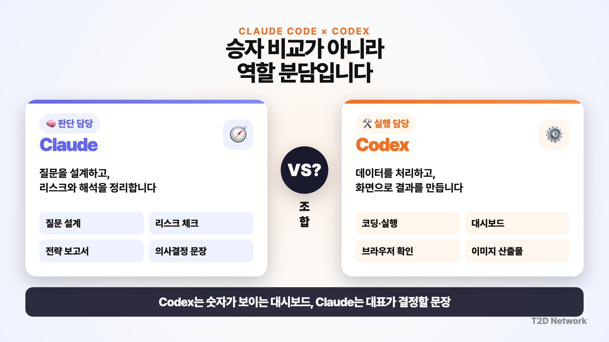
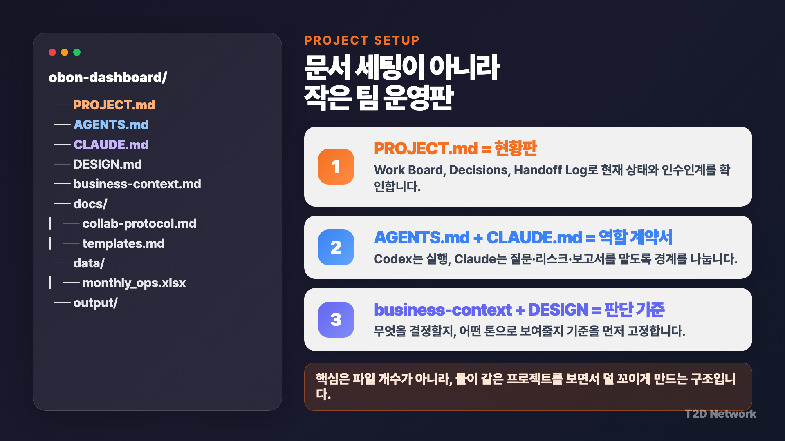
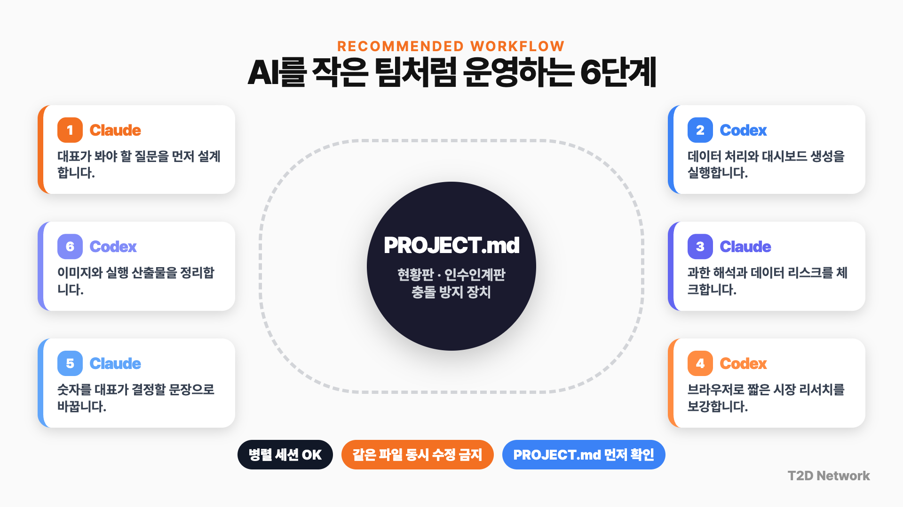

# Claude Code와 Codex를 작은 AI 팀처럼 나눠 쓰는 법


Claude Code와 Codex 중 하나를 고르는 대신, **Codex는 실행 담당**, **Claude Code는 판단 담당**으로 나눠 쓰는 실전 워크플로우 가이드입니다. 예제는 가상의 D2C 라이프스타일 브랜드 `오브온(OBON)`의 월간 운영 데이터를 가지고, 질문 설계 → 대시보드 생성 → 리스크 체크 → 브랜드 리서치 → 대표용 전략 보고서 → 프로모션 이미지 시안까지 이어지는 흐름으로 구성했습니다.

> 📌 예제 프로젝트 폴더는 별도 GitHub 저장소로 공개됩니다.  
> [obon-dashboard 예제 프로젝트](https://github.com/citizendev9c/obon-dashboard)

## 목차

- [이 가이드에서 만드는 것](#이-가이드에서-만드는-것)
- [핵심 개념: 승자 비교가 아니라 역할 분담](#핵심-개념-승자-비교가-아니라-역할-분담)
- [사전 준비](#사전-준비)
- [0단계: Codex와 Claude Code 셋업](#0단계-codex와-claude-code-셋업)
- [1단계: Git으로 되돌릴 수 있는 프로젝트 폴더 만들기](#1단계-git으로-되돌릴-수-있는-프로젝트-폴더-만들기)
- [2단계: 프로젝트 문서 구조 만들기](#2단계-프로젝트-문서-구조-만들기)
- [3단계: Codex 앱에서 프로젝트 열고 Claude Code 함께 쓰기](#3단계-codex-앱에서-프로젝트-열고-claude-code-함께-쓰기)
- [4단계: Claude Code에게 대표 질문 설계 맡기기](#4단계-claude-code에게-대표-질문-설계-맡기기)
- [5단계: Codex에게 대시보드 생성 맡기기](#5단계-codex에게-대시보드-생성-맡기기)
- [6단계: Claude Code에게 리스크 체크 맡기기](#6단계-claude-code에게-리스크-체크-맡기기)
- [7단계: Codex Chrome 플러그인으로 브랜드 공식 계정 리서치하기](#7단계-codex-chrome-플러그인으로-브랜드-공식-계정-리서치하기)
- [8단계: Claude Code로 대표용 전략 보고서 만들기](#8단계-claude-code로-대표용-전략-보고서-만들기)
- [9단계: Codex로 프로모션 이미지 시안 만들기](#9단계-codex로-프로모션-이미지-시안-만들기)
- [전체 워크플로우 한눈에 보기](#전체-워크플로우-한눈에-보기)
- [언제 이 구조를 쓰면 안 되는가](#언제-이-구조를-쓰면-안-되는가)
- [FAQ](#faq)
- [참고 자료](#참고-자료)

---

## 이 가이드에서 만드는 것

| 결과물 | 담당 도구 | 역할 |
|---|---|---|
| `PROJECT.md` | 사람 + 두 AI 공통 | 작업 현황판, 파일 락, 결정 기록, 인수인계 로그 |
| `AGENTS.md` | Codex | Codex가 맡을 실행 규칙 |
| `CLAUDE.md` | Claude Code | Claude Code가 맡을 판단·문서화 규칙 |
| `business-context.md` | 사람 | 오브온의 사업 맥락과 판단 기준 |
| `DESIGN.md` | 사람 | 대시보드와 이미지 산출물의 시각 기준 |
| `docs/collab-protocol.md` | 공통 | 협업 규칙, 락, Handoff Log 형식 |
| `docs/templates.md` | 공통 | 질문, 리스크, 보고서, 인계 문서 구조 |
| `output/questions_may-growth-dashboard.md` | Claude Code | 대표가 봐야 할 질문 설계 |
| `output/dashboard.html` | Codex | 월간 운영 대시보드 |
| `output/analysis_summary_may-growth-dashboard.md` | Codex | 데이터 분석 요약 |
| `output/risk_notes_may-growth-dashboard.md` | Claude Code | 최종 보고서 전 리스크 체크 |
| `output/brand_posts_research_may.xlsx` | Codex | 브랜드 공식 계정 최신 포스트 조사 |
| `output/final_report_may-growth-dashboard.pdf` | Claude Code | 대표용 전략 보고서 |
| `output/promo_image_may-growth-dashboard_01.png` | Codex | 프로모션 이미지 시안 |

핵심은 파일을 많이 만드는 것이 아닙니다. 핵심은 **두 AI가 같은 프로젝트 상태판을 보고, 같은 파일을 동시에 고치지 않게 만드는 것**입니다.

---

## 핵심 개념: 승자 비교가 아니라 역할 분담

Claude Code와 Codex를 비교할 때 흔히 “어느 쪽이 더 좋냐”로 갑니다. 그런데 실무에서는 답이 조금 다릅니다. 한쪽만 고르는 것보다, **어떤 작업을 누구에게 맡길지**가 더 중요합니다.

| 구분 | Claude Code | Codex |
|---|---|---|
| 이 가이드의 역할 | 판단 담당 | 실행 담당 |
| 잘 맡기는 일 | 질문 설계, 리스크 체크, 보고서 문장, 긴 맥락 해석 | 데이터 처리, 코드 실행, 대시보드 생성, 브라우저 확인, 이미지 생성 |
| 선호 환경 | CLI, `claude agents`, 백그라운드 세션 | Codex 앱, 프로젝트 폴더, 터미널, 브라우저/Chrome 플러그인 |
| 주의점 | 구현 파일을 직접 덮어쓰지 않게 하기 | 최종 전략 문서를 임의로 다시 쓰지 않게 하기 |
| 연결 장치 | `PROJECT.md`의 Work Board / Decisions / Handoff Log | `PROJECT.md`의 Work Board / Files locked / Handoff Log |

> 💡 비유하면, Codex는 “손발이 빠른 실행팀”, Claude Code는 “질문을 잡고 판단하는 전략팀”입니다. 둘 사이에 `PROJECT.md`라는 현황판을 두면 작은 AI 팀처럼 운영할 수 있습니다.



이 그림처럼 두 도구를 “누가 더 똑똑한가”로 비교하지 말고, 내 업무 안에서 어떤 역할을 맡길지 먼저 나누는 것이 핵심입니다.

---

## 사전 준비

| 준비물 | 왜 필요한가 | 참고 링크 |
|---|---|---|
| Claude Code | 질문 설계, 리스크 체크, 보고서 작성 | [Claude Code Agent view 공식 문서](https://code.claude.com/docs/en/agent-view) |
| Codex 앱 | 프로젝트 폴더 기반 실행, 터미널, 브라우저, 이미지 작업 | [Codex 앱 공식 문서](https://developers.openai.com/codex/app) |
| Git | 작업 되돌리기, 변경 기록, 예제 프로젝트 공개 | [Git 공식 사이트](https://git-scm.com/) |
| GitHub 계정 | 예제 프로젝트 저장소 공개 | [GitHub](https://github.com/) |
| RTK 선택사항 | 긴 명령 출력 압축, 토큰 절약 | [rtk-ai/rtk](https://github.com/rtk-ai/rtk) |
| 예제 데이터 | 월간 운영 스프레드시트 | [obon-dashboard 예제 프로젝트](https://github.com/citizendev9c/obon-dashboard) |

가격, 사용량 제한, 플랜 정책은 계속 바뀔 수 있습니다. 이 가이드는 특정 가격표를 고정해서 설명하기보다, **업무를 어떻게 나눠 맡길지**에 집중합니다.

---

## 0단계: Codex와 Claude Code 셋업

### Codex 앱 준비

1. ChatGPT에 로그인합니다.
2. Codex 섹션에서 Codex 앱을 설치합니다.
3. Codex 앱에서 프로젝트 폴더를 열 수 있는지 확인합니다.
4. 필요한 경우 Codex Chrome 플러그인도 설치합니다.

| Codex 기능 | 이 가이드에서 쓰는 장면 |
|---|---|
| 프로젝트 폴더 | `obon-dashboard` 폴더를 통째로 열기 |
| Built-in terminal | 프로젝트 안에서 명령 실행 |
| In-app browser | 대시보드 HTML 확인 |
| Chrome extension | 로그인된 Chrome 세션으로 브랜드 공식 계정 확인 |
| 이미지 생성/편집 | 프로모션 이미지 시안 제작 |

> ⚠️ 브라우저 리서치는 항상 “보이는 것만 기록”해야 합니다. 구매 전환처럼 화면에 없는 지표를 추정하면 안 됩니다.

### Claude Code 준비

Claude Code가 설치되어 있다면 프로젝트 폴더에서 실행합니다.

```bash
cd obon-dashboard
claude
```

여러 Claude Code 세션을 한 화면에서 관리하고 싶다면 Agent view를 엽니다.

```text
claude agents
```

영상에서는 이 화면에서 `question-designer`, `risk-reviewer` 같은 역할 프롬프트를 주는 방식으로 사용했습니다. 여기서 중요한 것은 “진짜 별도 직원을 만든다”보다, **역할이 다른 백그라운드 세션을 분리해서 쓰는 것**입니다.

### RTK 선택사항: 긴 출력 줄이기

RTK는 `git status`, `git diff`, `grep`, `pytest`, `npm test`처럼 출력이 긴 명령을 AI가 읽기 좋게 압축해주는 CLI 도구입니다. 필수는 아니지만, Claude Code나 Codex가 긴 로그를 자주 읽는 프로젝트라면 도움이 됩니다.

| 사용 위치 | 권장 방식 | 예시 |
|---|---|---|
| Claude Code | hook 초기화 후 Bash 명령 자동 압축 | `rtk init -g` |
| Codex | Codex용 초기화 또는 명시 호출 | `rtk init -g --codex` |
| 수동 사용 | 긴 명령 앞에 `rtk` 붙이기 | `rtk git status`, `rtk git diff` |

설치 예시:

```bash
brew install rtk
rtk --version
rtk init -g
rtk init -g --codex
```

설치와 최신 사용법은 공식 저장소를 참고하여 클로드코드나 코덱스에게 설치를 요청하세요.

- [RTK 공식 GitHub 저장소](https://github.com/rtk-ai/rtk)

---

## 1단계: Git으로 되돌릴 수 있는 프로젝트 폴더 셋업 요청하기

영상에서는 이미 프로젝트 폴더가 준비된 상태에서 시작했습니다. 실제로 따라 할 때도 터미널 명령어를 하나씩 외울 필요는 없습니다. **Codex나 Claude Code에게 “Git으로 되돌릴 수 있는 프로젝트 구조를 만들어달라”고 요청**하면 됩니다.

아래 프롬프트를 그대로 붙여넣고, 저장소 이름이나 폴더 이름만 본인 상황에 맞게 바꾸세요.

```text
obon-dashboard라는 프로젝트 폴더를 Git으로 되돌릴 수 있는 구조로 셋업해줘.

목표:
- 현재 위치에 obon-dashboard 프로젝트 폴더를 만든다.
- docs, data, scripts, output, archive 폴더를 만든다.
- .gitignore를 만들어서 임시 파일, 환경 변수 파일, 로그, 패키지 폴더, 가상환경 폴더가 커밋되지 않게 한다.
- Git 저장소를 초기화하고, 현재 기본 구조를 첫 커밋으로 남긴다.
- GitHub 원격 저장소도 연결할 수 있게 준비한다.
- 원격 저장소 주소는 아래를 사용한다.
  git@github.com:citizendev9c/obon-dashboard.git

주의:
- .env, node_modules, .venv, __pycache__, *.log, .DS_Store는 커밋하지 않게 처리해줘.
- 작업 전에는 어떤 파일과 폴더를 만들지 먼저 짧게 설명해줘.
- 작업 후에는 만든 파일/폴더, 첫 커밋 여부, 원격 저장소 연결 여부를 요약해줘.
- 권한 문제로 GitHub 업로드가 실패하면, 실패 원인과 내가 직접 해야 할 조치만 알려줘.
```

> 📌 이 예제 프로젝트가 공개되면 시청자는 아래 링크에서 전체 폴더 구조를 확인할 수 있습니다.  
> https://github.com/citizendev9c/obon-dashboard

### 왜 Git을 먼저 잡아야 하나요?

| 상황 | Git이 없을 때 | Git이 있을 때 |
|---|---|---|
| Codex가 파일 여러 개 수정 | 뭐가 바뀌었는지 확인 어려움 | 변경된 파일과 내용을 비교해 확인 가능 |
| Claude Code와 Codex가 번갈아 작업 | 덮어쓰기 위험 커짐 | 커밋 단위로 되돌리기 가능 |
| 예제 프로젝트 공유 | 폴더 압축 전달 필요 | GitHub 링크 하나로 공유 |
| 실험 실패 | 수동 복구 | 이전 커밋 상태로 복구 가능 |

---

## 2단계: 프로젝트 문서 구조 만들기

영상에서 사용한 기본 구조입니다.

```text
obon-dashboard/
  AGENTS.md
  CLAUDE.md
  PROJECT.md
  DESIGN.md
  business-context.md
  docs/
    collab-protocol.md
    templates.md
  data/
    monthly_ops.xlsx
  scripts/
  output/
  archive/
```

각 문서의 역할은 다음과 같습니다.

| 파일 | 역할 | 누가 주로 읽나 |
|---|---|---|
| `PROJECT.md` | 현재 상태판. Work Board, Decisions, Handoff Log 관리 | Claude Code, Codex 모두 |
| `AGENTS.md` | Codex 작업 지침. 데이터 처리, 대시보드, 이미지 산출물 규칙 | Codex |
| `CLAUDE.md` | Claude Code 작업 지침. 질문 설계, 리스크 체크, 보고서 작성 규칙 | Claude Code |
| `business-context.md` | 사업 맥락. 어떤 상품을 왜 밀어야 하는지 판단 기준 | 두 AI 모두 |
| `DESIGN.md` | 대시보드와 이미지의 색상, 톤, 금지사항 | 주로 Codex |
| `docs/collab-protocol.md` | 협업 방식. Work Board, 파일 락, 인계 규칙 | 두 AI 모두 |
| `docs/templates.md` | 산출물 템플릿. 질문, 리스크, 보고서, 인계 문서 구조 | 두 AI 모두 |

### PROJECT.md의 핵심 구조

`PROJECT.md`는 길게 쓰는 기획서가 아니라 **작업 현황판**입니다.

| 섹션 | 용도 | 예시 |
|---|---|---|
| Goal | 이 프로젝트가 해결할 일 | 다음 달 밀 상품과 콘텐츠 방향 결정 |
| Work Board | 지금 누가 어떤 파일을 만지는지 | `output/dashboard.html`은 Codex가 작업 중 |
| Decisions | 이미 확정된 운영 규칙 | 같은 파일 동시 수정 금지 |
| Handoff Log | 작업 종료 후 한 줄 인계 | changed / verified / next |

핵심은 Work Board의 `Files locked`입니다. Codex가 `output/dashboard.html`을 만들고 있으면 Claude Code는 그 파일을 직접 고치지 않고, 리뷰나 리스크 노트만 남깁니다.



이 구조에서 `PROJECT.md`는 단순 메모장이 아니라, 두 AI가 함께 보는 현황판입니다. `AGENTS.md`와 `CLAUDE.md`는 각 도구의 역할 계약서이고, `business-context.md`와 `DESIGN.md`는 판단 기준입니다.

---

## 3단계: Codex 앱에서 프로젝트 열고 Claude Code 함께 쓰기

1. Codex 앱을 엽니다.
2. `obon-dashboard` 폴더를 프로젝트로 엽니다.
3. Codex 앱 우측 상단의 터미널을 엽니다.
4. 터미널에서 Claude Code Agent view를 실행합니다.

```text
claude agents
```

이렇게 하면 Codex 앱 안에서 Codex 작업과 Claude Code 세션을 같이 볼 수 있습니다.

| 화면 | 하는 일 |
|---|---|
| Codex 앱 메인 | 데이터 분석, 대시보드 생성, 브라우저 확인 |
| Codex 터미널 | `claude agents` 실행 |
| Claude Agent view | 질문 설계, 리스크 체크 등 백그라운드 세션 관리 |
| VS Code 선택사항 | 파일 구조와 산출물 직접 확인 |

---

## 4단계: Claude Code에게 대표 질문 설계 맡기기

대시보드를 바로 만들기 전에 먼저 “대표가 어떤 질문에 답해야 하는지”를 정합니다. 이 단계는 Claude Code에게 맡깁니다.

```text
PROJECT.md, docs/collab-protocol.md, business-context.md, docs/templates.md를 읽고, 오브온 대표가 이번 달 운영 스프레드시트에서 봐야 할 질문을 설계해줘.

오늘 작업 slug는 may-growth-dashboard로 둔다.

조건:
- 원천 데이터와 대시보드 파일은 직접 수정하지 말 것
- Codex가 분석할 수 있도록 질문과 지표 정의만 작성
- 결과는 docs/templates.md의 questions_<slug>.md 구조에 맞춰 output/questions_may-growth-dashboard.md로 저장
- 산출물 작성 전 PROJECT.md Work Board에 output/questions_may-growth-dashboard.md 락을 잡고, 완료 후 해제
- PROJECT.md Handoff Log에 docs/collab-protocol.md 형식대로 changed/verified/next가 보이게 1줄 남길 것
- 최종 목표는 다음 달에 밀 제품, 고칠 제품, 콘텐츠 메시지를 결정하는 것
- 구매 전환처럼 일반 인스타 포스트에서 확인 어려운 지표는 제외
```

### 이 단계에서 나와야 하는 결과

| 결과물 | 확인할 내용 |
|---|---|
| `output/questions_may-growth-dashboard.md` | 대표가 봐야 할 질문 3~7개 |
| `PROJECT.md` Work Board | 작업 중에는 락이 잡혔다가 완료 후 해제됐는지 |
| `PROJECT.md` Handoff Log | Claude Code가 무엇을 만들었고 다음 작업이 무엇인지 |

이 질문 문서가 있어야 Codex가 단순 매출 순위표가 아니라, **의사결정에 필요한 대시보드**를 만들 수 있습니다.

---

## 5단계: Codex에게 대시보드 생성 맡기기

Claude Code가 질문을 설계했다면, 이제 Codex에게 실행을 맡깁니다.

```text
PROJECT.md, docs/collab-protocol.md, business-context.md, DESIGN.md, docs/templates.md와 Claude가 만든 output/questions_may-growth-dashboard.md를 읽고 작업해줘.

목표:
- 작업 slug는 may-growth-dashboard로 둔다.
- PROJECT.md의 Work Board를 확인하고, Files locked에 output/dashboard.html과 output/analysis_summary_may-growth-dashboard.md 락을 잡은 뒤 시작한다.
- data/monthly_ops.xlsx를 분석한다.
- sales, survey, instagram 시트를 연결해서 대표용 성장 대시보드를 만든다.
- 대시보드의 색상, 카드, 차트 톤은 DESIGN.md 기준을 따른다.
- output/dashboard.html 생성
- docs/templates.md의 analysis_summary_<slug>.md 구조에 맞춰 output/analysis_summary_may-growth-dashboard.md 생성

대시보드에 포함할 것:
1. 이번 달 매출 상위 상품
2. 만족도와 재구매 의향이 높은 상품
3. 인스타 저장/공유 반응이 좋은 콘텐츠 주제
4. 다음 달 우선순위: 밀 제품 / 고칠 제품 / 멈출 캠페인
5. 데이터 누락이나 이상치 경고

제약:
- 구매 전환은 계산하지 말 것
- 보이지 않는 인스타 지표를 추정하지 말 것
- 작업이 끝나면 PROJECT.md Work Board 락을 해제하고, Handoff Log에 changed/verified/next 형식으로 1줄 남길 것
```

### 대시보드에서 봐야 할 포인트

| 화면 요소 | 확인 질문 |
|---|---|
| 매출 상위 상품 | 많이 팔린 상품이 무엇인가? |
| 만족도 / 재구매 의향 | 장기적으로 건강한 상품은 무엇인가? |
| 인스타 저장 / 공유 | 콘텐츠 메시지로 밀 만한 주제는 무엇인가? |
| 액션 우선순위 | 다음 달에 밀 제품, 고칠 제품, 멈출 캠페인은 무엇인가? |
| 데이터 경고 | 누락, 이상치, 추정 금지 영역이 표시되는가? |

영상 예시에서는 “선물세트는 매출이 높지만 환불과 불만도 같이 올라올 수 있고, 룸스프레이는 만족도와 재구매 의향이 건강하다”는 식으로 해석합니다. 중요한 것은 숫자를 보여주는 데서 끝나는 것이 아니라, **대표가 다음 행동을 결정할 수 있게 만드는 것**입니다.

---

## 6단계: Claude Code에게 리스크 체크 맡기기

대시보드와 분석 요약이 나오면 바로 최종 보고서를 쓰기 전에 리스크를 봅니다.

```text
PROJECT.md, docs/collab-protocol.md, business-context.md, docs/templates.md, output/analysis_summary_may-growth-dashboard.md를 읽고,
최종 보고서 작성 전에 확인해야 할 리스크만 정리해줘.

조건:
- 원천 데이터와 대시보드 파일 수정 금지
- 데이터에 없는 내용을 추정하지 말 것
- 대시보드에서 과하게 해석한 부분이 있으면 지적
- 결과는 docs/templates.md의 risk_notes_<slug>.md 구조에 맞춰 output/risk_notes_may-growth-dashboard.md에 저장
- 산출물 작성 전 PROJECT.md Work Board에 output/risk_notes_may-growth-dashboard.md 락을 잡고, 완료 후 해제
- PROJECT.md Handoff Log에 changed/verified/next를 남길 것
```

### 리스크 체크 기준

| 리스크 | 왜 중요한가 | 대응 |
|---|---|---|
| 데이터에 없는 구매 전환 추정 | 화면에 없는 지표를 본 것처럼 말하면 신뢰가 깨짐 | “구매 전환은 이번 데이터로 판단 불가” 표시 |
| 인스타 공개 지표 누락 | 지역/로그인 상태에 따라 보이는 지표가 다름 | 보이는 값만 기록, 안 보이면 공란 |
| 상품 메시지 과장 | 향 제품에서 효능 표현은 위험할 수 있음 | 루틴/분위기/사용 장면 중심 표현 |
| 같은 파일 동시 수정 | AI 둘이 같은 파일을 고치면 충돌 발생 | Work Board의 Files locked 확인 |

---

## 7단계: Codex Chrome 플러그인으로 브랜드 공식 계정 리서치하기

이번에는 시장 리서치를 아주 작게 붙입니다. 크롤링처럼 크게 가지 않고, 브랜드 공식 계정 2개만 봅니다.

```text
PROJECT.md와 docs/collab-protocol.md, business-context.md를 먼저 읽고,
chrome plugin으로 official.nonfiction,tamburinsofficial 브랜드 공식 인스타 계정 2개를 열고,각 계정의 최신 공개 포스트 5개만 확인해줘.
포스트별로 이미지/영상이 여러 장이면 캐러샐을 넘기면서 다 확인 및 수집해줘.

작업 slug는 brand-posts-may로 둔다.

수집할 필드:
- 브랜드명
- 게시일, 보이면 기록
- 제품 또는 캠페인 주제
- 전체 카피
- 이미지/영상 스타일
- 포맷: 릴스, 캐러셀, 이미지
- 공개 반응 지표: 좋아요, 댓글, 조회수 등 보이는 것만
- CTA
- 오브온이 참고할 포인트 1줄

제약:
- 개인 계정 정보 수집 금지
- 댓글 본문 수집 금지
- 보이지 않는 지표 추정 금지
- 결과는 output/brand_posts_research_may.xlsx에 저장
- 시작 전 PROJECT.md Work Board에 output/brand_posts_research_may.xlsx 락을 잡고, 완료 후 해제
- 작업 후 PROJECT.md Handoff Log에 changed/verified/next 형식으로 1줄 남길 것
```

### 공개 브랜드 리서치 가드레일

| 허용 | 금지 |
|---|---|
| 브랜드 공식 계정 최신 공개 포스트 확인 | 개인 계정 정보 수집 |
| 보이는 좋아요, 댓글 수, 조회수 기록 | 보이지 않는 구매 전환 추정 |
| 이미지/영상 스타일, CTA, 카피 정리 | 댓글 본문 대량 수집 |
| 오브온이 참고할 포인트 1줄 | 의학적 효능이나 과장 광고 문구 도출 |

---

## 8단계: Claude Code로 대표용 전략 보고서 만들기

이제 Claude Code가 최종 보고서를 작성합니다. 이유는 단순합니다. 대시보드는 숫자를 보여주지만, 대표가 필요한 것은 “그래서 다음 달에 무엇을 할 것인가”입니다.

```text
PROJECT.md, docs/collab-protocol.md, business-context.md, DESIGN.md, docs/templates.md를 먼저 읽고,
Codex가 만든 output/dashboard.html, output/analysis_summary_may-growth-dashboard.md,
Claude의 `risk-reviewer` 역할 세션이 남긴 output/risk_notes_may-growth-dashboard.md,
Codex가 정리한 output/brand_posts_research_may.xlsx를 참고해서
대표용 최종 전략보고서 PDF를 pdf스킬 활용해서 작성해줘.

목표:
- 다음 달에 밀 제품 1개
- 개선해야 할 제품 또는 메시지 1개
- 인스타 콘텐츠 방향 3개
- 리스크 3개
- 바로 실행할 액션 5개

톤:
- 대표가 5분 안에 읽고 결정할 수 있게
- 숫자 나열보다 의사결정 중심
- 과장 금지
- 구매 전환처럼 데이터에 없는 내용은 쓰지 말 것

출력:
- docs/templates.md의 final_report_<slug>.pdf 구조를 따른다.
- output/final_report_may-growth-dashboard.pdf
- 작성 전 PROJECT.md Work Board에 output/final_report_may-growth-dashboard.pdf 락을 잡고, 완료 후 해제한다.
- 작성 후 PROJECT.md Handoff Log에 changed/verified/next 형식으로 1줄 남긴다.
```

### 좋은 보고서의 기준

| 기준 | 나쁜 보고서 | 좋은 보고서 |
|---|---|---|
| 결론 | “매출이 높았습니다” | “다음 달에는 룸스프레이를 선물세트 안에 넣고 루틴 메시지로 밀어야 합니다” |
| 근거 | 숫자 나열 | 근거 지표 2~3개 + 액션 연결 |
| 리스크 | 없음 | 데이터에 없는 영역과 과장 위험 표시 |
| 읽는 시간 | 길고 자세함 | 대표가 5분 안에 결정 가능 |

---

## 9단계: Codex로 프로모션 이미지 시안 만들기

보고서에서 추천 메시지가 나오면 Codex에게 이미지 시안을 맡길 수 있습니다.

```text
PROJECT.md, docs/collab-protocol.md, DESIGN.md, Claude가 작성한 output/final_report_may-growth-dashboard.pdf를 읽고,
추천 메시지를 바탕으로 다음 달 인스타 프로모션 이미지 시안 2개를 만들어줘.

제약:
- DESIGN.md의 색상, 이미지 톤, 금지사항을 따를 것
- 실제 브랜드 로고 사용 금지
- 오브온 가상 브랜드명만 사용
- 과장 광고 문구 금지
- 결과는 output/promo_image_may-growth-dashboard_01.png, output/promo_image_may-growth-dashboard_02.png로 저장
- 시작 전 PROJECT.md Work Board에 이미지 파일 락을 잡고, 완료 후 해제
- PROJECT.md Handoff Log에 changed/verified/next 형식으로 1줄 남길 것
```

### 이미지 시안에서 확인할 것

| 확인 항목 | 이유 |
|---|---|
| 실제 브랜드 로고를 쓰지 않았는가 | 외부 브랜드 시각 정체성 복제 방지 |
| `DESIGN.md` 색상과 톤을 따랐는가 | 프로젝트 기준 유지 |
| 과장 광고 문구가 없는가 | 향 제품 특성상 효능 단정 위험 |
| 파일명이 slug 규칙을 따르는가 | 다음 actor가 이어받기 쉬움 |
| Work Board 락이 해제됐는가 | 다음 작업 충돌 방지 |

---

## 전체 워크플로우 한눈에 보기



전체 흐름은 6단계로 볼 수 있습니다.

| 단계 | 담당 | 하는 일 | 핵심 산출물 |
|---|---|---|---|
| 1 | Claude Code | 대표가 봐야 할 질문 설계 | `questions_<slug>.md` |
| 2 | Codex | 데이터 처리와 대시보드 생성 | `dashboard.html`, `analysis_summary_<slug>.md` |
| 3 | Claude Code | 해석 과잉과 데이터 리스크 점검 | `risk_notes_<slug>.md` |
| 4 | Codex | 브랜드 공식 계정 리서치 | `brand_posts_research_<slug>.xlsx` |
| 5 | Claude Code | 대표용 전략 보고서 작성 | `final_report_<slug>.pdf` |
| 6 | Codex | 이미지/실행 산출물 제작 | `promo_image_<slug>_01.png` |

중앙에는 항상 `PROJECT.md`가 있습니다. 병렬 세션은 가능하지만, 같은 파일을 동시에 수정하지 않는 것이 이 구조의 안전장치입니다.

---

## 언제 이 구조를 쓰면 안 되는가

두 AI를 같이 쓰는 구조는 강력하지만, 모든 작업에 필요한 것은 아닙니다.

| 상황 | 왜 안 맞는가 | 추천 방식 |
|---|---|---|
| 이메일 한 통 쓰기 | 협업 문서가 오버킬 | Claude 또는 Codex 하나만 사용 |
| 짧은 요약 | 파일 락과 인계가 불필요 | 하나의 채팅에서 처리 |
| 간단한 코드 수정 | 역할 분담보다 즉시 수정이 빠름 | 한 도구로 수정 후 Git diff 확인 |
| 공용 현황판 없이 병렬 작업 | 서로 같은 파일을 덮어쓸 위험 | `PROJECT.md` 먼저 만들기 |
| 같은 파일 동시 수정이 필요한 작업 | 충돌 가능성이 큼 | 순차 작업 또는 명확한 파일 분리 |

기준은 단순합니다. **반복되는 업무이고, 산출물이 여러 개이며, 판단과 실행처럼 특정 기준으로 나눠 운영할 가치가 있을 때** 이 구조를 쓰세요.

---

## 운영 체크리스트

작업을 시작하기 전에 아래를 확인하세요.

| 체크 | 질문 |
|---|---|
| 프로젝트 상태판 | `PROJECT.md`에 Goal, Work Board, Decisions, Handoff Log가 있는가? |
| 역할 계약 | `AGENTS.md`와 `CLAUDE.md`가 서로의 역할을 침범하지 않게 되어 있는가? |
| 파일 락 | 산출물 작업 전 Work Board에 `Files locked`를 잡는가? |
| 템플릿 | `docs/templates.md`에 산출물 구조가 정의되어 있는가? |
| 데이터 제한 | 보이지 않는 지표를 추정하지 않는가? |
| Git 커밋 | 큰 변경 전후로 커밋 또는 stash가 되어 있는가? |
| 인계 로그 | 작업 종료 시 Handoff Log에 changed / verified / next를 남기는가? |

---

## FAQ

### Q1. Claude Code와 Codex를 꼭 둘 다 구독해야 하나요?

아닙니다. 이 가이드는 “둘 다 써야 한다”가 아니라, 이미 두 도구를 쓰고 있거나 비교 중인 분들이 **업무를 어떻게 나눠 맡기면 덜 꼬이는지**를 보여주는 구조입니다. 하나만 써도 충분한 작업은 하나만 쓰는 게 더 효율적입니다.

### Q2. `PROJECT.md`가 꼭 필요한가요?

두 도구를 번갈아 쓰거나 백그라운드 세션을 여러 개 띄운다면 필요합니다. `PROJECT.md`는 기억장이 아니라 현황판입니다. 누가 어떤 파일을 만지는지, 어떤 결정이 끝났는지, 다음 작업이 무엇인지 한눈에 보이게 해줍니다.

### Q3. RTK는 꼭 설치해야 하나요?

필수는 아닙니다. 다만 `git diff`, `grep`, 테스트 로그처럼 출력이 긴 명령을 AI가 자주 읽는다면 도움이 됩니다. 설치 전에는 공식 저장소의 최신 안내를 확인하세요.

### Q4. Codex와 Claude Code가 같은 파일을 동시에 고치면 안 되나요?

가능하면 피하세요. 영상 구조의 핵심은 “병렬 세션은 가능하지만 같은 파일 동시 수정은 금지”입니다. 같은 파일을 만져야 한다면 한쪽이 먼저 끝내고 Handoff Log를 남긴 뒤 다음 도구가 이어받는 식이 안전합니다.

---

## 참고 자료

| 자료 | 링크 |
|---|---|
| 예제 프로젝트 폴더 | [citizendev9c/obon-dashboard](https://github.com/citizendev9c/obon-dashboard) |
| Claude Code Agent view 공식 문서 | https://code.claude.com/docs/ko/agent-view |
| Claude Code Subagents 공식 문서 | https://code.claude.com/docs/ko/sub-agents |
| Codex 앱 공식 문서 | https://developers.openai.com/codex/app |
| Codex 앱 기능 문서 | https://developers.openai.com/codex/app/features |
| Codex 앱 브라우저 문서 | https://developers.openai.com/codex/app/browser |
| Codex Chrome Extension 문서 | https://developers.openai.com/codex/app/chrome-extension |
| RTK 공식 GitHub 저장소 | https://github.com/rtk-ai/rtk |

---

## 한 줄 요약

Claude Code와 Codex를 같이 쓸 때 핵심은 성능 비교가 아니라 **역할 위임**입니다. Codex는 실행하고, Claude Code는 판단하고, `PROJECT.md`는 둘 사이의 현황판이 됩니다.
