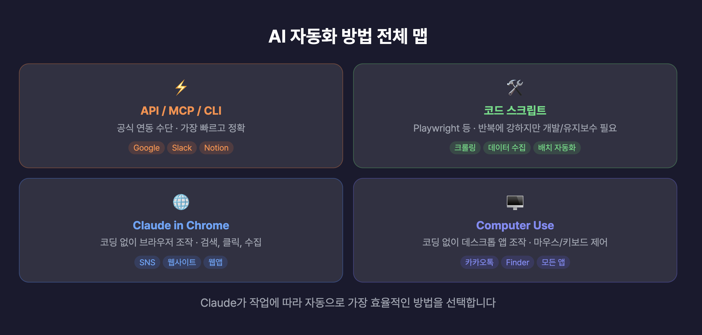
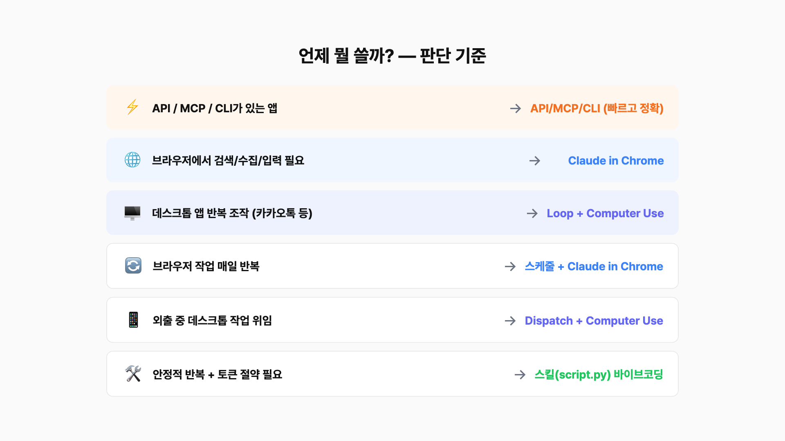

# Computer Use & Claude in Chrome 완전 가이드


API가 없는 앱도 AI로 자동화하는 방법 — Computer Use와 Claude in Chrome의 설정, 활용 시나리오, 한계점까지 정리한 종합 가이드입니다.

## 목차

- [개요](#개요)
- [자동화 방법 전체 맵](#자동화-방법-전체-맵)
- [설정 가이드](#설정-가이드)
  - [Computer Use 설정](#computer-use-설정)
  - [Claude Code CLI 추가 설정](#claude-code-cli-추가-설정)
  - [Claude in Chrome 설정](#claude-in-chrome-설정)
- [활용 시나리오](#활용-시나리오)
  - [시나리오 1: 카카오톡 매출 브리핑 자동 전송 (Computer Use)](#시나리오-1-카카오톡-매출-브리핑-자동-전송-computer-use)
  - [시나리오 2: 웹사이트 벤치마크 분석 (Claude in Chrome)](#시나리오-2-웹사이트-벤치마크-분석-claude-in-chrome)
  - [시나리오 3: X 트렌드 수집 + 네이버 지도 크롤링 (Claude in Chrome)](#시나리오-3-x-트렌드-수집--네이버-지도-크롤링-claude-in-chrome)
- [스킬화 + 스케줄 + Dispatch 활용](#스킬화--스케줄--dispatch-활용)
  - [스케줄 + Claude in Chrome — 브라우저 작업 자동화](#스케줄--claude-in-chrome--브라우저-작업-자동화)
  - [Computer Use + Dispatch — 데스크톱 앱 원격 위임](#computer-use--dispatch--데스크톱-앱-원격-위임)
- [한계점 및 주의사항](#한계점-및-주의사항)
- [판단 기준 — 언제 뭘 쓸까?](#판단-기준--언제-뭘-쓸까)
- [FAQ](#faq)

## 개요

AI 자동화 시스템을 구축할 때 가장 답답한 순간은, 자동화하고 싶은 서비스에 API나 MCP, CLI 같은 연동 수단이 없을 때입니다.

예를 들어 매일 아침 매출 데이터를 정리해서 카카오톡으로 팀에 보내야 하는 상황을 생각해보면, 카카오톡에는 개인 채팅용 API가 없기 때문에 n8n이나 Make 같은 자동화 도구로도 처리가 불가능합니다. 웹사이트 데이터 수집도 마찬가지로, 사이트마다 구조가 다르고 봇 차단이 있어서 크롤링 스크립트 유지보수가 부담됩니다.

Anthropic이 발표한 **Computer Use**와 **Claude in Chrome**은 이런 문제를 해결하기 위한 기능입니다.

- **Computer Use**: AI가 데스크톱 화면을 보면서 마우스와 키보드를 직접 조작
- **Claude in Chrome**: 크롬 브라우저 안에서 클릭, 타이핑, 스크롤 등을 코딩 없이 수행

> **참고**: Computer Use는 리서치 프리뷰 단계, Claude in Chrome은 베타 단계입니다. 리서치 프리뷰는 베타보다 더 초기 단계이므로 Computer Use 쪽의 제약이 더 많습니다.

## 자동화 방법 전체 맵

AI로 업무를 자동화하는 방법은 크게 네 가지입니다.



### 1. API / MCP / CLI 연동

앱이 공식적으로 제공하는 연동 수단을 활용하는 방식입니다. 구글 캘린더 API로 일정을 만들거나, 노션 MCP 서버로 데이터를 읽고 쓰거나, NotebookLM CLI 도구로 명령어를 실행하는 방식입니다. **가장 빠르고 정확하고 저렴합니다.**

참고로, 공식 API가 없더라도 커뮤니티에서 Playwright 기반 CLI를 만들어 비공식으로 자동화하는 경우도 있습니다(예: NotebookLM). 다만 이런 도구가 없는 앱은 여전히 자동화하기 어렵습니다.

### 2. 코드 스크립트

Playwright 같은 도구로 크롤링이나 데이터 수집 스크립트를 직접 짜는 방식입니다. Claude Code에 바이브코딩으로 짜달라고 하면 코드를 직접 쓸 줄 몰라도 만들 수 있습니다. 한 번 잘 만들어두면 토큰 비용 없이 돌릴 수 있다는 것이 장점이지만, 사이트 UI가 바뀌면 코드를 수정해야 하고 유지보수 부담이 있습니다.

### 3. Claude in Chrome

크롬 브라우저 확장 프로그램으로, 코딩 없이 브라우저 안에서 클릭, 타이핑, 스크롤 등을 수행합니다. API가 없는 웹사이트에서 정보 검색, 폼 입력, 데이터 수집 작업에 적합합니다.

### 4. Computer Use

코딩 없이 AI가 데스크톱 화면을 스크린샷으로 보면서 마우스와 키보드를 직접 조작합니다. 카카오톡 같은 데스크톱 앱을 제어할 수 있고, 브라우저도 읽기 전용으로 확인할 수 있습니다.

### 네 가지 방법 비교

| 방법 | 속도 | 정확도 | 비용 | 적용 범위 |
|------|------|--------|------|-----------|
| API / MCP / CLI | 가장 빠름 | 가장 정확 | 저렴 | API 있는 앱만 |
| 코드 스크립트 | 빠름 | 높음 | 저렴 (토큰 無) | 개발 가능한 범위 |
| Claude in Chrome | 빠름 | 높음 | 중간 | 브라우저 안 모든 웹사이트 |
| Computer Use | 느림 | 보통 | 비쌈 (토큰 多) | 데스크톱 앱 전부 |

> **핵심 포인트**: Claude는 작업을 받으면 자동으로 가장 효율적인 방법을 선택합니다. API가 있으면 API를, 브라우저 작업이면 Chrome 확장을, 데스크톱 앱이면 Computer Use를 사용합니다.

## 설정 가이드

### Computer Use 설정

#### 사전 요구사항

- **Mac** (현재 macOS만 지원. Windows는 Anthropic이 지원 예정이라고 밝혔으나 구체적 일정은 미공개)
- **Claude Pro 이상 구독** ($20/월~)
- **Claude 데스크톱 앱** (최신 버전)

#### 설정 순서

1. Claude 데스크톱 앱 실행 → **Settings** → **General**
2. 아래로 스크롤하여 **"Computer Use"** 옵션 → **활성화**
3. Mac **시스템 설정**(Privacy & Security)에서 다음 권한 허용:
   - **접근성(Accessibility)** 권한
   - **화면 녹화(Screen Recording)** 권한

> 이 설정은 Cowork, Claude Code 모두 동일하게 적용됩니다.

### Claude Code CLI 추가 설정

터미널에서 Claude Code를 사용하는 경우 추가 설정이 필요합니다.

```bash
# Claude Code 세션에서 /mcp 입력
/mcp
```

1. 목록에서 `computer-use` 선택 → **Enable**
2. 프로젝트 단위로 저장되므로 한 번만 설정하면 됩니다
3. 목록에 보이지 않으면 세션을 종료한 후 재시작

### Claude in Chrome 설정

#### 설치 순서

1. **Chrome 웹스토어**에서 "Claude in Chrome" 확장 프로그램 설치
2. Claude 데스크톱 앱 → **Settings** → **Connectors**에서 "Claude in Chrome"이 활성화되어 있는지 확인 (기본값: INCLUDED)
3. **Settings** → **Desktop app** → **General** → **"Browser Use"** → **"Allow all browser actions"** 토글 ON
4. Claude Code CLI에서 사용하려면:
   - 시작 시: `claude --chrome`으로 시작
   - 세션 중: `/chrome`으로 활성화

> **보안 참고**: "Allow all browser actions"를 켜면 Claude가 모든 웹사이트에서 묻지 않고 조작할 수 있습니다. 편리하지만 보안 리스크가 있으므로, Claude 전용 구글 계정을 별도로 만들어서 사용하는 것도 좋은 방법입니다.

#### 앱별 권한 허용

Computer Use는 앱별로 권한을 별도로 허용해야 합니다. 처음 카카오톡을 사용하려 하면 "카카오톡 사용을 허용하시겠습니까?"라고 묻습니다. **한 세션 내에서 한 번만 허용하면 됩니다.**

## 활용 시나리오

### 시나리오 1: 카카오톡 매출 브리핑 자동 전송 (Computer Use)

카카오톡은 한국에서 업무용으로 가장 많이 쓰이지만, 개인/그룹 채팅 API가 없어서 n8n이나 Make로도 자동화가 불가능했습니다. Computer Use로 이 문제를 해결할 수 있습니다.

#### 프롬프트 예시

```
Downloads/revenue 폴더에 있는 3월_매출.xlsx 파일을 확인하고, 서비스유형별 매출 현황을 요약해줘.
그리고 카카오톡 '마케팅팀' 채팅방에 요약 내용을 한줄씩 잘라서 전송하지말고 한 메세지로 정리해서 보내고,
원본 엑셀 파일도 첨부해서 Computer use 사용해서 보내줘.
```

#### 실행 과정

1. 엑셀 파일을 읽어서 매출 데이터를 분석 (Claude의 기본 코드 실행 능력)
2. 요약 내용을 정리
3. Computer Use 시작 → 카카오톡 앱 권한 요청 → 허용
4. 카카오톡 열기 → 채팅 목록에서 '마케팅팀' 방 탐색
5. 채팅방에 요약 내용 타이핑 후 전송
6. Finder에서 엑셀 파일을 찾아 카카오톡 채팅창에 드래그하여 전송

#### 현실적인 평가

- **속도**: 사람이 직접 하면 10초, Computer Use는 30초~1분 소요
- **토큰 소비**: 일반 작업 대비 높음
- **실용성**: 내가 컴퓨터 앞에 있다면 직접 하는 게 빠름. **Dispatch와 결합하여 외출 중 원격 실행 시 가장 유용**

> **추천 활용법**: 외출 중에 폰으로 "매출 정리해서 팀 카톡방에 보내줘" 한 줄만 보내면, 사무실 맥에서 알아서 처리하는 방식이 가장 현실적입니다.

### 시나리오 2: 웹사이트 벤치마크 분석 (Claude in Chrome)

경쟁사 웹사이트를 AI가 직접 살펴보고 UI/UX 분석 리포트를 작성하는 시나리오입니다.

#### 프롬프트 예시

```
이 https://xyz.com/ 웹사이트(URL)를 열어서 메인 페이지, 메뉴 아이콘의 각 메뉴 섹션을 순서대로 확인해줘.
각 페이지의 UI/UX 강점과 약점을 분석하고, 구씨컴퍼니의 AI 자동화 웹사이트 제작에 참고할 만한 인사이트를 정리해줘.
```

#### 실행 과정

1. 브라우저가 열리고 해당 웹사이트로 이동
2. 메인 페이지 스크린샷을 찍고 분석
3. 스크롤하면서 여러 섹션 확인
4. 다음 페이지로 이동하여 같은 과정 반복
5. 최종 분석 리포트 정리

> **핵심 포인트**: 이 작업은 브라우저에서 페이지를 탐색하면서 분석해야 하므로, Claude가 자동으로 Claude in Chrome을 선택합니다.

#### 현실적인 평가

- 사람이 직접 경쟁사 사이트 5개를 꼼꼼히 분석하면 반나절 소요
- Claude in Chrome으로 약 10분 만에 리포트 생성 가능
- **Computer Use보다 실용적** — 시간 절감 효과가 확실함

### 시나리오 3: X 트렌드 수집 + 네이버 지도 크롤링 (Claude in Chrome)

검색어 입력이 필요한 브라우저 작업을 테스트하는 시나리오입니다. Computer Use는 브라우저에서 읽기만 가능하고, 검색어 입력이나 버튼 클릭은 안 됩니다. 이런 작업은 Claude in Chrome이 담당합니다.

#### 3-1: X에서 Claude Code 트렌드 확인

**프롬프트 예시:**

```
Chrome에서 X.com을 열고, Explore 탭에서 'claude code'를 검색해서,
TOP순으로 상위 10개 포스트를 확인하고,
지금 Claude Code 관련해서 X에서 주로 논의되는 주제를 5가지로 요약해줘.
```

**실행 과정:** Chrome이 열리고 → X에서 검색 → 스크롤하면서 포스트 읽기 → 트렌드 요약

#### 3-2: 네이버 지도에서 맛집 정보 수집

**프롬프트 예시:**

```
Chrome에서 네이버 지도를 열고, '성수동 맛집'으로 검색해서,
리스트에 뜨는 음식점 상위 10개의 이름, 카테고리(한식/일식/양식/중식), 평점, 리뷰 개수를
정리해서 엑셀 파일로 만들어줘.
```

**실행 과정:** 네이버 지도는 Claude in Chrome으로 시도 시 보안 차단에 걸림 → Claude가 자동으로 **Playwright MCP로 폴백**하여 접근 시도

#### 핵심 교훈: 폴백(Fallback) 동작

모든 웹사이트가 한 가지 방법으로 다 되는 것은 아닙니다.

- **X(Twitter)**: Claude in Chrome으로 정상 작동
- **네이버 지도**: 보안 차단으로 Claude in Chrome 실패 → 다른 방식으로 자동 전환

사이트마다 보안/차단 방식이 다르기 때문에, 실제로 사용할 때는 직접 테스트하면서 가장 잘 되는 방법을 찾아야 합니다. 안 되면 아래처럼 직접 방법을 지시할 수도 있습니다:

```
Claude in Chrome 대신 Playwright frame api로 접근해봐
```

> **핵심 포인트**: Claude가 하나의 방법이 안 되면 자동으로 다른 방법을 시도하는 폴백 과정 자체가 매우 유용합니다. 결국 작동하는 방식을 찾으면 그 방식으로 자동화를 설정할 수 있습니다.

## 스킬화 + 스케줄 + Dispatch 활용

매번 수동으로 지시하는 대신, 스킬, 스케줄, Dispatch를 활용하면 훨씬 효율적으로 사용할 수 있습니다.

### 스케줄 + Claude in Chrome — 브라우저 작업 자동화

스케줄과 가장 잘 맞는 것은 **Claude in Chrome(브라우저 작업)** 입니다. 스킬을 별도로 만들 필요 없이, 스케줄에 프롬프트를 직접 넣으면 됩니다.

#### 스케줄 프롬프트 예시

```
Chrome에서 X.com을 열고, 'claude code'를 검색해서,
TOP순 상위 10개 포스트를 확인하고,
주요 논의 주제를 5가지로 요약해서 content 폴더에 오늘 날짜로 마크다운 파일을 저장해줘.
```

반복 주기를 **매일 아침 10시**로 설정하면, 매일 출근 시 X 트렌드 요약이 이미 정리되어 있습니다.

> **작동 원리**: Claude in Chrome의 "Allow all browser actions" 설정은 세션을 넘어서 유지되기 때문에, 스케줄 실행 시에도 별도 승인 없이 바로 작동합니다.

#### 반복 크롤링 대안

반복 크롤링이 필요한 경우, Claude Code에 Playwright 크롤링 스크립트를 짜달라고 해서 스케줄에 거는 방법도 있습니다. 스크립트 실행 자체는 토큰을 쓰지 않으므로 비용 절감이 가능합니다. 다만 사이트 UI가 바뀌면 코드 수정이 필요하고, 봇 탐지가 강한 사이트는 오히려 Claude in Chrome이 잘 통과하는 경우도 있습니다.

### Computer Use + Dispatch — 데스크톱 앱 원격 위임

카카오톡 같은 **데스크톱 앱 조작(Computer Use)** 은 현재 스케줄과 조합이 어렵습니다.

#### 스케줄 연동이 안 되는 이유

Computer Use의 앱 권한은 **"Allow for this session"** — 세션 단위로만 허용됩니다. 스케줄 작업은 매번 새 세션으로 실행되는데, 새 세션마다 앱 승인을 수동으로 해야 하므로 무인 실행이 불가능합니다.

#### 스케줄 연동 가능 여부 정리

| 조합 | 가능 여부 | 이유 |
|------|-----------|------|
| API/MCP 작업 + 스케줄 | ✅ 가능 | 커넥터 설정이 영구 유지 |
| Claude in Chrome + 스케줄 | ✅ 가능 | "Allow all browser actions" 영구 유지 |
| Computer Use + 스케줄 | ❌ 불가 (현재) | 앱 권한이 세션 단위, 수동 승인 필요 |
| Computer Use + Loop | ⚠️ 우회 가능 | 같은 세션 유지 → 앱 권한 유지 |

#### Loop를 활용한 우회 방법

스케줄은 안 되지만, **Loop 기능으로 우회가 가능합니다.** Loop은 같은 세션 안에서 일정 간격으로 작업을 반복 실행하는 기능으로, 세션이 유지되므로 처음 한 번만 앱 권한을 승인하면 이후로는 자동 실행됩니다.

- 세션이 끊기지 않는 한 며칠이고 반복 가능
- 다만 Loop은 약 일주일 정도 지나면 만료되므로 재설정이 필요

#### Dispatch 활용 시나리오

Dispatch는 폰의 Claude 앱에서 지시하면 사무실 맥에서 실행되는 기능입니다. Computer Use가 실행 중에 화면을 점유하기 때문에 데스크톱에서 동시 작업이 불편하지만, Dispatch 상황에서는 어차피 컴퓨터 앞에 없으므로 문제가 되지 않습니다.

**Dispatch + Computer Use 활용 예시:**

```
다운로드 폴더에서 제안서 파일 찾아서 카카오톡 '세일즈팀' 채팅방에 보내줘
```

```
이번 주 일정 확인해서 카카오톡 팀 방에 공유해줘
```

```
이번달 세일즈 프레젠테이션 파일을 내 4시 미팅 일정에 첨부해줘
```

> **참고**: Mac이 깨어 있어야 합니다. Settings에 "Keep computer awake" 옵션을 켜두면 유휴 잠자기는 방지됩니다. 단, 노트북 뚜껑을 닫으면 잠자기 모드에 들어가므로 유의하세요.

## 한계점 및 주의사항

### 한계 1: Computer Use는 느리고 토큰을 많이 소비

스크린샷 찍고 → 분석하고 → 클릭하는 사이클 하나에 3~5초 소요됩니다. 토큰 소모량도 일반 작업 대비 훨씬 높습니다. API나 Chrome 확장으로 할 수 있는 작업에 Computer Use를 쓰는 것은 비효율적이므로, **다른 방법이 없을 때만** 사용하는 것이 맞습니다.

### 한계 2: Computer Use에서 브라우저는 읽기 전용

Computer Use로 브라우저를 열어서 볼 수는 있지만, 클릭이나 타이핑은 안 됩니다. 검색이 필요한 브라우저 작업은 반드시 Claude in Chrome을 사용해야 합니다.

### 한계 3: 정확도 이슈

스크린샷 기반이므로 작은 버튼이나 복잡한 UI에서는 엉뚱한 곳을 클릭할 수 있습니다.

### 한계 4: 플랫폼과 플랜 제한

| 기능 | 지원 플랫폼 | 지원 플랜 |
|------|------------|-----------|
| Computer Use | Mac 전용 | Pro, Max |
| Claude in Chrome | Mac, Windows (Chrome 브라우저) | Pro, Max, Team, Enterprise |

Windows Computer Use 지원은 Anthropic이 예정이라고만 밝혔고, 구체적 일정은 미공개입니다.

### 한계 5: 실행 중 화면 점유

Computer Use가 작동하면 다른 앱들이 숨겨지고 화면을 점유합니다. 노트북 하나로 다른 작업을 하면서 동시에 Computer Use를 돌리기는 어렵습니다. Dispatch(외출 중 원격 지시)나 자리를 비울 때 실행하는 것이 가장 현실적입니다.

### 한계 6: 스케줄 자동 실행 제한

Computer Use의 앱 권한이 세션 단위이므로 스케줄 무인 실행이 불가합니다. Loop 기능으로 우회는 가능하지만, 약 일주일 후 만료되어 재설정이 필요합니다. 안정화되면 영구 승인 옵션이 추가될 가능성이 높습니다.

### 한계 7: 모든 웹사이트가 되는 것은 아님

사이트마다 보안/차단 방식이 달라서 어떤 사이트는 Claude in Chrome으로 되고, 어떤 사이트는 안 됩니다. Claude가 자동으로 여러 방법을 폴백하며 시도하지만, 결국 사이트마다 직접 테스트해야 합니다.

### 한계 8: 차단 영역

은행, 증권, 의료 시스템 등은 Anthropic이 기본 차단해두었으며, CAPTCHA가 나오면 사람이 직접 해결해야 합니다.

## 판단 기준 — 언제 뭘 쓸까?



| 상황 | 추천 방식 |
|------|-----------|
| API / MCP / CLI 있는 앱 | API / MCP / CLI (빠르고 정확) |
| 브라우저에서 검색/입력 필요 | Claude in Chrome |
| 데스크톱 앱 조작 필요 | Computer Use |
| 브라우저 작업 매일 반복 | Claude in Chrome + 스케줄 |
| 외출 중 데스크톱 작업 위임 | Computer Use + Dispatch |
| 반복 크롤링 (비용 절감) | 코드 스크립트 (바이브코딩) |

> 한계가 답답하다면, Claude Code에 바이브코딩으로 자동화 스크립트를 짜달라고 하는 것도 방법입니다. 한 번 잘 만들어두면 토큰 비용도 아끼고 더 안정적으로 돌릴 수 있습니다. 상황에 따라 코딩 없이 빠르게 갈지, 코드로 단단하게 갈지 선택하면 됩니다.

## FAQ

### Q: Computer Use를 사용하려면 어떤 환경이 필요한가요?
A: Mac(macOS), Claude Pro 이상 구독($20/월~), Claude 데스크톱 앱 최신 버전이 필요합니다. Windows는 아직 지원되지 않습니다.

### Q: Claude in Chrome과 Computer Use의 차이점은 무엇인가요?
A: Claude in Chrome은 크롬 브라우저 안에서 클릭/타이핑/스크롤이 가능한 확장 프로그램이고, Computer Use는 데스크톱 전체 화면을 스크린샷으로 보면서 마우스/키보드를 조작하는 기능입니다. 브라우저 작업은 Claude in Chrome이 더 빠르고 정확하며, 카카오톡 같은 데스크톱 앱 조작은 Computer Use만 가능합니다.

### Q: Computer Use로 브라우저에서 검색이 가능한가요?
A: 아닙니다. Computer Use로는 브라우저를 열어서 읽기만 가능하고, 검색어 입력이나 버튼 클릭은 안 됩니다. 검색이 필요한 브라우저 작업은 Claude in Chrome을 사용해야 합니다. 잘 알려지지 않은 브라우저로는 가능한 경우도 있지만, 언제든 막힐 수 있습니다.

### Q: Claude는 어떤 방법을 사용할지 자동으로 선택하나요?
A: 네, Claude는 작업 내용에 따라 자동으로 가장 효율적인 방법을 선택합니다. API가 있으면 API를, 브라우저 작업이면 Claude in Chrome을, 데스크톱 앱이면 Computer Use를 선택합니다. 하나의 방법이 실패하면 자동으로 다른 방법으로 폴백하기도 합니다.

### Q: 스케줄로 매일 자동 실행이 가능한가요?
A: Claude in Chrome 작업은 스케줄 자동 실행이 가능합니다("Allow all browser actions" 설정이 세션을 넘어 유지되므로). Computer Use는 앱 권한이 세션 단위라서 스케줄 무인 실행이 불가하며, Loop 기능으로 같은 세션을 유지하면서 반복하는 우회 방법은 있습니다.

### Q: 보안 관련 주의사항이 있나요?
A: "Allow all browser actions"를 켜면 Claude가 모든 웹사이트에서 자유롭게 조작할 수 있어 보안 리스크가 있습니다. Claude 전용 구글 계정을 별도로 만들어 사용하는 것을 권장합니다. 또한 은행, 증권, 의료 시스템은 Anthropic이 기본 차단해두었습니다.

### Q: 모든 웹사이트에서 Claude in Chrome이 작동하나요?
A: 아닙니다. 사이트마다 보안/차단 방식이 달라서 어떤 사이트는 되고 어떤 사이트는 안 됩니다(예: X는 되지만 네이버 지도는 차단). 안 되는 경우 "Playwright로 접근해봐" 같은 식으로 직접 방법을 지시할 수 있습니다.

### Q: 비용이 얼마나 드나요?
A: Claude Pro 구독($20/월)이 기본이고, Computer Use는 스크린샷 기반이라 토큰 소모가 높습니다. Claude in Chrome은 중간 수준입니다. 반복 작업의 비용을 줄이려면 Claude Code로 크롤링 스크립트를 짜서 토큰 없이 실행하는 방법도 있습니다.
