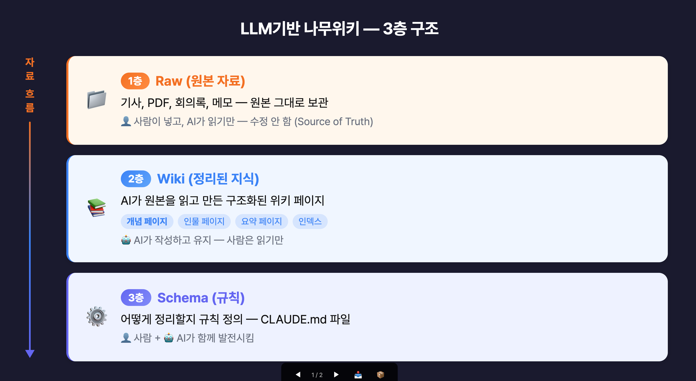
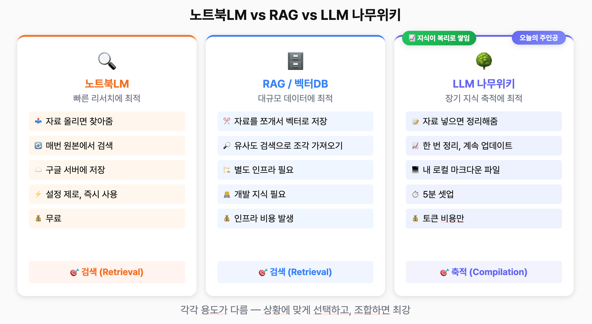

# LLM 나무위키 — AI가 관리하는 나만의 지식 베이스 구축 가이드


Andrej Karpathy가 공개한 LLM Wiki 아이디어를 기반으로, Claude Code와 Obsidian을 활용해 개인 지식을 복리로 축적하는 시스템을 만드는 방법을 안내합니다.

## 목차

- [개념 소개](#개념-소개)
  - [왜 지식이 축적되지 않는가](#왜-지식이-축적되지-않는가)
  - [3층 구조](#3층-구조)
  - [3가지 운영 방법](#3가지-운영-방법)
- [기존 방식과 비교](#기존-방식과-비교)
- [셋업 실습](#셋업-실습)
  - [1. Obsidian 설치](#1-obsidian-설치)
  - [2. Claude Code 실행 및 초기 프롬프트](#2-claude-code-실행-및-초기-프롬프트)
  - [3. Obsidian Web Clipper 설치](#3-obsidian-web-clipper-설치)
- [실무 활용 — 자료 넣기](#실무-활용--자료-넣기)
  - [시나리오 1: 업계 동향 리서치 축적](#시나리오-1-업계-동향-리서치-축적)
  - [시나리오 2: 시장 조사 위키화](#시나리오-2-시장-조사-위키화)
  - [시나리오 3: 업무 기록을 지식으로 축적](#시나리오-3-업무-기록을-지식으로-축적)
  - [시나리오 4: 독서 인사이트 축적](#시나리오-4-독서-인사이트-축적)
- [위키 활용 — 질문하기](#위키-활용--질문하기)
- [한계와 비용](#한계와-비용)
- [FAQ](#faq)

## 개념 소개

### 왜 지식이 축적되지 않는가

우리가 평소에 AI를 쓰는 방식은 **매번 처음부터 찾는** 구조입니다. ChatGPT에 파일을 올리거나, NotebookLM에 자료를 넣어도 마찬가지입니다. 어제 했던 분석이 오늘에 반영되지 않고, 지식이 축적되지 않습니다.

Andrej Karpathy(전 Tesla AI 총괄, OpenAI 창립 멤버)가 2026년 4월에 공개한 [LLM Wiki 아이디어](https://gist.github.com/karpathy/442a6bf555914893e9891c11519de94f)는 이 문제를 정면으로 해결합니다. AI가 자료를 받으면 그냥 저장하는 게 아니라, 읽고, 핵심을 정리하고, 기존에 정리해둔 내용과 연결하고, 모순이 있으면 플래그까지 달아놓습니다. 한 번 정리해두면, 새로운 자료가 들어왔을 때 기존 정리 위에 쌓이는 구조입니다.

> 주식처럼 지식이 **복리**로 불어나는 구조입니다.

### 3층 구조



| 층 | 이름 | 역할 | 누가 관리하나 |
|---|---|---|---|
| 최상위 | **Schema** (`CLAUDE.md`) | 위키를 어떤 구조로 관리할지 규칙 정의 | 사람이 설정 |
| 중간 | **Wiki** (`wiki/` 폴더) | AI가 원본을 읽고 정리해서 만든 지식 페이지 | AI가 작성·관리, 사람은 읽기만 |
| 최하위 | **Raw** (`raw/` 폴더) | 기사, PDF, 회의록, 메모 등 원본 자료 | 사람이 넣고, AI는 읽기만 |

### 3가지 운영 방법

1. **넣기**: 자료를 `raw/` 폴더에 넣고 "이거 정리해"라고 하면, AI가 읽고 위키 페이지를 생성합니다. 자료 하나를 넣으면 관련 위키 페이지가 10~15개 동시에 업데이트됩니다.
2. **물어보기**: "이 주제에 대해 뭐가 있지?" 하고 질문하면, AI가 이미 정리된 위키에서 답변합니다. 매번 원본을 다시 뒤지는 게 아니라, 정리해놓은 걸 보고 답변하니까 빠르고 정확합니다.
3. **건강검진 (Lint)**: 주기적으로 "위키 상태 점검해봐"라고 하면, AI가 페이지 간 모순, 오래된 정보, 빠진 내용을 확인해줍니다.

> Karpathy 원문: "사람이 위키를 포기하는 이유는 관리 부담이 지식보다 빠르게 증가하기 때문이다. LLM은 지루해하지 않고, 교차참조 업데이트를 잊지 않으며, 한 번에 15개 파일을 수정할 수 있다."

역할을 정리하면 이렇습니다:
- **Obsidian** = 뷰어 (정리된 결과를 보여주는 도구)
- **Claude Code** = 편집자 (자료를 읽고 정리해주는 AI)
- **나무위키** = 거기에 쌓이는 내 지식, 내 노하우

## 기존 방식과 비교



| 구분 | NotebookLM | RAG / 벡터DB | LLM 나무위키 |
|---|---|---|---|
| 작동 방식 | 자료 올리면 찾아줌 | 자료를 쪼개서 벡터로 저장, 유사도 검색 | 자료 넣으면 정리해줌 |
| 지식 축적 | 매번 원본에서 검색 | 매번 유사 조각 검색 | 한 번 정리, 계속 업데이트 |
| 데이터 저장 | 구글 서버 | 별도 클라우드 인프라 | 내 로컬 마크다운 파일 |
| 설정 난이도 | 설정 제로 | 개발 지식 필요 | 5분 셋업 |
| 최적 용도 | 빠른 리서치 | 대규모 데이터 | 장기 지식 축적 |
| 비용 | 무료 | 인프라 비용 발생 | 토큰 비용만 |

> Karpathy 원문: "NotebookLM, ChatGPT 파일 업로드, 그리고 대부분의 RAG 시스템은 이 방식으로 작동한다. 작동은 하지만, LLM이 매번 질문할 때마다 처음부터 지식을 재발견한다. 축적이 없다."

**상황별 추천:**
- 자료 10~20개 빠르게 훑어보고 요약 → **NotebookLM**
- 기업 규모로 수십만 건 문서 처리 → **RAG**
- 개인/소규모 팀이 6개월~1년에 걸쳐 업무 지식을 체계적으로 축적 → **LLM 나무위키**

세 가지를 상황에 따라 함께 사용하는 것이 가장 효율적입니다.

## 셋업 실습

필요한 것은 딱 두 가지입니다: **Obsidian**(무료)과 **Claude Code**.

### 1. Obsidian 설치

1. [obsidian.md](https://obsidian.md) 사이트에서 운영체제에 맞는 버전을 다운로드합니다.
2. 설치 후 실행하면 "Create new vault" 옵션이 나옵니다.
3. 원하는 이름을 지정합니다 (예: "my-wiki").
4. 이미 폴더를 생성했다면 "Open Folder"로 해당 폴더를 지정해도 됩니다.

### 2. Claude Code 실행 및 초기 프롬프트

터미널에서 방금 만든 vault 폴더로 이동한 다음, Claude Code를 실행합니다.

```bash
cd ~/path/to/my-wiki
claude --dangerously-skip-permissions
```

Claude Code가 실행되면, 아래 프롬프트를 붙여넣습니다. `[내가 주로 넣을 자료]` 부분만 본인 상황에 맞게 수정하면 됩니다.

```
나만의 지식/노하우 위키를 만들어줘.

아래 Karpathy의 LLM Wiki 아이디어를 참고해서 구현해:
https://gist.github.com/karpathy/442a6bf555914893e9891c11519de94f

이 프로젝트는 내 업무와 학습에서 쌓이는 지식을 축적하는 나만의 나무위키야.
자료를 넣으면 네가 읽고 정리해서 위키로 만들어주고, 나는 필요할 때 질문하면 돼.

나는 {{나의 직업/역할}}을(를) 하고 있어.
내가 주로 넣을 자료:
- {{자료 유형 1: 예) 업계 동향 기사, 경쟁사 분석 자료}}
- {{자료 유형 2: 예) 프로젝트 회의록, 의사결정 기록}}
- {{자료 유형 3: 예) 읽은 책에서 얻은 인사이트, 멘탈모델}}
- {{자료 유형 4: 예) 강연/교육에서 배운 노하우}}
- {{자료 유형 5: 예) 개인 프로젝트 기록, 삽질 기록}}

다음을 만들어줘:
1. CLAUDE.md — 위키 관리 규칙 (Schema). 자료 넣기/질문하기/건강검진 3가지 운영 방법 정의
2. raw/ 폴더 — 원본 자료 보관 (내가 넣고, 너는 읽기만)
3. wiki/ 폴더 — 정리된 지식 저장 (네가 작성하고 관리)
4. wiki/index.md — 전체 목차 (자료 넣을 때마다 업데이트)
5. wiki/log.md — 작업 이력

raw와 wiki 안에는 하위 폴더 없이 플랫하게 관리해줘. 분류는 index.md에서 카테고리별로 정리하면 돼.
위키 페이지는 마크다운으로 작성하고, 페이지 간 [[위키링크]]로 교차참조해.

{{선택사항: 사업/업무 맥락 파일이 있다면 아래 줄 추가}}
먼저 {{맥락 파일 경로}} 파일을 읽어서 내 사업 미션, 방향성, 타겟 고객을 파악해줘.

중요한 규칙:
모든 위키 페이지의 맨 앞에 > callout 블록으로 "내 비즈니스/방향성 관점에서의 핵심 takeaway"를 먼저 넣어줘.
내 미션과 방향성을 고려했을 때 이 내용에서 내가 가져가야 할 핵심이 뭔지를 첫 문단에서 바로 확인할 수 있게.
그 아래에 구체적 내용이 오도록 해줘.

항상 페이지를 wiki에 추가할때 교차참조를 적극적으로 활용해줘.
```

> **팁**: "서로 다른 자료 간에 의외의 연결점이 있으면 적극적으로 연결해줘"라고 한 마디 추가하면, AI가 단순 정리를 넘어서 기사와 책 인사이트 사이의 연결, 경쟁사 동향과 내 프로젝트 사이의 공통점 같은 것을 알아서 잡아줍니다.

프롬프트를 실행하면 Claude Code가 폴더 구조(`raw/`, `wiki/`)와 `CLAUDE.md` 파일을 자동으로 생성합니다. 약 2분이면 기본 세팅이 완료됩니다.

### 3. Obsidian Web Clipper 설치

웹에서 기사를 바로 `raw/` 폴더에 저장하기 위한 브라우저 확장 프로그램입니다.

1. [obsidian.md/clipper](https://obsidian.md/clipper)에서 브라우저에 맞는 버전을 설치합니다 (Chrome, Safari, Firefox 등 지원).
2. 확장 프로그램 설정에서 왼쪽 **Templates** 메뉴 > **Default** 클릭
3. **Note location** 필드를 `Clippings` → `raw`로 변경
4. **Vault**를 본인이 만든 위키 vault로 지정

이제 웹 브라우징 중 기사를 클립하면 자동으로 `raw/` 폴더에 마크다운으로 저장됩니다.

## 실무 활용 — 자료 넣기

### 시나리오 1: 업계 동향 리서치 축적

매주 읽는 업계 기사를 Web Clipper로 `raw/` 폴더에 저장한 뒤, Claude Code에 처리를 요청합니다.

```
raw 폴더에 새로운 기사가 추가됐습니다. 읽고 위키에 반영해주세요.
```

기사 하나에서 주요 인물 페이지, 핵심 개념 페이지, 기사 요약 페이지 등 여러 위키 페이지가 생성되고, 인덱스도 자동으로 업데이트됩니다.

### 시나리오 2: 시장 조사 위키화

링크만 던지면 AI가 사이트에서 정보를 추출해 `raw/`에 정리해줍니다.

```
아래 사이트들에서 {{조사하고 싶은 주제}} 관련 정보를 조사해서
raw에 정리해줘:

https://example1.com
https://example2.com
https://example3.com
```

### 시나리오 3: 업무 기록을 지식으로 축적

프로젝트 기록, 회의록, 작업 대본 등을 `raw/`에 넣으면 AI가 각 기록에서 다룬 주제, 사용한 도구, 핵심 개념들을 위키로 정리해줍니다.

### 시나리오 4: 독서 인사이트 축적

Karpathy도 원문에서 직접 언급한 활용법입니다. 책을 읽으면서 느낀 점을 대충 적어서 넣으면 됩니다.

```
'생각에 관한 생각' 읽었는데, 시스템1/시스템2 개념이 인상깊었어.
빠른 판단이 편향을 만든다는 거.
사업 의사결정할 때 시스템2를 의식적으로 써야겠다는 생각이 들었어.
정리해서 raw에 넣어줘.
```

3줄짜리 메모라도 "기억해두고 싶다" 싶으면 넣으세요. 정리는 AI가 해줍니다.

### 일괄 처리 및 자동화

다양한 자료가 쌓였으면 한 번에 처리할 수 있습니다.

```
raw에 아직 처리하지 않은 자료 10개를 찾아서 위키에 반영해줘.
서로 다른 자료 간에 의외의 연결점이 있으면 적극적으로 연결해줘.
```

`/loop` 명령어로 자동화할 수도 있습니다:

```
/loop 10분 raw에 새로 넣은 자료 10개를 찾아서 위키에 반영해줘.
서로 다른 자료 간에 의외의 연결점이 있으면 적극적으로 연결해줘.
```

## 위키 활용 — 질문하기

자료가 쌓이면 교차 질문에서 진짜 위력을 발휘합니다. 서로 다른 자료들 사이의 연결, 그리고 내 비즈니스 맥락을 고려한 인사이트는 지식이 쌓여있어야 가능합니다.

**종합 인사이트 요청:**
```
오늘 넣은 자료들을 전부 종합해서,
의외의 연결점이나 내 사업에 적용할 수 있는 인사이트가 있으면 알려줘.
```

**콘텐츠/업무 소재 추천:**
```
위키에 쌓인 자료들을 기반으로,
다음에 할 일 또는 다룰 주제 3개를 우선순위별로 추천해줘.
```

**교차 질문 (복리의 핵심):**
```
내가 읽은 책에서 배운 것 중에,
현재 진행 중인 프로젝트에 적용할 수 있는 프레임워크가 있어?
```

독서 메모와 시장 조사 데이터가 따로 놀지 않고, AI가 연결해서 실행 가능한 인사이트를 뽑아줍니다. 자료가 쌓일수록 이런 교차 질문의 답변 품질이 올라갑니다.

## 한계와 비용

| 한계 | 설명 | 대응 방법 |
|---|---|---|
| 토큰 비용 | AI가 자료를 읽고 위키를 만드는 과정에서 토큰 사용 | Claude Pro/MAX 플랜이면 월정액 안에서 해결. API 사용 시 자료량에 따라 비용 발생 |
| 규모 한계 | 수백 페이지까지는 잘 작동하지만, 수천~수만 개를 넘어가면 한계 | Karpathy에 따르면 약 100개 문서, 40만 단어 규모에서 잘 작동. 그 이상은 RAG 고려 |
| 정보 노후화 | 위키에 오래된 정보가 그대로 남아있을 수 있음 | 주기적으로 건강검진(Lint) 실행: "위키 점검해줘" |

> 수백만 문서를 다루는 기업 시스템으로는 부족하지만, 개인이나 소규모 팀이 업무 지식을 관리하는 용도로는 복잡한 인프라 없이 마크다운 파일만으로 작동하므로 가성비가 뛰어납니다.

## FAQ

### Q: Obsidian은 유료인가요?
A: 개인 사용은 완전 무료입니다. Sync, Publish 같은 부가 기능만 유료입니다.

### Q: Claude Code 대신 다른 AI를 쓸 수 있나요?
A: Karpathy의 원래 아이디어는 특정 AI에 한정되지 않습니다. 다만 Claude Code는 로컬 파일 시스템에 직접 접근해서 마크다운 파일을 읽고 쓸 수 있어 이 용도에 가장 적합합니다.

### Q: 어떤 종류의 자료를 넣을 수 있나요?
A: 기사, PDF, 회의록, 메모, 독서 노트, 프로젝트 기록, 대본, 시장 조사 결과 등 텍스트 기반 자료라면 무엇이든 가능합니다. 3줄짜리 메모도 됩니다.

### Q: 기존에 Notion이나 Obsidian에 정리해둔 노트가 있으면 어떻게 하나요?
A: 마크다운으로 내보내기 해서 `raw/` 폴더에 넣으면 AI가 위키로 정리해줍니다.

### Q: 데이터는 어디에 저장되나요?
A: 내 컴퓨터의 로컬 마크다운 파일로 저장됩니다. 데이터 소유권이 완전히 본인에게 있고, Git으로 버전 관리도 가능합니다.

### Q: 자료 수집도 자동화할 수 있나요?
A: Claude Code 스킬을 만들어 매주 업계 뉴스를 자동으로 수집해서 `raw/`에 넣어주는 파이프라인을 구성할 수 있습니다.

## 참고 자료

- [Karpathy의 LLM Wiki 원문 (GitHub Gist)](https://gist.github.com/karpathy/442a6bf555914893e9891c11519de94f)
- [Obsidian 다운로드](https://obsidian.md)
- [Obsidian Web Clipper](https://obsidian.md/clipper)
- [Claude Code](https://claude.ai/code)
