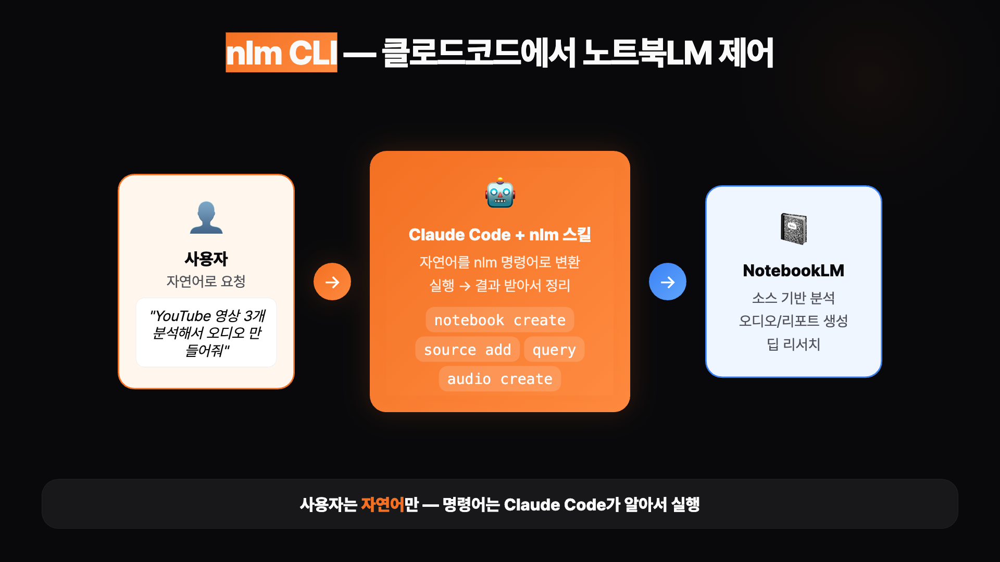
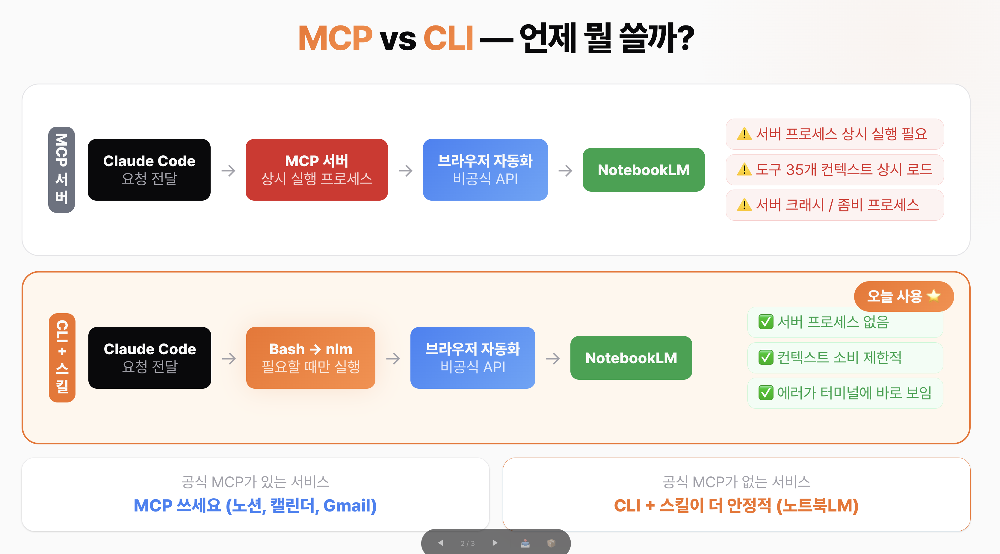

# Claude Code에서 NotebookLM 활용하기 — nlm CLI 설치 및 활용 가이드


Claude Code에서 NotebookLM을 자연어로 제어할 수 있는 `nlm` CLI 도구를 설치하고, 리서치·오디오 브리핑·보고서 생성까지 자동화하는 방법을 안내합니다.

## 목차

- [개요](#개요)
- [핵심 개념: MCP vs CLI](#핵심-개념-mcp-vs-cli)
- [사전 준비사항](#사전-준비사항)
- [설치 가이드](#설치-가이드)
  - [1. nlm 도구 설치](#1-nlm-도구-설치)
  - [2. Google 계정 로그인](#2-google-계정-로그인)
  - [3. Claude Code 스킬 설치](#3-claude-code-스킬-설치)
  - [4. 설치 확인](#4-설치-확인)
- [활용 사례](#활용-사례)
  - [실습 1: YouTube 영상 분석 + 오디오 브리핑](#실습-1-youtube-영상-분석--오디오-브리핑)
  - [실습 2: 소스 기반 질의 + 리서치 노트 정리](#실습-2-소스-기반-질의--리서치-노트-정리)
  - [실습 3: 딥 리서치 → 전략 보고서 자동 생성](#실습-3-딥-리서치--전략-보고서-자동-생성)
- [주의사항 및 한계점](#주의사항-및-한계점)
- [FAQ](#faq)

---

## 개요

NotebookLM은 소스를 올려놓고 질문하고, 오디오 브리핑을 듣고, 인포그래픽을 만드는 등 리서치와 학습에 매우 유용한 도구입니다. 하지만 지금까지는 NotebookLM의 분석 결과를 다른 작업에 이어서 활용하려면 수동으로 복사-붙여넣기를 해야 했습니다.

`nlm`은 NotebookLM의 모든 기능을 **터미널 명령어 하나로** 실행해주는 CLI(Command Line Interface) 도구입니다. 노트북 만들기, 소스 추가, 질문, 오디오 생성, 딥 리서치, 인포그래픽, 다운로드까지 — NotebookLM 웹사이트에서 마우스로 하던 모든 작업을 명령어로 할 수 있게 해줍니다.

핵심은 이겁니다. Claude Code에 **nlm cli/skill을 설치**하면, 여러분은 자연어로 말하기만 하면 됩니다. Claude Code가 알아서 nlm 명령어를 실행합니다.



**작동 흐름:**
```
사용자 (자연어 요청)
  → Claude Code가 nlm 명령어 자동 실행
    → NotebookLM에서 소스 추가 / 질의 / 오디오 생성
      → 결과를 Claude Code가 받아서 정리
```

---

## 핵심 개념: MCP vs CLI

Claude Code 같은 AI 도구에서 외부 서비스를 연결할 때, 크게 두 가지 방식이 있습니다.



### MCP (Model Context Protocol) 방식

MCP는 Claude Code가 외부 서비스에 접근할 때 사용하는 표준 프로토콜입니다. Notion MCP, Google Calendar MCP처럼, 뒤에서 **MCP 서버라는 프로세스가 계속 돌아가면서** 요청을 중계하는 구조입니다.

```
Claude Code → MCP 서버 (상시 작동) → 브라우저 자동화 → NotebookLM
```

**MCP 방식의 특징:**
- 서버 프로세스가 상시 실행됨
- 도구 목록이 컨텍스트에 상시 로드됨
- 서버 크래시나 좀비 프로세스 위험이 있음

### CLI 방식

CLI는 **서버 없이 직접 실행**하는 방식입니다. 터미널에서 `nlm source add ...`처럼 명령어를 치면 바로 실행됩니다.

```
Claude Code → Bash로 nlm 직접 실행 → 브라우저 자동화 → NotebookLM
```

**CLI 방식의 특징:**
- 서버 없음, 필요할 때만 실행
- 컨텍스트 소비 없음
- 에러가 터미널에 바로 보임

### 어떤 방식을 선택해야 할까?

| 상황 | 권장 방식 | 이유 |
|------|-----------|------|
| 공식 MCP 서버가 있는 서비스 (Notion, Google Calendar, Gmail 등) | **MCP** | 서버가 안정적이고, 인증 처리가 깔끔하며, 업데이트를 제공자가 관리함 |
| 공식 MCP가 없는 서비스 (오늘의 NotebookLM 케이스) | **CLI + 스킬** | 비공식 MCP 서버는 보안 취약점·좀비 프로세스·CPU 폭주 등의 문제가 빈번함 |

실제로 한 연구에서 오픈소스 MCP 서버 222개를 분석한 결과, 86%에서 보안 취약점이 발견되었습니다. 이는 MCP 프로토콜 자체의 문제가 아니라, **구현 품질의 문제**입니다.

NotebookLM은 아직 공식 MCP 서버가 없기 때문에, CLI 방식이 구조적으로 더 단순하고 안정적입니다. CLI라고 해서 명령어를 직접 타이핑할 필요는 없습니다 — Claude Code에 스킬을 설치하면, 자연어로 말하기만 하면 됩니다. 사용자 경험은 MCP와 완전히 동일합니다.

`nlm`은 GitHub에서 NotebookLM 관련 프로젝트 중 가장 안정적이라는 평가를 받고 있으며, 오픈 이슈가 매우 적고 활발하게 업데이트되고 있습니다.

---

## 사전 준비사항

- **Claude Code** 설치 및 실행 환경
- **uv** (Python 패키지 매니저) — Claude Code를 이미 사용 중이라면 대부분 설치되어 있음. 없으면 Claude Code에서 `uv 설치해줘`라고 요청하면 자동 설치됨
- **Google 계정** — 전용 계정 사용을 권장 (아래 참고)
- **Chrome 브라우저**

> ⚠️ **전용 Google 계정 사용을 권장합니다.** 이 도구는 비공식 도구이므로, 혹시 모를 상황에 대비해 메인 계정보다는 별도 계정을 사용하는 것이 안전합니다.

---

## 설치 가이드

총 3단계로, 약 3분이면 셋업이 완료됩니다.

### 1. nlm 도구 설치

```bash
uv tool install notebooklm-mcp-cli
```

이 한 줄이면 `nlm` 명령어가 생깁니다. 의존성이 자동으로 설치됩니다.

### 2. Google 계정 로그인

```bash
nlm login
```

Chrome 브라우저가 자동으로 열리고 Google 로그인 화면이 나타납니다. 로그인을 완료하면 인증 정보가 저장됩니다.

### 3. Claude Code 스킬 설치

```bash
nlm skill install claude-code
```

이 명령어를 실행하면 Claude Code가 nlm의 모든 명령어 사용법을 학습합니다. 이후부터는 자연어로 요청하면 Claude Code가 알아서 nlm 명령어를 실행합니다.

### 4. 설치 확인

```bash
nlm doctor
```

설치 상태와 인증 상태를 확인할 수 있습니다.

> 💡 **MCP 서버 방식으로 설정하고 싶다면:** `nlm setup add claude-code` 명령어로 MCP 설정도 가능합니다. 하지만 위에서 설명한 이유로 CLI + 스킬 방식을 권장합니다.

---

## 활용 사례

점점 깊어지는 3가지 활용 사례를 통해 실제 활용 방법을 알아봅니다.

### 실습 1: YouTube 영상 분석 + 오디오 브리핑

**상황:** AI 업계 CEO 인터뷰 영상 3편(총 3시간 이상)을 빠르게 파악하고 싶을 때

**Claude Code에 요청:**

```
https://www.youtube.com/watch?v=68ylaeBbdsg
https://www.youtube.com/watch?v=Rni7Fz7208c
https://www.youtube.com/watch?v=SfOaZIGJ_gs

노트북LM에 'AI CEO 인터뷰 분석'이라는 노트북을 만들고,
이 YouTube 영상 3개를 소스로 추가해줘.
소스 추가 다 되면 오디오 브리핑 한국어로 만들어줘.
```

**Claude Code가 자동으로 실행하는 명령어:**

```bash
# 1. 노트북 생성
nlm notebook create "AI CEO 인터뷰 분석"

# 2. YouTube 영상 소스 추가 (영상당 30초~1분 소요)
nlm source add <notebook-id> --url "https://youtube.com/watch?v=..." --wait

# 3. 오디오 브리핑 생성 (약 10분 소요)
nlm audio create <notebook-id> --confirm

# 4. 오디오 파일 다운로드
nlm download audio <notebook-id> --output "ai-ceo-briefing.mp3"
```

**오디오 생성 대기 팁 — /loop 활용:**

보통은 클로드코드가 알아서 반복적으로 오디오 생성여부를 체크하고, 다운로드를 해줍니다. 만약 자동으로 해주지 않는다면, Claude Code의 `/loop` 명령어를 활용하면 매번 확인할 필요 없이 자동으로 처리할 수 있습니다:

```
/loop 3분 오디오 생성 완료되었는지 체크하고, 완성되었으면 output 폴더를 만들고,
거기에 노트북 이름별로 폴더를 만들고 거기에 오디오 파일을 넣어줘.
```

자동으로 완료를 감지했을 경우에는 바로 다운로드를 요청하면 됩니다:

```
완성되었으면 output 폴더를 만들고,
거기에 노트북 이름별로 폴더를 만들고 거기에 오디오 파일을 넣어줘.
```

**결과:** 3시간짜리 인터뷰 3편이 약 25분짜리 오디오 하나로 요약됩니다. NotebookLM은 소스에 없는 내용은 말하지 않기 때문에 환각이 거의 없고, 실제 인터뷰 발언 기반의 신뢰도 높은 요약을 제공합니다.

---

### 실습 2: 소스 기반 질의 + 리서치 노트 정리

**상황:** 실습 1에서 만든 노트북을 활용해 심화 분석을 하고, 결과를 마크다운 파일로 정리하고 싶을 때

**Claude Code에 요청:**

```
방금 만든 AI CEO 인터뷰 노트북에서 질문 좀 해줘.
세 CEO가 공통으로 강조하는 AI 트렌드는 무엇인지,
그리고 각자의 입장 차이가 있는 부분이 있다면 뭔지 분석해줘.

결과를 마크다운으로 정리해서 output/노트북이름/ai-ceo-analysis.md에 저장해줘.
```

**Claude Code가 자동으로 실행하는 과정:**

```bash
# 1. NotebookLM에 질문 (소스 기반 답변 + 인용 포함)
nlm notebook query <notebook-id> "세 CEO가 공통으로 강조하는 AI 트렌드와 각자의 입장 차이를 분석해줘"

# 2. 대화를 이어가며 추가 질문
nlm notebook query <notebook-id> "이 중에서 한국 시장에 가장 시사점이 큰 내용은?" --conversation-id <cid>
```

그리고 두 답변을 종합해서, Claude Code가 마크다운 보고서로 정리하고 프로젝트 폴더에 자동 저장합니다. 핵심 트렌드 요약, CEO별 입장 비교, 한국 시장 시사점까지 구조화된 보고서가 만들어집니다.

**핵심은 역할 분담입니다:**

| 도구 | 역할 |
|------|------|
| **NotebookLM** | 소스에 기반한 정확한 답변 (환각 거의 없음) |
| **Claude Code** | 답변을 종합하고, 구조화하고, 파일로 저장 |

NotebookLM은 "소스에 뭐라고 써있는지"를 정확하게 찾아주고, Claude Code는 "그걸 어떻게 정리할지"를 처리합니다.

---

### 실습 3: 딥 리서치 → 전략 보고서 자동 생성

**상황:** AI 자동화 관련 강연 준비를 위해 최신 동향을 빠르게 파악하고, 사업 관점의 전략 보고서까지 만들고 싶을 때

**Step 1 — 딥 리서치 실행 및 소스 수집:**

```
노트북LM에서 'AI agent trends 2026'이라는 주제로 딥 리서치를 해줘.
기존 AI CEO 인터뷰 노트북에 결과를 추가하고,
딥리서치 briefing doc을 다운로드해줘.
그리고 추가적으로 트렌드 관련 질문을 던지고 해당 내용도 보고서로 정리해서
마크다운 파일로 저장해줘.
```

**Claude Code가 자동으로 실행하는 과정:**

```bash
# 1. 딥 리서치 시작 (약 5분 소요, 40개 내외 소스 자동 수집)
nlm research start "AI agent trends 2026" --mode deep --notebook-id <notebook-id>

# 2. 리서치 진행 상태 확인
nlm research status <notebook-id>

# 3. 발견된 소스를 노트북에 추가 (기존 인터뷰 3개 + 리서치 소스 40개)
nlm research import <notebook-id> <research-id>

# 4. 리포트 생성 및 다운로드
nlm report create <notebook-id> --confirm
nlm download report <notebook-id> <artifact-id>
```

**Step 2 — 사업 맥락을 반영한 전략 보고서 생성:**

딥 리서치 리포트만으로는 "내 사업에 뭘 해야 하는가"까지 나오지 않습니다. 여기서 Claude Code의 진가가 드러납니다:

```
방금 다운로드한 딥 리서치 리포트 내용을 참고하고,
내 사업 방향성 문서 @reference/business-context.md와
브랜드 가이드라인 @reference/brand-design-guideline.md도 같이 읽어서,
이 리서치 내용을 우리 사업 관점에서 해석한 전략 보고서를 한국어 PDF로 만들어줘.
어떤 트렌드를 우선 활용해야 하는지, 액션 아이템 포함해서.

브랜드 가이드라인에 맞춰서 디자인해줘.
```

Claude Code가 세 가지를 동시에 읽고 종합합니다: NotebookLM 리서치 결과, 사업 방향성 문서, 브랜드 디자인 가이드라인. 그리고 브랜드 색상·폰트·레이아웃에 맞춘 PDF 보고서를 생성합니다.

**전체 플로우 요약:**

```
1단계 [소스 수집]
  YouTube 영상, 웹 기사 → NotebookLM
  (nlm source add, nlm research start)

2단계 [분석]
  NotebookLM → 질의 + 리포트 → 리서치 데이터
  (소스 기반 정확한 답변)

3단계 [전략 해석]
  리서치 데이터 + 사업 방향성 문서 → Claude Code가 사업 전략 도출

4단계 [PDF 생성]
  전략 보고서 + 브랜드 가이드라인 → 브랜드 PDF 완성
```

NotebookLM이 해주는 건 "시장에 이런 트렌드가 있다"까지이고, Claude Code가 해주는 건 "그래서 우리는 뭘 해야 하는가"까지입니다. 프로젝트에 사업 컨텍스트 문서와 브랜드 가이드라인을 넣어두면, 리서치할 때마다 내 맥락에 맞춰 해석하고 내 브랜드 형식으로 만들어주는 시스템이 됩니다.

---

## 주의사항 및 한계점

### 비공식 도구

`nlm`은 Google이 공식적으로 제공하는 API가 아니라, **브라우저 자동화 방식**으로 NotebookLM을 제어하는 비공식 도구입니다. 따라서 다음 사항을 인지하고 사용해야 합니다:

- **세션 토큰 만료**: 세션 토큰이 주기적으로 만료될 수 있습니다. 자동 복구 기능이 내장되어 있어 대부분 자동으로 갱신되지만, 간혹 수동 재로그인(`nlm login`)이 필요할 수 있습니다.
- **UI 변경 대응**: Google이 NotebookLM의 UI를 변경하면 일시적으로 작동하지 않을 수 있습니다. 다만 개발자가 활발히 업데이트하고 있어 보통 빠르게 대응됩니다.
- **전용 계정 사용 권장**: 비공식 도구이므로 메인 Google 계정이 아닌 전용 계정을 사용하는 것이 안전합니다.

### NotebookLM 자체 특성

- NotebookLM은 **본인 Google 계정 권한으로 무료 사용** 가능합니다.
- 소스에 없는 내용은 생성하지 않아 **환각이 거의 없는** 것이 큰 장점입니다.

---

## FAQ

### Q: nlm은 무료인가요?
A: nlm 도구 자체는 무료 오픈소스입니다. NotebookLM도 Google 계정이 있으면 무료로 사용할 수 있습니다.

### Q: MCP 방식과 CLI 방식 중 어떤 걸 써야 하나요?
A: 공식 MCP 서버가 있는 서비스(Notion, Google Calendar, Gmail 등)는 MCP를, 공식 MCP가 없는 서비스(NotebookLM 등)는 CLI + 스킬 방식을 권장합니다. 사용자 경험은 동일하지만, CLI 방식이 구조적으로 더 안정적입니다.

### Q: 설치가 안 될 때는 어떻게 하나요?
A: `uv`가 제대로 설치되어 있는지 먼저 확인하세요. Claude Code에서 `uv 설치해줘`라고 요청하면 자동으로 설치됩니다. 그래도 문제가 있다면 `nlm doctor` 명령어로 상태를 확인하세요.

### Q: 세션이 만료되면 어떻게 하나요?
A: 대부분 자동 복구가 처리합니다. 만약 자동 복구가 안 되면 `nlm login`으로 다시 로그인하면 됩니다.

### Q: 오디오 브리핑은 어떤 언어로 생성되나요?
A: 오디오 생성 시 한국어를 포함한 다양한 언어를 지정할 수 있습니다. Claude Code에 "한국어로 만들어줘"라고 요청하면 됩니다.

### Q: Claude Code 없이 nlm만 단독으로 쓸 수 있나요?
A: 네, nlm은 독립적인 CLI 도구이므로 터미널에서 직접 명령어를 입력해서 사용할 수 있습니다. 다만 Claude Code와 함께 사용하면 자연어로 제어할 수 있어 훨씬 편리합니다.

### Q: 이 시스템을 더 확장하려면?
A: 리서치 이후의 후속 작업(예: 블로그 포스트 작성, 프레젠테이션 생성, 뉴스레터 초안 등)을 Claude Code 스킬로 추가해두면, 리서치부터 최종 결과물까지 한 번에 자동화할 수 있습니다.

---

## 참고 자료

- [nlm CLI GitHub 저장소](https://github.com/jacob-bd/notebooklm-mcp-cli)
- [NotebookLM 공식 사이트](https://notebooklm.google.com/)
- [Claude Code 공식 문서](https://docs.anthropic.com/en/docs/claude-code)
